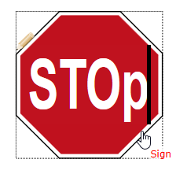
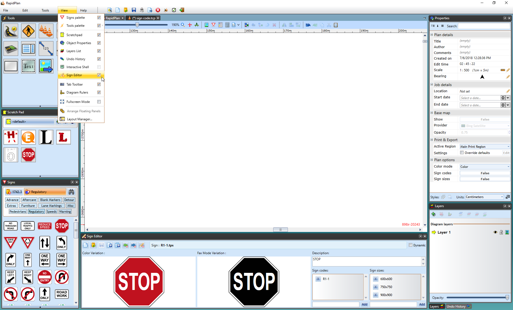
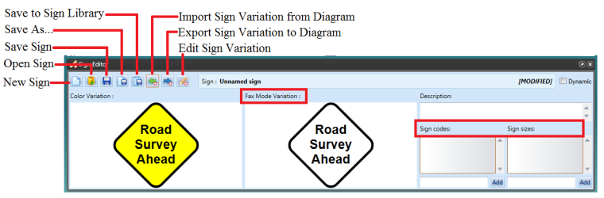
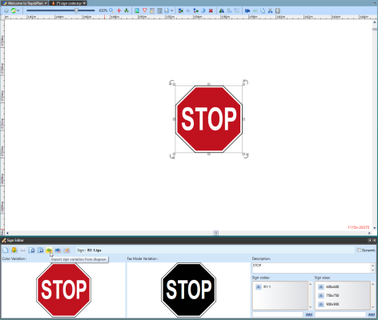
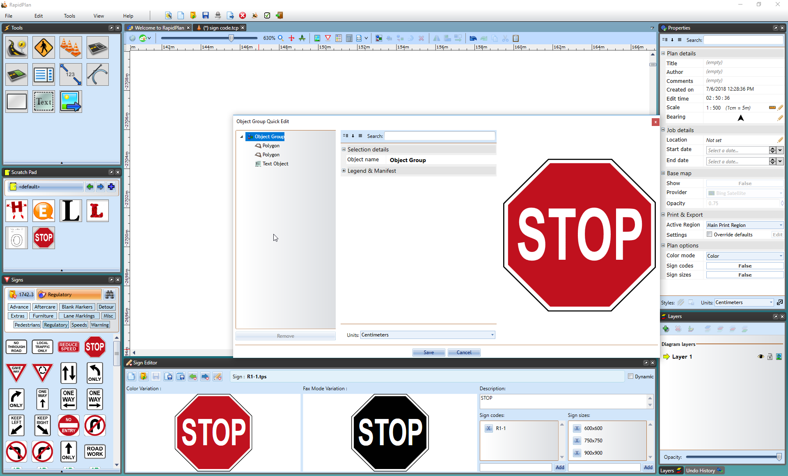
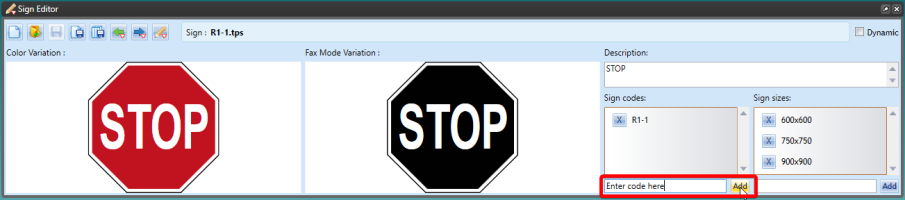
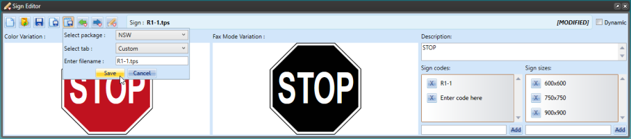
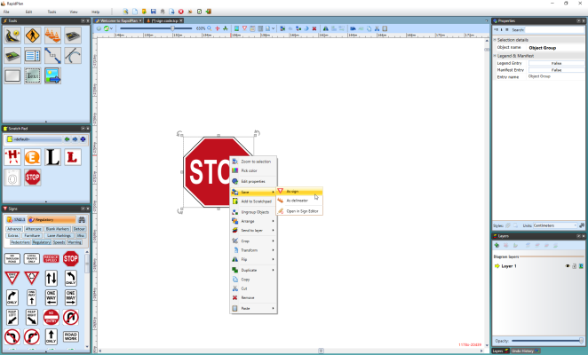
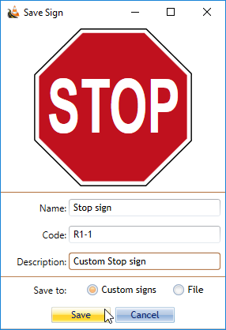

---

sidebar_position: 4

---
# Creating Variations of your Sign

Creating variations for your custom sign is made very simple using the Sign Editor Palette in RapidPath.

In RapidPath you can quickly edit text in signs. Just double-click on any text object that's part of a group or sign to edit it in-place.

## The Sign Editor

To open the Sign Editor, select **View** and tick the **Sign Editor** box. The palette will then appear at the base of your screen.

### How to use the Sign Editor

In the Sign Editor you can:

- Produce and Save Sign Variations
- Edit Sign Variations
- Add a Sign Description
- Add Sign Codes
- Add Sign Sizes

### Opening a Sign into Sign Editor

To open a sign in the Sign Editor you have two options;

 1. **Select "Open Sign" option** - use to access saved files from your computer
 2. **Select "Import Sign Variation From Diagram" option** - use to open a sign from your canvas

Once you have constructed your base sign in RapidPath, select the sign on the canvas and select **Import Sign Variation From Diagram** in the Sign Editor. As you can see the editor will immediately provide a Fax Mode version of your sign for you.

### Editing Sign Variations in Sign Editor

Now that there are two signs, your standard sign and the fax mode variation, you can edit them as separate signs.

To do this either click on the desired sign directly in Sign Editor which will take you to the quick edit window, or select the **Edit Sign Variation** icon and select the sign from there.

As shown above, the **Quick Edit** window is the same as discussed in other sections of RapidPath, where you change the object's properties as usual.

**Adding Sign Description, Codes and Sizes to your Sign**
Adding a description for you sign, and/or codes and sign sizes is very easy in the Sign Editor.

**To Add a Designation Code to your Sign:**

- Enter your desired code in the section below **Sign Codes**.
- Select **Add**.
- Once you have completed your sign, select **Save to Library** to save your sign and all its variations to the Sign Palette.

  **Note**: You must save your sign (either to your computer or to the Signs Palette) in order to use all of its edited variations.

### Saving your Sign and its Variations

In the Sign Editor you can save your sign and variations to your computer by selecting the **Save As...** icon in the Sign Editor Palette or you can choose to **Save to Sign Library** where you can choose its location within the Sign Palette. For example, in the image below the sign is being saved to the **NSW** package under the **Custom** tab in the Signs Palette. All of the sign's variations will be saved here.

**Note**: Toggle Fax and Sign Codes modes from the Options toolbar to see your completed sign with all the variations we've created.

## A Faster Way to Save Signs (Right click > Save)

RapidPath has a much faster and easier way to save signs when you don't need to save and edit different variations.

Using **Save** from the context menu allows you to save a group as a sign to the **Custom** tab of the Signs Palette. It is a simple process, but doesn't afford the power or flexibility that the Sign Editor allows.

In some regards, it is the "lazy man's" sign creation tool - but it is equally suited to less sophisticated users who don't need or are unable to create signs using the full sign creation process.

**How to Save from the Context Menu:**

- Ensure all of the elements of your sign are **grouped**.
- **Right click** on the group and select **Save** from the context menu that appears.

 

- In this save option you can enter a name for the sign, a sign code and a description. You can also select whether to save it to the **Custom** tab or to a file.

