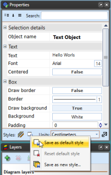

---

sidebar_position: 5

---
# Changing Default Text Settings

By default RapidPath will create Arial 14pt text. This can be changed through the RapidPath Preferences screen or from within the Properties palette.

## To Set a New Default Font Through the Preferences Screen

- From the main menu Select **Tools** > **Preferences**.
- Select the **Defaults** tab (see below).
- Scroll down to the Fonts and Text section.
- Set the font as you require or set any other parameters you desire.
- Exit Preferences by closing its tab.

    

## To Set a New Default Font Through the Properties Palette

- Select the **Text Object** tool from the Text tab.
- Click on the canvas and enter you text in the allocated area.
- Use the Properties Palette to set the font as you require or set any other parameters you desire.
- Click **Save as Default Style** at the base of the palette when complete.

    
