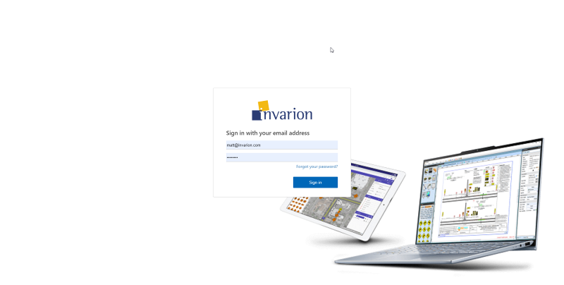
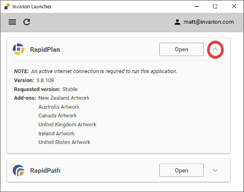

---

sidebar_position: 1

---
# Downloading RapidPlan - The Invarion Launcher

RapidPlan is accessed through a small client program named the Invarion Launcher.

## Installing the Invarion Launcher

When you are ready, **please use the link below to download the .exe installer for the Invarion Launcher** to your Windows capable computer:

[https://invarion.com/downloads/InvarionLauncherSetup.exe](https://invarion.com/downloads/InvarionLauncherSetup.exe)

**Please note:**

- Admin access is not required for this install. **We highly recommend installing on individual user profiles**.
- **The Invarion Launcher will install Microsoft's Visual C++ runtime onto your machine**. This is required to operate Google Maps.
- Please contact our [Support team](https://invarion.com/au/support/) if an .msi install is required or if you have difficulty with installation.
- If RapidPlan is required on a **Apple computer**, please see ['Can I run RapidPath On a Mac?'](/docs/rapidpath/faqs/can-i-run-rapidpath-on-a-mac.md) for information.

For **whitelist, firewall and proxy setup information**, please visit [this page](https://rapidplan.com/pages/firewall-and-proxy-setup).

## Accessing RapidPlan with the Invarion Launcher

Now that the Invarion Launcher is installed, if it's the first time a user is logging in, you will be presented with the below instructions when you open the Invarion Launcher.

Clicking on Sign In will direct the user to a browser window to enter the username and password that has been created (for more details on managing users, please visit our ***Account Management*** section).
Once the credentials have been entered and the details are accepted, you will be prompted to close the browser window and return to the Launcher.

**If you have forgotten your password**, simply click the '**Forgot your password**' link under the login area, you will then be sent to another browser window with steps on resetting your password.

Once the user has logged into the Launcher client, the applications assigned to that user will display. Clicking '**Open**' will launch that specific application.

If an update is required, or installation for your first use of RapidPlan, the Launcher will automatically download and apply this prior to launching the application.

To manually check for any updates, simply click the **Refresh Icon** in the top left of the Launcher window.

To check which version of RapidPlan you are using, simply click the drop-down arrow.

This will detail the current RapidPlan version you are using, as well as any signage add-ons that have been assigned to your RapidPlan license.

## Other Invarion Launcher Controls

Clicking the hamburger icon (three horizontal lines icon) in the top left of the window will allow you to access the **Settings Menu**.

Here, you can specify the default downloads folder.

The '**Show advanced settings**' button contains features that our support team will advise you to access, should you encounter any technical issues.

We advise only to access these settings in those circumstances.

## Minimum Computer Specifications

Before downloading the software, please ensure your machine complies with the minimum specifications recommended for running RapidPlan.

**A list of the minimum specifications can be reviewed here:**

[https://invarion.com/install/](https://invarion.com/install/)
