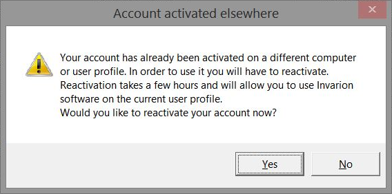

---

sidebar_position: 5

---
# Transferring a Single-Machine License

Based on the current License Agreement in place for single-machine licenses, ***"One license per user, per machine"***, a RapidPath account can only be activated on a single user profile on a particular computer. Activation on another machine or on another profile on the same PC requires another RapidPath license, otherwise, subsequent activation of the same license will render the program automatically deactivated on the original user account profile.

## Transferring a License to Another Machine or Computer

In the event of a transfer to another PC, the program will ask the user whether they want to reactivate their account on the new PC.

If a user chooses to reactivate their license, it will be disabled while being transferred. Generally, the process takes approximately 8 hours, after which the user will be able to log in as normal.

## Multi-Machine licenses

If you require more flexible access, you might consider purchasing or upgrading to a multi-machine licenses. A comparison between the two license types can be seen below:

### Single-machine licenses

Single-machine licenses are each linked to a specific computer (and a specific user's Windows profile) and they each can have one assigned username.  If your computer gets replaced, or if there is a change in staffing/roles, we can assist in transferring single-machine licenses to new computers/users, but they are not suited for regular use across multiple computers or between multiple users.  Single-machine licenses are better suited for individual planners using one computer, or a team of planners where everyone needs to be able to use RapidPlan at the same time.

### Multi-machine licenses

Multi-machine licenses allow for RapidPlan to be installed on any number of computers with any number of people registered as users, and the number of users who can access RapidPlan at any one time is determined by the number of licenses held.  For example, with one multi-machine license, you could have five registered users (each with their own login details and RapidPlan installed on their computers), and one of those registered users will be able to access RapidPlan at any one time. Note that multi-machine licenses require an internet connection when in use.
