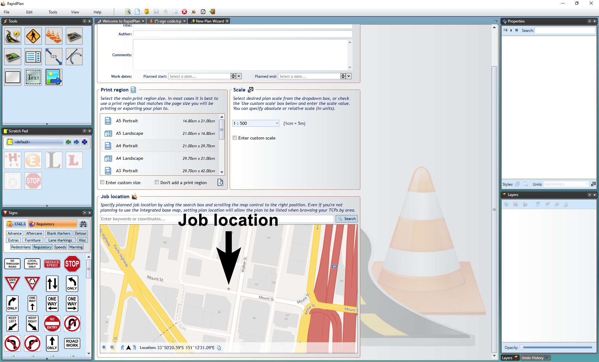

---

sidebar_position: 1

---
# Accessing Integrated Mapping

In [The Canvas](/docs/rapidpath/the-canvas/) we covered how to start a new plan from different plan types, so in this section we will focus on aspects only relevant to integrated mapping.

## To access the integrated mapping feature

- Select the **New Plan Wizard** on the Welcome screen.
- In **step 1** select a **Base Map** plan.
- In **step 2** you can specify a plan scale or leave it as the default scale.
- Now specify a job location. You can search location by street address or longitudinal and latitudinal coordinates.
- The red cross in the center of the map points to the job location, scroll the map as necessary to the desired location.
- Once the scale and location are set, select **Create Plan** at the top.

**Note:** As it is an unrestricted canvas, you can scroll and zoom to anywhere on the map you like. This means it can be important to be fairly precise when setting your job location in **step 2** so that you can find the exact spot when searching plans by location in the future.

## Map Properties

The Base Maps tab in the plan's Properties Palette allows you to control whether to **show** the map on the plan, choosing a **Provider** for the map and the **opacity** of the map.

### Base Map Provider

Eight base map providers are available to all RapidPath users. These are:

1. **Omniscale** - Street view, provided by Omniscale
2. **Google Satellite** - Satellite imagery, provided by Google
3. **Google Hybrid (light)**- Satellite imagery with street names and annotations, provided by Google
4. **Google Hybrid (full)** - Satellite imagery with street names, annotations and road outlines, provided by Google
5. **Bing Satellite** - Satellite imagery, provided by Bing
6. **Bing Hybrid** - Satellite imagery with street names and annotations, provided by Bing
7. **ArcGIS World** - Satellite imagery, provided by Esri
8. **ArcGIS Hybrid** - Satellite imagery with street names and annotations, provided by Esri

There's also a number of region-specific mapping providers available in the software, depending on which country version you have access to.

To view these additional mapping providers, go to the  **Base map**  section of the Properties palette. Select the  **Provider**  dropdown menu. Click  **More providers...**. In the dialogue box (displayed in Figure 14.3), check the providers you want to use. These will then become visible in the dropdown menu.

**Please note**: Access to content from NearMap and Metromap (both available to users in USA, Australia and New Zealand) requires a paid subscription to those services.

### Custom Base Map Provider  

You can also add your own custom map provider. It is disabled by default and to change it go on Properties palette in the **Base map** section open **Provider** selection dropdown, click **More providers...**. On bottom of the list check **Custom ArcGIS Service** and press Save button.
Now on **Provider** selection dropdown click on **Custom ArcGIS Service** which will open a new window where you can enter your custom map provider **Service address**. Press **Get Details** button and if your service address is valid, you can save it and/or add it to bookmarks.

### Custom Base Map Provider Requirements

- RapidPath version >= 3.2
- Supported data formats: standard World File, MapInfo raster .TAB file
- Spatial reference: ESRI 102100/3857 (Web Mercator)
