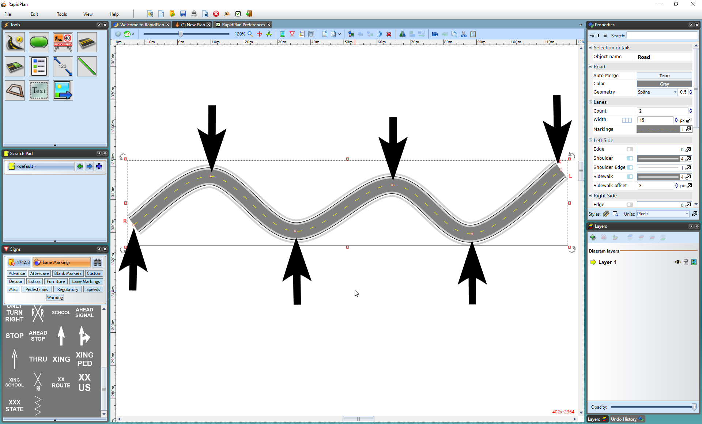
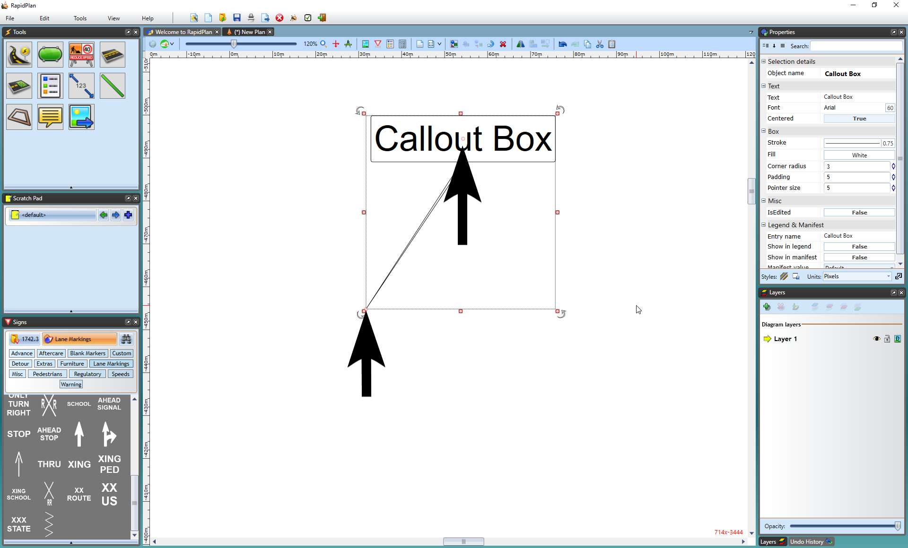

---

sidebar_position: 5

---
# Control Points and Snapping

Almost every element in RapidPath has at least one control point. A control point is a handle that allows you to alter the shape of an object. They appear in RapidPath as small red circles. Control points do different things to different kinds of objects, and different objects have different numbers of control points.

The control points along the road enable you to adjust its shape.

Callout boxes have two control points - one to position the head and one for the tail.

To view an object's control points you must select it. Once you have selected an object, you can move its control points around to change the shape and of the object.

## Keeping Control Points Straight

Irrespective of what item you are drawing or altering, you can keep your control points in a perfectly straight line by holding down the **SHIFT** key as you are drawing. The same applies if you are moving an existing control point.

This technique is especially helpful when drawing straight roadways.

## Adding/Deleting a Control Point

You can add a control point to an object, for example if you want to add a curve to a train track, by selecting the object, right clicking and selecting **Insert Control Point**.

**Note:** This option will only appear for objects that can utilize extra control points.

Similarly, you can remove control points by selecting the object, right clicking and selecting **Remove Control Point**.

## Control Point Snapping

Once you have selected an object and can view its control points, you can seamlessly connect objects to one another by snapping into existing control points. Hold the **Ctrl** key while point-snapping roads/work areas or other objects and their geometries will merge.

This feature will help you to create a neat and straight-lined work area.

**Tip:** If you want to snap control points across multiple layers/stages, hold **Ctrl+Alt** while drawing or transforming objects. This is particularly useful when drawing complex plans with multiple stages, as it allows hassle free snapping to base stage objects like road lanes and edges.

**Note:** You can also snap points and align drawn segments not only at control points, but anywhere along a snap geometry as shown in Figure 5.12 below.

### Advanced snapping

For additional snapping options, press the Alt key while snapping to a geometry to enable guides for tangent and perpendicular lines as well as geometry midpoints.

## Drawing along geometries

Snap to an existing geometry when drawing an object and RapidPath will automatically create control points to fit the desired curve.

This is useful when needing to draw delineation devices or a work area along a curved geometry.

To being drawing along a geometry, simply left click your device along the red geometry where you want the device to begin. The tool will then follow the curve you draw out, as seen in Figure 5.11 below.

While drawing an object you can snap its segments to different geometries as well. This can be done by snapping points to existing geometries and tracing the drawing along it, as seen in Figure 5.12 below.

## Offsetting the geometry

Use the Offset Geometry tool to further adjust the position of an object.

To utilize the offset tool, simply complete your drawing along the geometry, once completed, right click and select 'Offset geometry' in the right click menu displayed (shown below).

Simply click and drag to your desired offset, or type your desired offset value in the offset dialogue box, as shown below.

Once the offset has been created, right click to save your changes.

## Tangent Points (Bezier Geometry)

Tangent Points visible only when Bezier Geometry is engaged. They are used to create a smoothed curvature of the line object/edge of an object either side of the control point.

There can be up to two Tangent Points per control point, and appear blue with a line between each of them and the red control point.

For full details on how to use Bezier Geometry/Tangent Points, please see the [Properties](/docs/rapidpath/object-properties-and-transformations/object-geometry.md) section.
