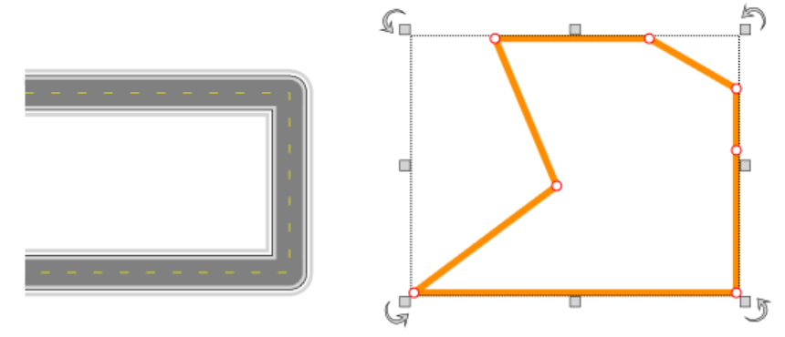
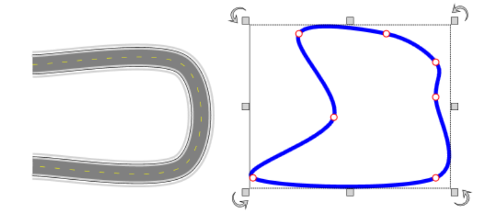
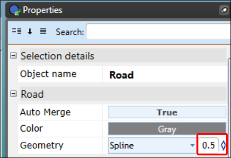
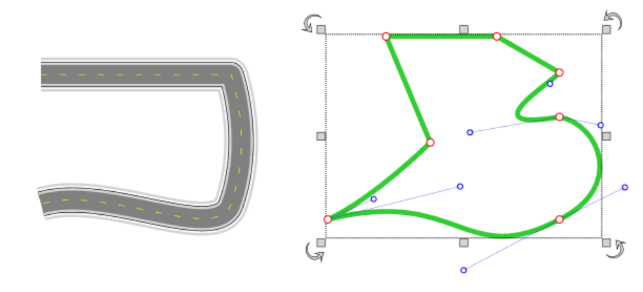

---

sidebar_position: 3.1

---
# Object Geometry

## Object Geometry Types

Many objects will include Geometry in the Properties that can be altered. Geometry dictates the shape of the path the object takes between two points, altering its shape.

There are three geometries to choose from:

### Line Geometry

Line Geometry takes a direct path between control points.

### Spline Geometry

Spline Geometry smooths the path between control points.

Note that the degree to which the path is smoothed when using Spline is governed by the **Tension** value (pictured below). The value can be set to *any number less than 1*; a lower value will be more direct, while a higher value will be more smooth.

### Bezier Geometry

Bezier Geometry allows for the highest degree of customisation, allowing you to accurate match or design a curvature exactly as needed, while leaving sections you'd prefer to remain straight-straight.

An object set to Bezier Geometry will appear as if the same as Line Geometry initially, but once an object is set to bezier you are able to create up to 2 Tangent Points per [Control Point](./control-points-and-snapping.md):

Tangent Points are used to create a smoothed curvature on either side of an object at a chosen Control Point.

As shown in the image below, a tangent point will create curvature; more smooth and extended when placed further from a Control Point, or more immediate and shorter when placed nearby.

There can be up to two Tangent Points per control point, and appear blue with a line between each of them and the red control point.

**To create a Tangent Point** on an object set to Bezier Geometry: Simply hold **Ctrl**, while clicking and dragging a red Control Point.

If needed, a Tangent Point can be reset (as if to delete it) by *Right-Clicking it > 'Reset Control Point'*.
