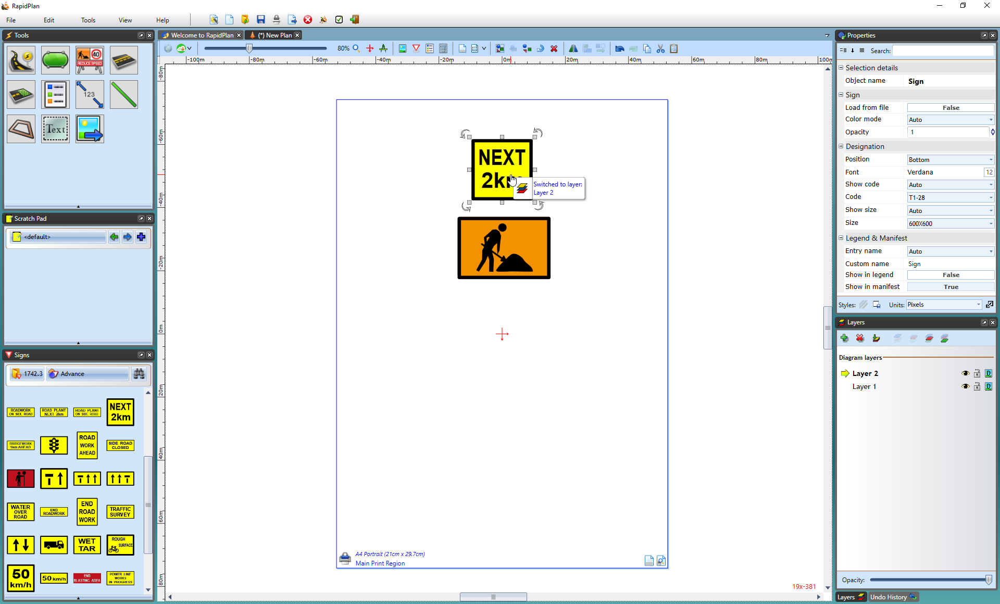
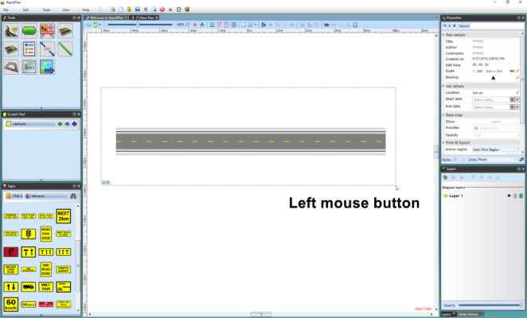
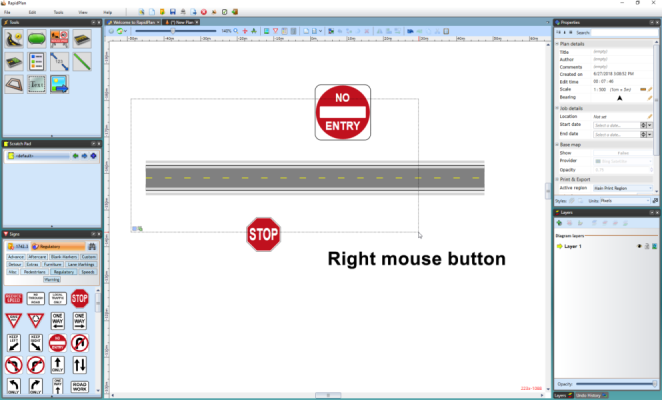
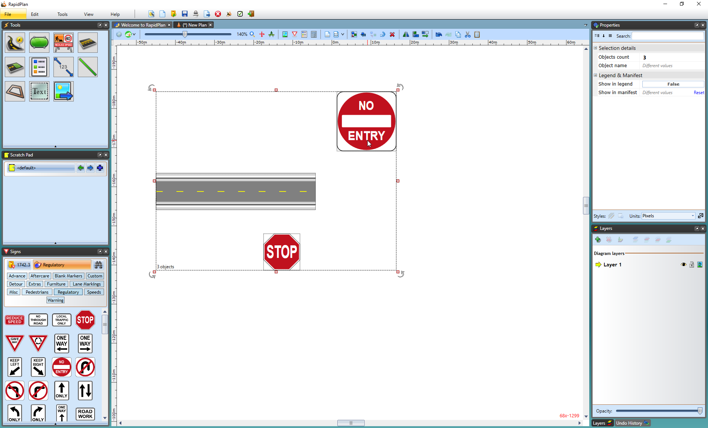

---

sidebar_position: 1

---
# Selecting Objects

Before you can manipulate the properties of your objects (such as the size, shape, position or rotation) you must first tell RapidPath which item or items you want to change. You do this, by selecting your desired object(s). Sometimes you will need to select only one object,
as would be the case when you want to change the size of a single sign. On other occasions you will need to select multiple items, like when you need to move and group objects at the same time. The two cases are handled slightly differently.

## Selecting Single Objects

There are two ways to select a single item in RapidPath:

- By clicking on it.
- By dragging a selection box around it (this can also be used for selecting multiple items as specified at the end of the previous [chapter](/docs/rapidplan/the-canvas/blank-canvas.md).

## Select by Clicking

Simply click once on your desired object and it will become selected. You will notice a number of new controls are displayed.

## Selecting objects on different layers

If you are working across multiple layers, you can switch between different objects on the fly by holding down the **CTRL + ALT** keys and clicking on desired objects in a different layer. This will switch to the layer on which the object is on, as shown below.

## Select with a Selection Box

The other way to select an object is by dragging a selection box around it. Simply click outside the bounds of your object, and drag the selection box out until it completely encompasses it. Release the mouse, and your object will be selected.

**Note**: The selection box will only capture items that are completely surrounded by the selection box. However, if you hold **right mouse button** whilst dragging the selection box over the objects, it will select all of the objects in the selection box, even if partially covered.

## Selection preview

Any objects that have been highlighted in the selection box will be highlighted in green, indicating what you have selected.

The below are the available selection modes when selecting objects:

### Selection modes

 New selection (default)

 Add to selection (hold Shift key)

 Remove from selection (hold Alt key)

### Capture modes

 Contained objects (default)

 Intersecting objects (use right mouse button)

## Selecting Multiple Objects

Selecting multiple objects is useful when you want to move, duplicate, cut or copy more than one element on a plan. You will also need to select multiple objects if you wish to group a collection of items together.

Again, there are two ways to perform a multiple selection:

- By dragging a selection box around all of the elements (as described above).
- By holding **SHIFT** and repeatedly clicking on each element that you wish to select.

