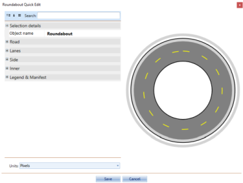

---

sidebar_position: 3

---
# Understanding Object Properties

An important feature accessed through selecting an object is editing the object's properties. Every single object in RapidPath has a set of **properties** which determine how that object appears on the canvas. The available properties will vary from object to object. The table below contains a few examples of different objects and some of their properties:

|Object                                                                            | Tools type |Example properties                                                                           |
|----------------------------------------------------------------------------------|------------|---------------------------------------------------------------------------------------------|
| Ellipse, Rectangle, Polygon, Rounded rectangle,Filled Bezier, Filled spline  | Shapes     | **Stroke** - width, color, style, cap  **Fill** - opacity, color, style  **Tension**|
| Delineator tool                                                                  | Devices    | **Positioning** - spacing, alignment, geometry style  **Delineators** - type, size      |
| Road tool                                                                        | Roads      | **Measurements** - units  **Road** - auto merge, color, geometry style  **Lanes** - count, width, markings  **Lane Markings** - width, color, style, dash and gap lengths  **Shoulders** - show left, show right, left shoulder width, right shoulder width  **Side-walks** - show left, show right, left width, right width, left offset, right offset  **Distance Markers** - spacing, show         |

Each object is drawn with it's default properties set, but you will undoubtedly want to frequently change an object's properties. Fortunately, this is very simple. Default preferences can be changed by clicking on
**Tools** > **Preferences**.

## View or Edit an Object's Properties

 1. As discussed previously, you can edit properties from the properties palette or using quick edit mode. Double click on the object you wish to inspect to open the Quick Edit box. The object's properties screen will appear. Note that the properties will be different for each object type.

    

1.Make any necessary adjustments to the settings.
2.The Preview window will show you any adjustments you've made. Press Ok to complete your changes.
