## RapidPath 4.3 (Coming soon...)

### Chainage Marker

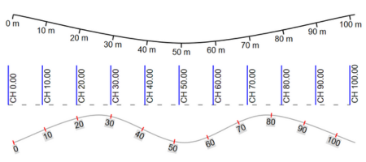

The new Chainage Marker tool enables quick generation of chainage references along linear geometry.

Key capabilities include:
- Generation of chainage markers from lines, splines, or Bézier curves
- Automatic creation of ticks at configurable spacing
- Snappable ticks
- Labels that display the chainage value for each tick
- Fully adjustable label position and alignment to accommodate different plan layouts

This tool streamlines the process of marking distances and references along roads, paths, and work zones.

### Custom symbols

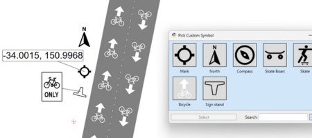

Custom symbols functionality has been added to selected objects, enabling greater visual consistency and customization.

The following objects support the unified custom symbol system:
- Bike lane
- North arrow
- Arrow board
- LUMS board
- Location marker
- Sign stand

Each supported object now includes a Custom symbol toggle in the Properties Grid. When enabled, the default built-in symbol is replaced with a custom symbol.

The Properties Grid provides a visual picker for selecting or changing the custom symbol. Symbols are loaded from the Custom Symbols folder and can be:
- Previewed visually
- Identified by name
- Sorted and filtered by name for easier selection

This update makes it easier to reuse standardized symbols across different objects.

### Running multiple instances

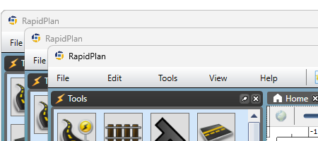

Multiple RapidPath instances can now run on the same machine, allowing parallel work with multiple plans or workflows.

A new instance can be started in two ways:
- New RapidPath window (Ctrl + Alt + N) – Available in the File section of the Main Menu. Opens a new empty window.
- Open in new window – Available in the diagram tab. Opens the selected plan in a new window.

### Print Region sorting

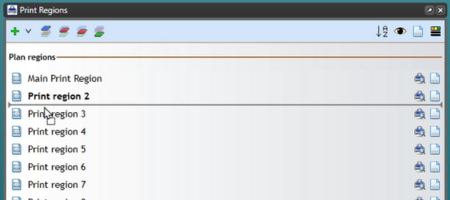

Print region management has been simplified with a single, consistent ordering system.

What’s changed:
- Print regions can now be reordered directly in the Print Regions window using drag-and-drop
- The list order defines the default output order for actions such as batch export

This creates one clear source of truth for print order, removing the need for renaming regions or manually adjusting page numbers.

### Icons in the Manifest Box

The Manifest Box can now optionally display object icons, matching the behavior of the Legend Box.

Benefits:
- Faster visual identification of listed objects
- Improved consistency between legends and manifests
- Clearer, more readable plan documentation

### More changes

**Print Region Comments** - Comments can now be added to print regions to capture additional context. Comments appear as a popup on the region and in the Print Regions panel, and can also be included as a text variable when printing or exporting.

**Improved Zoomed View Box Snapping** - Zoomed View Box snapping has been enhanced to provide greater precision and flexibility. The following snapping options has been added:
- Snap the view box to the source region
- Snap to source region bounds
- Snap to source region geometry
- Maintain bounds snapping while adjusting the source region

View box is the zoomed view of plan content within the source region.

**Improved Inner Print Region Name Placement** - Print region names that appear inside other print regions in print and export outputs are now smartly positioned to remain clear and readable, even when regions are rotated or overlapping. This applies when the Inner regions option is set to Box in the Print & Export properties of the containing region.

**Performance Improvements And Future-Proofing** - System performance has been optimized, and architectural enhancements have been introduced to improve long-term scalability and stability.

## RapidPath 4.2

<iframe width="560" height="315" src="https://www.youtube.com/embed/2R16n1xQkDY?si=4Tdq8FHMlKxH3dRA" title="YouTube video player" frameborder="0" allow="accelerometer; autoplay; clipboard-write; encrypted-media; gyroscope; picture-in-picture; web-share" referrerpolicy="strict-origin-when-cross-origin" allowfullscreen></iframe>

### CAD Export

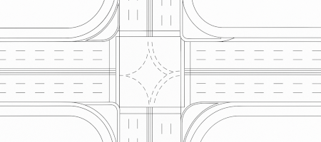

Following the success of the new CAD Import functionality added in the previous release, RapidPath 4.2 now lets you close the loop and export traffic control plans to CAD files (DXF or DWG format). Modelspace and paperspace are both supported, for your worksite drawings and print frame contents respectively. Georeferencing options allow you adjust the spatial reference and make sure the data exported from RapidPath can be easily integrated with your existing CAD files.

### Google Road Level Details

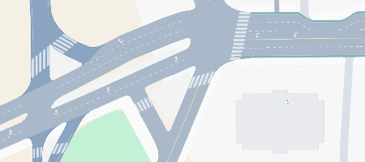

Google's new Road Level Details view is now available in RapidPath with the Google Roadmap basemap provider. In selected locations around the world, you can now zoom in to reveal an extraordinary level of road details - curb geometries, turn lanes, lane markings, pedestrian crossings and more. NOTE: subject to Google data availability at specific locations.

### Adjustable Google annotations

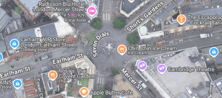

With RapidPath 4.2, you control what you see on your basemap. Both Google Roadmap and Google Satellite providers now come with an adjustable level of annotations. Select None if you want just want the plain map, Light for road names and public transport locations, or Full to see all Google map labels, including marked places of interest.

### Plan comments with locations

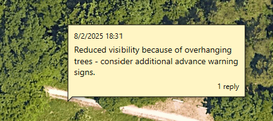

For plans stored in the Invarion Cloud, you can now annotate specific locations with comments. This will come handy when collaborating on shared plans: reviewing, asking for adjustments or highlighting potential site risks to planners. Additionally the feature comes with comment threads, responses and marking specific issues as resolved.

### More changes

**Custom print region sizes** - The default list of print region sizes can now be fully customized, to expose convenient shortcuts for the region sizes you use most often and remove the ones you don't need.

**Marked Path arrow tails** - In the newly added Tails drawing mode, the Marked Path object allows you to draw a collection of arrows with a desired length, running along the object geometry.

**New Crosswalk type: Ladder** - The Ladder Crosswalk style is now natively supported without having to draw the outer edges manually.

**Advanced web proxy settings** - The 4.2 release makes RapidPath fully compatible with the new web proxy settings available in the current version of the Invarion Launcher.

## RapidPath 4.1

<iframe width="560" height="315" src="https://www.youtube.com/embed/I9XC3B_DMVg?si=SEF-pV9MFP0l3H5v" title="YouTube video player" frameborder="0" allow="accelerometer; autoplay; clipboard-write; encrypted-media; gyroscope; picture-in-picture; web-share" referrerpolicy="strict-origin-when-cross-origin" allowfullscreen></iframe>

### New vehicles

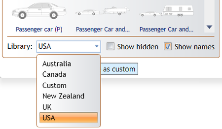

The vehicle library has been extended to include national standard vehicles from a range of countries. Simply open the vehicle dialog and choose the library you need.
A new 'National standards' add-on has automatically been assigned to each RapidPath subscription and included at no extra charge. Specialist libraries, such as Construction, are still available for purchase as separate add-ons.

### Georeferenced CAD Import

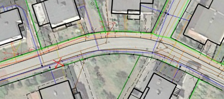

CAD Import has been integrated into RapidPath's georeferenced import tool (previously used for KML/SHP files only), allowing you to seamlessly integrate CAD road layouts with georeferenced traffic control plans. All EPSG spatial projections are supported, with CAD data reprojected on the fly for instant overlay over your TCP basemap.

### Measure turning radius

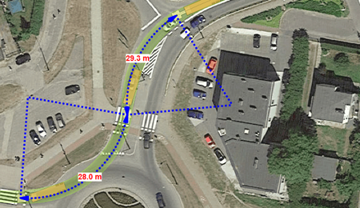

Turning radius can now be measured for each section of a vehicle path. To do this, highlight the path and select the new turn radius mode from the menu. Choose a style for the markers and select individual path sections to add the annotations.

### More changes

**Location Marker Object** - new annotation object designed to mark specific positions on the plan in the form of pin icons and the corresponding location coordinates.

**Zoomed View Box stage selection** - the Zoomed View Box allows selecting a specific stage whose contents will be displayed. Using this feature lets you present objects drawn on another plan stage.

**New Batch Export options** - the Batch Export tool allows creating a separate PDF file for each stage you're exporting. Additionally, you can now select whether page numbering is common for the whole export job or separate for each output file.

**Roads Import tool improvements** - predefined road styles can now be assigned to specific OSM road categories. Simply use OSM_*category* as name when saving the style, for example OSM_secondary (the full list of OSM road categories can be found [HERE](https://wiki.openstreetmap.org/wiki/Key:highway#Roads)). Additionally, lane count will be imported from OSM data (where available) and new settings are available for automatically including road names and speed limits in the Roads Import operation.

**New Print Region styling options** - new advanced settings category: "Print region style", with options that allow adjusting the style of print regions displayed in the plan editor as well as the inner regions on exported plans.

**Find and Replace Signs auto zoom** - a new options that allows automatic zooming to signs selected by the Find and Replace Signs tool.

**Batch coordinate converter (NZ Mobile Road integration)** - Batch Edit Location Markers tool allows to export position coordinates of your selected markers, then replace them with custom text imported from an external coordinate converter tool or service.

**Performance improvements** - especially when importing aerial tiles and performing tasks on multiple threads.

## RapidPath 4.0

<iframe width="560" height="315" src="https://www.youtube.com/embed/hHBbLazCEZY?si=05l8dj_SkGoc8z9b" title="YouTube video player" frameborder="0" allow="accelerometer; autoplay; clipboard-write; encrypted-media; gyroscope; picture-in-picture; web-share" referrerpolicy="strict-origin-when-cross-origin" allowfullscreen></iframe>

### Invarion Cloud Integration

RapidPath 4.0 is integrated with Invarion Cloud, allowing users to:

* Store their traffic management plans on the Invarion Cloud instead of local files.
* Open and edit the same plans in RapidPath as well as RapidPath Online (users who have licenses for both applications).
* Use Invarion Cloud's collaboration features: share plans with other users, add comments.
* Share plans with users who don't have a RapidPath license - they will still be able to open them in read-only mode.

*NOTE: In the weeks following RapidPath 4.0 official release, integration with Invarion Cloud will be gradually made available for users based on their company size and region.*

Invarion Cloud can also be accessed directly from your web browser by opening [cloud.invarion.com](https://cloud.invarion.com)

## RapidPath 3.11

<iframe width="560" height="315" src="https://www.youtube.com/embed/HRZIudmRyEU?si=jqoV6G_qYx1pC86a" title="YouTube video player" frameborder="0" allow="accelerometer; autoplay; clipboard-write; encrypted-media; gyroscope; picture-in-picture; web-share" referrerpolicy="strict-origin-when-cross-origin" allowfullscreen></iframe>

### Rich Text Editor

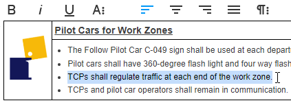

Use RapidPath's new advanced text formatting capabilities to create TCP notes and documentation as well as custom titleboxes directly on your plan. The new Rich Text tool is based on  a powerful yet simple to use editor that allows using different text styles, paragraphs, lists, tables, images and more - all in one object. Additionally, the editor allows pasting externally created content, e.g. from Microsoft Office or Google Docs.

### Imaging Georeferencing

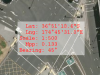

Image georeferencing has been improved in version 3.11, adding full support for non-north aligned imagery, an ability to export TCPs as georeferenced images and georeferencing existing imagery by aligning it with the underlying basemap.

### Import ESRI Shapefiles

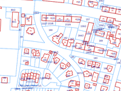

ESRI Shapefiles can now be imported to TCPs using the same interface as KML imports, with automatic scale adjustment and import area selection.

### Geometry Distance Input

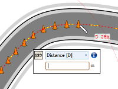

Need to draw a 50m taper along a curved road? Use distance input and geometry snapping tools and let RapidPath do the measurement for you.

### Reduced Eye Strain Mode

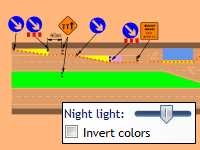

RapidPath 3.11 introduces new settings that adjust the color temperature for content displayed in the plan editor, reducing your eye fatigue when drawing and editing TCPs.

### QR Code Generator

Using the new QR Code tool lets you quickly add QR codes to your TCPs, allowing your customers to quickly access your website or any other plan-related online resources.

### More changes

**Keyboard shortcuts on menu items** - commands in the application menu as well as in all context menus present their assigned keyboard shortcuts.

**Auto detect pasted hyperlinks** - RapidPath will automatically detect when pasted text is a hyperlink and paste it as a Hyperlink instead of a regular text object.

**Dedicated Paste Image and Paste Text commands** - when the clipboard contains data in multiple formats, rich text will be selected automatically. If you wish to paste as image or text instead, use these dedicated paste commands.

**Improved SVG import** - SVG handling has been significantly improved, any SVG content you import can be ungrouped into editable primitive objects.

**Improved Parking Bay object** - the Parking Bay object now allows more flexibility when drawing bay corners, plus parking bay shape is now controlled with a dedicated offset vector.

**Plan property: "Last modified by"** - the new property of the plan allows keeping track of who authored its last revision.

**Batch Export option: "Use plan folder by default"** - using this option will make batch export save exported files alongside the original TCP files.

**MetroMap support for historical imagery layers** - MetroMap subscribers can now select different imagery layers when importing aerial tiles from the MetroMap provider.

**Open location in NearMap** - NearMap subscribers can select any location on their TCP and open it in NearMap using the web browser.

**Additional Lane Status and LUMS panels (Aus only)** - Lane Status and LUMS Board tools have been updated with new panels that were added to the latest Australian standard.

## RapidPath 3.10

<iframe width="560" height="315" src="https://www.youtube.com/embed/oJ4tD4Aa5fM?si=2DjulBJ5k0EvDaBr" title="YouTube video player" frameborder="0" allow="accelerometer; autoplay; clipboard-write; encrypted-media; gyroscope; picture-in-picture; web-share" allowfullscreen></iframe>

### KML Support

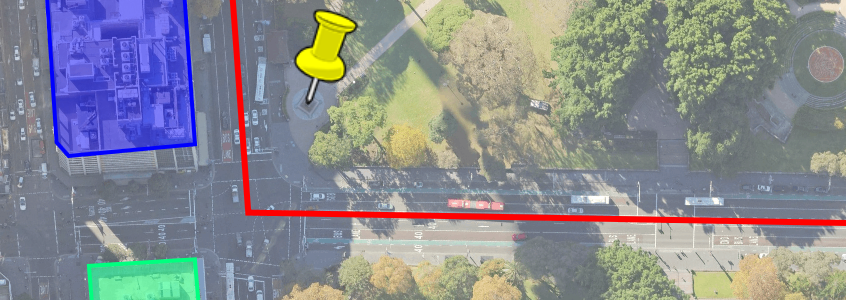

Incorporate Keyhole Markup Language (KML/KMZ) geographic data into your plans and streamline your workflow by getting access to content created in Google Earth and similar KML-based systems.

### Fit Objects

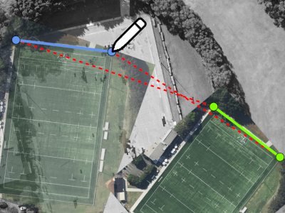

Automatically apply scale and rotate transformations required to fit objects to the underlying basemap or other existing content. This is particularly useful for aligning third party aerials.

### Scale/Rotate at Point

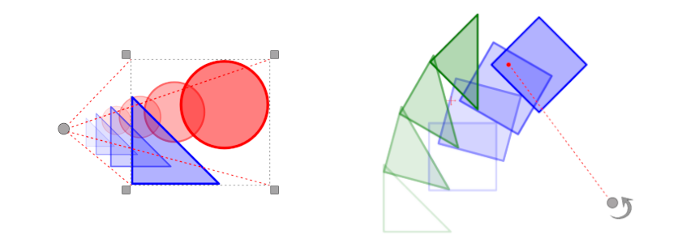

Using the newly added "Select scale/rotate point" options, you can now scale or rotate selected objects around a specific point, provides a CAD-like experience for greater drawing precision and control over your plans.

### Performance and memory usage improvements

RapidPath's core rendering engine has been redesigned to provide significant performance and memory usage improvements, so you can enjoy a faster and more reliable drawing experience.

### More changes

 **Import and export text variables as CSV** - We've added support for CSV (Comma-Separated Values) format, which is commonly used in spreadsheets. By using CSV format, you can easily import and export text variables between our software and other spreadsheet applications, streamlining your workflow and saving you time.

**Batch export one PDF per plan** - The new batch export option “One file per plan” allows exporting multiple plans in a single batch while saving each into a separate file.

**Conversion between a Text Objects and Text Boxes** - Seamlessly convert text objects to text boxes and vice versa.

**Copy and paste multiple layers** - Right-click in the Layers panel and select “Copy visible layers” from the context menu to copy all currently visible layers. Then paste them by selecting “Paste layers” from the same menu.

**Sidewalk offset color** - Sidewalk offset color can now be changed in all Road Tools.

**Print regions position on bearing change** - Changing the bearing of the map readjusts the positions of print regions to ensure that they are accurately centered on the intended location.

**Reset page numbers** - Find this option in “Advanced tools” to recalculate print regions’ page numbers (this will also resets any manual changes to the page numbers).

**Zoomed View Box - drag source area** - With the Zoomed View Box object selected, you can now easily change the position of its source region by clicking on its border and dragging it to a new location.

**Snapping in the Edit crop tool** - Snap to other objects while defining the object’s crop.

**Base stage layers reordering** - You can now conveniently rearrange the order of base stage layers while working on a different stage.

**Multiline stage names** - Stage names now support multiline text.

**Multi Message Sign dialog size** - The size of the MMS dialog is now saved in your application settings. This means that the next time you open the dialog, it will automatically open to the same size you previously used.

## RapidPath 3.9

<iframe width="560" height="315" src="https://www.youtube.com/embed/pbWWQuE7wqs?si=Z2KwuBOWtrkGWCd9" title="YouTube video player" frameborder="0" allow="accelerometer; autoplay; clipboard-write; encrypted-media; gyroscope; picture-in-picture; web-share" allowfullscreen></iframe>

### Predefined Styles improvements

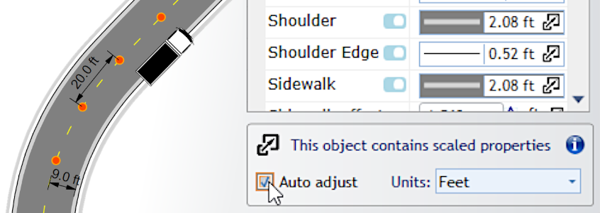

Predefined object styles can now automatically adjust scaled properties to the current plan scale. This lets you use on-site units to specify values for properties like road lane width or delineator spacing and use such styles to draw objects with the correct dimensions on plans at different scales.

Additionally, individual styles can now be added to the Scratchpad for quick access and it's much easier to create custom style icons.

### Print Regions List

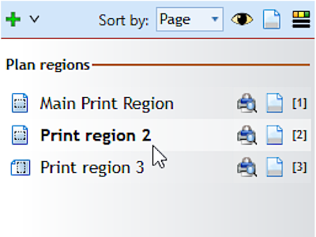

A dockable panel listing all Print Regions on the current plan allows accessing, editing and printing them without having to manually scroll the plan canvas.

### Plan Location tools

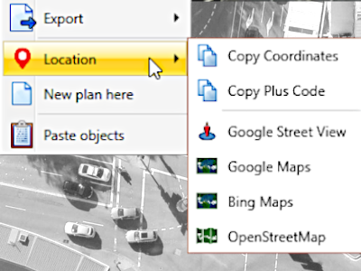

**Right click** on any location while drawing a base map plan and use the location coordinates to look it up in a number of external services including Google Maps and Street View.

### More changes

**Templates in Recent Plans** - The "Recent Plans" list includes TCT templates, providing quick access to the templates you use most frequently.

**Open multiple plans** - The "Open Plan..." file selection dialog now allows opening multiple plans in one go.

**Font underline** - Font Underline decoration was added as a property to all text objects.

**Delete signs with stands** - Use "Alt + Delete" shortcut to remove signs together will their connected sign stands.

**Reversed Delineator devices** - New Device->Reversed property of Delineator objects allows you to make sure your Parallel or Perpendicular device alignment follows your desired direction.

**Road surface objects mask** - Road surface objects like crosswalk, parking bay and flush medians can now mask other underlying markings.

**Print region visibility and style** - The F4 shortcut can be used to quickly toggle print region visibility on/off and the print region decorations style (color, opacity) can be adjusted in Advanced Preferences.

## RapidPath 3.8

### Google Maps support

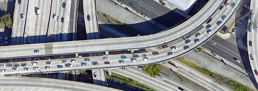

One of the most requested and long awaited features is finally available - Google Maps have been added to the list of supported basemap providers. Pick from one of 3 options: Satellite only, Hybrid Light (with road labels) or Hybrid Full and enjoy working over excellent quality aerial imagery for locations across the globe.

### Invarion Launcher

The Launcher is the new distribution channel for desktop versions of RapidPath, ensuring your Invarion software is always up to date.

### Hyperlink tool

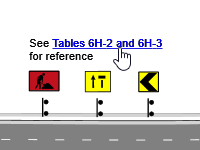

Use the Hyperlink text tool on your plans to reference online resources and other files via clickable links on exported PDF documents.

### Performance and stability

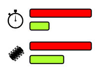

The underlying platform used by RapidPath was updated to improve performance and stability, as well as ensure long term support for our core features.

## RapidPath 3.7

<iframe width="560" height="315" src="https://www.youtube.com/embed/RXNz1CwSoec?si=VAj7OIE_bvyEDFkV" title="YouTube video player" frameborder="0" allow="accelerometer; autoplay; clipboard-write; encrypted-media; gyroscope; picture-in-picture; web-share" allowfullscreen></iframe>

### Multi-layer Snapping

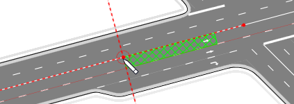

Hold **Ctrl + Alt** while drawing or transforming objects to allow snapping to objects on all visible layers. This is particularly useful when drawing complex plans with multiple stages, as it allows hassle free snapping to base stage objects like road lanes and edges.

### Import new AutoCAD files

The CAD Import tool has been updated to support new formats, including DXF/DWG 2018 used in AutoCAD 2021.

### Snap & Align to Geometry

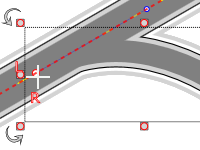

Snap points and align drawn segments not only at control points, but anywhere along a snap geometry.

### Search for Plus Codes

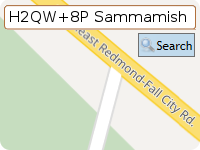

The search bar now supports Plus Codes, a geocoding scheme used by Google as an alternative to street addresses and GPS coordinates.

### Circle/Cloud shaped Zoomed View Box

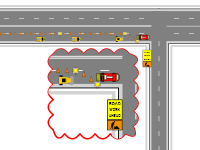

The Zoomed View Box can now be styled to present its content in an ellipse or cloud shaped box.

### More changes

**New LINZ basemaps** - RapidPath users in New Zealand will now benefit from the new LINZ Aerial Imagery Basemap service.

**Sign stand arrows** - sign stand connectors can now be styled to with arrow pointers.

**Double dash lane marking style** - support for drawing double dash lane markers, with customizable dash lengths.

**Auto restore previous session on startup** - the Preferences->Basic Options->On startup dropdown now includes an option to "Restore last session".

**Ungroup Recursively** - the Ungroup Recursively tool allows quickly breaking down complex groups into basic objects.

**Ungroup artwork based tools** - delineators and objects like arrowboards can now be ungrouped for custom adjustment of individual devices/elements.

**Faster aerial photos import** - the Import Aerial Photos tool now uses multithreading to improve import speed.

**Rounded corners on print borders** - the Print Options dialog allows specifying a radius for rounded print borders.

**Click-controller tools palette** - disable the "Auto tools palette popups" option in advanced preferences if you prefer to access Tool categories by clicking the mouse.

**New, and updated, sign and template libraries include:**

* Florida (FDOT) Standard Plans 2020-2021
* Minnesota TTC Field Manual update
* California MUTCD Signs update
* Washington DC Workzone Utility Typicals
* British Columbia Construction Signs update
* Transport for NSW TCAWS Manual Templates 2020
* Transport for NSW TCAWS Signs update
* Queensland MUTCD Q-Series Signs update
* South Australia DPTI Templates 2020
* South Australia DPTI Multi Message Signs update
* Ireland DOT TTM Layout update
* UK Department for Transport/Highways Agency Templates update
* NZTA Signs Update

## RapidPath 3.6

<iframe width="560" height="315" src="https://www.youtube.com/embed/4lZSaLL5t64?si=tUUPk3nWV9wNTH8Y" title="YouTube video player" frameborder="0" allow="accelerometer; autoplay; clipboard-write; encrypted-media; gyroscope; picture-in-picture; web-share" allowfullscreen></iframe>

### Plan locations map

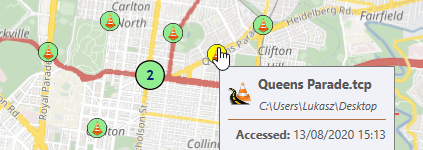

The Welcome Screen now includes a dynamic map control, presenting the locations of your traffic control plans. Browse plans by location, see a quick preview of their details and double-click to open. All recent plans are visible, as well as TCPs from folders you specify.

### Improved Recent Plans

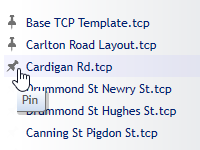

The Recent Plans list can now display up to 50 items, highlights selected item on the map and allows pinning your favorite plans for instant access.

### Show Street View

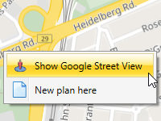

Right-click on a map location and select Show Google Street View to see on-site photos in your web browser (subject to Street View image availability at the specific location).

### Advanced Snapping

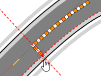

Press the Alt key while snapping to a geometry to enable snappable guides for tangent and perpendicular lines as well as geometry midpoints.

### Rotate Print Regions

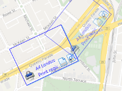

Individual print regions can now be rotated. This is handy when planning works on a long and windy road, where each page needs a different bearing.

### Custom Sign Stands

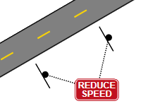

Sign stands now support custom icons and can be positioned, oriented and styled independently from actual signs. Multiple signs can be connected to one stand.

### Search & Replace Signs

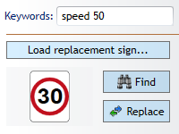

Advanced sign search and replace tool allows quickly finding and updating signs, which is particularly useful when editing very large plans.

### More changes

 **Convert to sign** - the Save Sign dialog now allows automatical replacement of the original object with the newly created sign.

**Create sign group** - group multiple sing panels (e.g. main + complementary) into a single sign group that can be attached to sign stand(s) while still preserving individual panel codes in the manifest.

**Adjust order of stages** - right-click on the Plan Stages dropdown and select "Reorder stages..." to open a dialog where stages can be ordered as required.

**Export text as geometry** - for compatibility with some printer drivers and non-standard fonts, an option to print/export text as geometry is now available.

**Pause plan edit timer** - the plan edit timer can be paused and resumed when required.

**Disable latest autosave check** - when not desirable, users can disable checking for the most recent autosaved version of a plan.

**Minimize/move splash screen** - the RapidPath Splash Screen can now be moved to the side or minimized while RapidPath is initializing.

**Validate saved plans** - to prevent data loss caused by plans getting corrupt when the saving process is interrupted (e.g. when writing to a network location), RapidPath 3.6 will validate TCP files right after they're saved and warn the user if any issues are detected.

**MetroMap provider** - following the recent acquisition of EagleView by MetroMap, we've updated our basemap provider. MetroMap users can access the imagery in RapidPath using their username/password or the MetroMap API Key.

## RapidPath 3.5

<iframe width="560" height="315" src="https://www.youtube.com/embed/WqkFKqh3S3A?si=yo_1WFYUcd65jTLC" title="YouTube video player" frameborder="0" allow="accelerometer; autoplay; clipboard-write; encrypted-media; gyroscope; picture-in-picture; web-share" allowfullscreen></iframe>

### Plan Stages

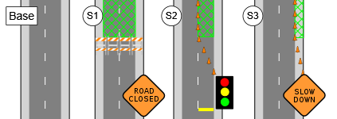

Several phases of works at one location can now be included in a single TCP, using the new Plan Stages feature. Each stage has its own set of layers and print regions, while the Base Stage is used for elements shared across all the other stages (for example the road network and permanent markings).

### Auto Templates

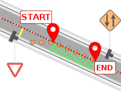

RapidPath can now lay out required devices and signage for a selected set of simple typical jobs. Pick the location, specify worksite dimensions and let our algorithms do the rest.

### Selection Preview

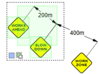

The selection box will now highlight captured objects while you're dragging, letting you see what gets selected. A great way to improve precision especially on complex plans with many objects. And while we're at it, here's a quick guide to the available selection modes:

Selection Modes

 New selection (default)

 Add to selection (hold **Shift** key)

 Remove from selection (hold Alt key)

Capture Modes

 Contained objects (default)

 Intersecting objects (use right mouse button)

### Spellcheck improvements

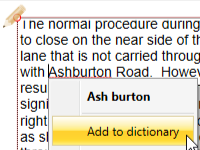

Right-click on an underlined word when editing text and quickly add it to the spellcheck dictionary, so it doesn't get highlighted in the future.

### Inverted Crop

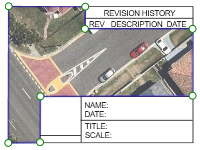

Remove bits that obstruct the view underneath or create fancy cutout shapes using the new Inverted Crop option. This feature will be particularly useful if you ever import a CAD-style page frame as an image - you can then crop out the viewport bit to reveal the plan content.

### Restore from Autosave

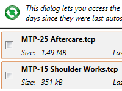

Ever lost work because you accidentally closed a plan without saving it? Use File->Undo close tab to get out of trouble, or just open the plan again and - Rapid will check for the last autosaved version. The latest autosaved versions of all plans are preserved for 14 days and accessible via the Help -> Restore autosaved plans dialog.

### More changes

**Distance Marker breakline** - when not drawing to scale, use the Breakline property of Distance Marker to indicate where the marker symbolically represents a larger on-site distance.

**Print/export all regions** - other than the existing option to export active view, the right-clicking on the diagram canvas now also allows printing/exporting all print regions on the diagram via the Batch Export dialog.

**Toggle text alignment** - use **Ctrl + Alt  + C** to quickly toggle between the available text alignment modes in all selected text objects.

**Quick load print frame file** - if you've saved your standard Print Frame to a file, you will now be able to apply it to new plans quicker. Right-click on the print frame icon and select Create print frame -> From file...

**Drag group by control point** - with an objects group selected, press the Alt key to highlight the grouped objects' snapable control points. You can now use them to move the whole object and snap to other points on the plan.

**Quick-adjust intersection masks** - **Right click** on an intersection object, select Edit intersection elements -> Show mask offset handles. The intersection gets decorated with points you can drag in order to mask out default markings to the desired distance along incoming roads.

**Default aerial tiles provider setting** - you can now set the default aerials import tile provider independently of the default base map provider. This is useful if you normally use cartograpic maps as your plan canvas background, but import tiles from a satellite imagery provider.

**Imported aerial tile details** - each aerial tile will now preserve information about when it was imported, from which provider and which survey (where available). Select the tile to see this information - it will help you work out whether the tiles might need updating should you reuse the plan on another occasion.

**NearMap survey selection improvements** - when selecting a NearMap survey during aerial photos import, a small preview is presented for the selected survey, letting you quickly pick the one with the best level of detail.

**Improved QLD satellite provider** - the QLD satellite provider now uses the new service hosted by the QLD government, providing better quality imagery in most locations.

**Color blind support** - the default color of some on-canvas decorations can now be adjusted in the settings for improved visibility over base maps.

## RapidPath 3.4

<iframe width="560" height="315" src="https://www.youtube.com/embed/h_Lq_4TB75U?si=6tpdY-SYlfz6hObF" title="YouTube video player" frameborder="0" allow="accelerometer; autoplay; clipboard-write; encrypted-media; gyroscope; picture-in-picture; web-share" allowfullscreen></iframe>

### Advanced Geometry drawing

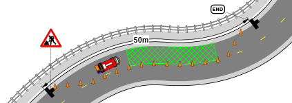

Snap to an existing geometry when drawing an object and RapidPath will automatically create control points to fit the desired curve. Use the Offset Geometry tool to further adjust object position. Drawing delineators, lane markings, work zones along road and lane edges becomes easier than ever. NOTE: use F3 to quickly toggle snapping on/off or **Right click** the toolbar button to individually toggle snapping to points and/or geometries.

### Snap to Bounds

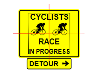

When moving or scaling objects and print regions, their bounds edges and centers snap to each other for quick and precise positioning. NOTE: use F3 to quickly toggle snapping on/off.

### New drawing tools

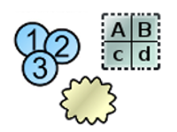

Create notes sections with the editable Text Table, use Cloud Shape and Number Stamper to quickly annotate your TCP contents.

### Advanced Cropping

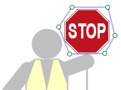

Crop images and other objects to any desired shape, edit individual points and segments in existing crop geometries.

### Improved CAD import

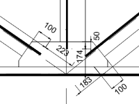

The redesigned CAD Import tool improves import quality and presents a live preview of what gets imported as you adjust the options.

### Batch Export improvements

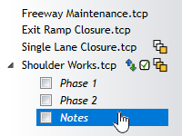

Plans and print regions can now be arranged by drag-dropping the items, then saved and restored as reusable export configurations.

### NearMap integration

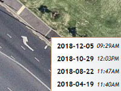

NearMap subscribers in USA, Australia and New Zealand can now access NearMap aerials as base map layer in RapidPath. Requires a NearMap API key - please [read instructions for obtaining one](https://docs.nearmap.com/display/ND/API+Key+Authentication).

### More changes

 **Custom Hatch Fills** - use Primitive objects (Lines and Shapes) to draw a hatch segment, right-click and select Save->As Custom Hatch... To use the saved hatch, select an object with a configurable background, set Properties->Style->Fill->Style to Custom Hatch, then select your saved hatch below.

**Image Georeferencing Tool** - use Tools->Advanced tools->Georeference image files... to create a georeference World File for any map image by pairing two selected pixels with corresponding map locations. Once georeferenced, the image can be imported onto a Base Map plan with it's scale and position adjusted automatically.

**Skew Objects** - create pseudo perspective views by holding **Ctrl + Alt** to turn object scale handles into skew handles.

**Independent Control Point Tangents** - right-click on a Bezier Control Point and check the "Independent tangents" option. This will make both tangent points independent of each other, allowing more complex geometry shapes.

**Merge Layer Down** - select a layer and use the Merge Down button to move all its objects to the layer underneath.

**Print Frame Auto Scaling** - print frames can now automatically scale their objects to preserve their horizontal or vertical proportions to the page size when printing to different pages sizes.

**RapidPath Cloud drag&drop files** - RapidPath Cloud (formerly Share Online) now supports moving files by drag-dropping them between folders.

**Ctrl + B/I for Bold/Italic Text** - all text objects now support **Ctrl + B** and **Ctrl + I** keyboard shortcuts to toggle Bold and Italic text style respectively.

**Downward Text Orientation** - change Text Object's Text->Orientation property to Vertical to make it draw letters top-to-bottom instead of left-to-right.

**MMS Panels and Frames in Manifest** - the Multi Message Sign can now report it's panels and frame to the Manifest individually, to allow counting the number of specific panels required for a job site.

**Adjustable Island Edges** - the Island tool now has a full set of Edge, Shoulder and Sidewalk properties that can be matched with road objects.

**Extend Geometry** - right-click on a geometry object and select Edit geometry ->Draw more points to extend the object at either end.

**Paste Geometry** - copy a geometry object, then select another object, right-click and select Paste->Geometry to paste only the source geometry while preserving object style.

**Individual Object Opacity** - the Opacity of each object can now be set individually.

## RapidPath 3.3

<iframe width="560" height="315" src="https://www.youtube.com/embed/vzrYt5RD5bE?si=2B_wHJHPWzcWkUba" title="YouTube video player" frameborder="0" allow="accelerometer; autoplay; clipboard-write; encrypted-media; gyroscope; picture-in-picture; web-share" allowfullscreen></iframe>

### Intersections Editor

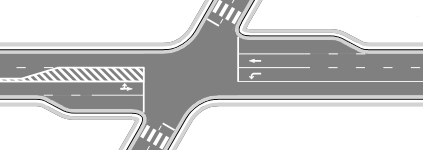

Create complex intersections with just a few mouse clicks. The intersection editor will assist you in adding corners, turn lanes, markings, crosswalks and lane symbols. Once created, an intersection remains fully adjustable and editable.

### Dimensions Input Panel

Start typing at any time while drawing objects to specify precise distance, angle, offset, point or coordinates for the next point. Pixels or site distance units can be used (for plans drawn to scale).

### Sign Stand tool

All sign devices can now display an adjustable stand icon to specify their exact position and orientation.

### Road Width Handles

Select a road and press **Ctrl + H** to display a set of handles that allow quick resizing of lanes, shoulders and sidewalks.

### Print & Export improvements

Get more control over your output with the Print Current View tool, fixed output scale mode and preserving layers in exported PDFs.

### Improved Location Search

Searching for your job location in the New Plan Wizard is now more accurate and flexible. When your search query matches several locations, a selectable list is presented.

### Export Device Coordinates

The Manifest Export tool can now include location coordinates for signs and other devices, both when exporting to PDF and to machine readable formats which can be used to import the data to other traffic management systems.

### More changes

 **Double-click to repeat last tool -** double-click on a blank space on the drawing canvas to repeat the last operation (e.g. draw another text object)

**Rotate and scale multiple objects individually** - when multiple objects are selected, you can press the Alt key to change transformation mode from collective to individual. The scale and rotate handles will then transform each object individually (in place).

**Importing road names and speed limits** - After using the Roads Import tool, right-click on the imported roads and select "Import road data". If the required data is available in OpenStreetMaps, your roads will get annotated with names and speed limit signs.

**Zoomed View Box improvements** - The Zoomed View Box can now outline the source region and lets you select which layers it is displaying.

**Optimize Images tool** - to reduce the file size of plans containing large amounts of image data go to Tools -> Advanced tools -> Optimize images.

**New Plan Here tool** - right-click anywhere on an existing plan and use the "New Plan Here" tool to create new plans in selected locations.

**JPEG2000 support** - RapidPath now supports the JPEG2000 format both for import and export.

**New base map providers [AUS & NZ]** - high quality aerial photos from Land Information New Zealand (LINZ), Land Information System Tasmania (Orthomaps Tasmania). Additionally, Spookfish enterpsise license holders can now access Spookfish maps directly from RapidPath.

## RapidPath 3.2

<iframe width="560" height="315" src="https://www.youtube.com/embed/ZqSQmxp3Rr4?si=y1WhpwYNcYzGYkjI" title="YouTube video player" frameborder="0" allow="accelerometer; autoplay; clipboard-write; encrypted-media; gyroscope; picture-in-picture; web-share" allowfullscreen></iframe>

### Print Frames and In-Place Print Preview

Frames allow drawing titleboxes and other plan annotations on a separate paper-space layer and reusing them for multiple plans and print regions. Combined with in-place print preview they provide full control over how TCP objects are positioned on printouts.

### Text Variables

Use Text Variables to create reusable templates and objects whose text gets auto-filled based on built-in or custom variable values. Custom variables can be defined for a single plan only, or application-wide. While editing text, type the '$' character to see a list of available variables.

### Importing Georeferenced Images (NearMap / MapInfo Integration)

Import and automatically position aerial imagery from external applications that use georeferenced images. This feature will enable you to import maps from applications like NearMap or MapInfo Pro.

### Zoomed View Box tool

The Zoomed View Box tool allows you to create insets presenting specific site areas at a higher level of detail. The tool is available in the Annotations category of the Tools palette.

### Export Manifest tool

Create manifest documents based on one or more traffic control plans, then print or export to a range of formats: PDF, Text, CSV, XML and Json. Access the export tool by right-clicking on a Manifest Box, or via File -> Export -> Batch Export -> Export batch manifest...

### Find Objects listed in Legend/Manifest

Legend and Manifest Boxes can now be used to trace entries back to the actual on-plan objects they represent.

### New Base Map providers [Aus only]

![New Base Map Providers [Aus only]](./assets/131739809194929861-VicMaps.png)

New base map providers allow access to VIC, NSW and QLD state government services, containing detailed cartographic data and high-resolution imagery. In the provider selection dropdown, click More providers..., then select the providers you want to use - they will become visible in the dropdown. NOTE: the VicMap Basemaps services require a license, please contact State of Victoria, DELWP for details.

### More changes

 **Editing text in groups and signs** - double-click on any text object that's part of a group or sign to edit it in-place.

**Improved signs search** - the signs palette will now find all signs containing the provided word or phrase.

**Faster signs loading** - loading signs and templates has become significantly faster, to make switching between libraries almost instant.

**Break/join object at point** - split multi-point objects into separate sections and join separate objects into one

**Multi-Message dialog improvements [AUS only]** - added support for inverted frames, swapping left/right panels and hiding unused signs

**Combined federal/state libraries [AUS only]** - all state libraries are now based on 1742.3 and you can select whether you want the whole federal+state set displayed, or just the state-specific signs.

## RapidPath 3.1

<iframe width="560" height="315" src="https://www.youtube.com/embed/DLPNw1SCmGo?si=58LWxB3ZoK1EjMGD" title="YouTube video player" frameborder="0" allow="accelerometer; autoplay; clipboard-write; encrypted-media; gyroscope; picture-in-picture; web-share" allowfullscreen></iframe>

### Control Point Snapping and Road Alignment

Precisely connect objects with each other by snapping into existing control points. Hold the **Ctrl** key while point-snapping roads or other objects and their geometries will merge seamlessly.

### Measurements Panel

Press F8 to quickly measure distances, areas and angles on your plan. Measurements are precise, zoom-independent and can be saved as marker objects.

### Base Map Bearing

Base map bearing is now adjustable, so you can draw your plans at any orientation.

### Selection improvements

The selection box has been optimized for extra flexibility when selecting multiple objects. Additionally, you can now preview and select objects across all layers by holding the **Ctrl + Alt** keys.

### New Drawing tools

Use the Marked Path tool to illustrate vehicle movement direction and the Road Region tool to draw irregular asphalted regions like parking lots.

### Road Ends

Roads can now automatically draw Flat, Round or Cul-de-sac endings with a specified radius.

### Improved PDF compression

Files produced by exporting your base map plans to PDF are now much smaller and can be easily distributed as email attachments.

### Multi-Message Bookmarks

The Multi Message Sign dialog loads faster, shows panel codes and lets you bookmark your most used panels for instant access.

### More changes

**Scale/Rotate By...** - precisely transform your objects by typing in scale factors and rotation angles.

**Resize Signs Tool** - improve plan readability by uniformly adjusting the size of all sign icons.

**Move All** - move all object on the plan or on selected layers (lock the layers you don't want to move).

**Adjustable Hatch Fills** - line thickness and spacing can now be adjusted for all hatch fill styles.

**Static Legend/Manifest Boxes** - legend and manifest can be converted to static lists, which allows you to copy them between plans/layers while preserving their original content.

**Apply Predefined Styles** - predefined styles can now be applied to new and existing objects alike.

***\*Multipage Printing Guides\**** - when printing to multiple pages, RapidPath can automatically draw page guide lines that make it easier to join pages.

***\*TIFF Support\**** - Tagged Image File Format (TIFF) is now supported in all image import and export tools.

**Adjustable Mouse Buttons** - if your mouse device has additional buttons (Middle, X1, X2), you can use them as shortcuts for selected commands.

**Autosave Improvements** - plans autosaved in previous RapidPath sessions can now be restored for up to 14 days.

## RapidPath 3.0

<iframe width="560" height="315" src="https://www.youtube.com/embed/f2V5d3LrRVo?si=hGzROd9NuuOGBtBR" title="YouTube video player" frameborder="0" allow="accelerometer; autoplay; clipboard-write; encrypted-media; gyroscope; picture-in-picture; web-share" allowfullscreen></iframe>

<iframe width="560" height="315" src="https://www.youtube.com/embed/BuxZl8RMM5o?si=I8DmQyusB_N7nXva" title="YouTube video player" frameborder="0" allow="accelerometer; autoplay; clipboard-write; encrypted-media; gyroscope; picture-in-picture; web-share" allowfullscreen></iframe>

### Integrated Base Maps

RapidPath can now display a dynamic base map preview on the plan drawing canvas, download aerial tiles as plan background, import road network data and display lat/lng coordinates of any point on the plan. All you need to do to enable these features is specify plan location and scale. You can toggle between maps provided by Bing, ArcGIS and Omniscale, but we're planning to add even more providers in future RapidPath releases.

### New Plan Wizard

Use the New Plan Wizard to quickly specify all properties of a new plan you're creating. The wizard integrates the creation of four basic plan types: Blank canvas, Base map, From template and From PDF.

### Unrestricted Canvas

The plan drawing canvas is now fully unrestricted. Scroll to its edges and it'll expand automatically. Use print regions to indicate which parts of the canvas you want to include on printouts.
TIP: the "Scroll to origin" button will help you quickly go back to diagram center.

### Copying Object Styles

After you copy an object to clipboard, select another object and use the Paste Style tool (**Ctrl + Shift + V**) to have all the properties of the original object automatically applied to it.
TIP: use the Duplicate Style tool (**Ctrl + Shift + D**) to draw an object using the same style as your current selection.

### Editing Text

All objects containing text can now be easily edited on-canvas. Simply **Double click** on the text you want to change and start typing.

### Batch Print

Batch Export tool is now accompanied by Batch Print - a dialog that lets you quickly print multiple plans. Both dialogs have a new clean design and allow selecting print regions you want included on the printout.

### Performance improvements

RapidPath has been redesigned to make the most out of your computer's capabilities. It is now quicker, more responsive, uses less memory and loads TCPs up to 10 times faster than before!

### Distance Markers

Auto Distance Markers have been merged into the corresponding Distance Marker tools, so each marker can now display site distance in the selected units (Default), or custom text - depending on its Marker Mode property value. Additionally, we've added a Combined Offset Distance Marker Tool, as well as new text alignment options for all marker types.

### Plan Properties

You can now specify job location coordinates for each traffic control plan you're drawing. Other than integrating base maps, in the future this will allow you to search your plans by location (show all plans in a selected area). Additionally, job start and end dates can be specified.

### More changes

 **Custom spellchecker dictionary** - add words and phrases you often use so that SpellCheck knows they're valid.

**Properties panel improvements** - advanced editors for Stroke, Fill, Text and other properties. Adjustable ordering and searching.

**Redesigned Quick Edit dialog** - if you prefer the dialog over the Properties panel, the new Quick Edit tool now allows you to edit all object properties.

**Reorganized toolbars, menus and keyboard shortcuts** - quick access to the tools you use the most.

**Improved diagram rulers** - accurate rulers that help you measure Site, Page or Pixel distances on your plan.

**Non-blocking background operations** - load, save, print, export and autosave operations are much quicker and run in the background without blocking the RapidPath window.

**Swap zoom & pan keys** - if you prefer using the Control key over Shift for mouse-wheel zooming, you can now enable this option in Preferences.

**Copy/paste hex colors** - the color editors now allow you to copy and paste precise color values in hex RGB format.

**New US paper sizes** - the following fixed print region sizes were added (Imperial metrical system only): ANSI C Sheet (17x22''), ARCH C Sheet (18x24''), ANSI D Sheet (22x34''), ARCH D Sheet (24x36'').

**Resizing print regions** - print regions can now be freely scaled in each direction. Hold the **Shift** key down while scaling to preserve region proportions.

**Arc Pie tool** - a new tool for drawing filled arc figures.

**Dotted Hatch fill** - primitive objects can now be filled with a CAD-like Dotted Hatch brush.

**Better lane markings customization** - lane marking dash lengths and gaps can now be accurately adjusted for all lane marker styles. Additionally The dedicated Lane Marker tool has a new Mask property, which by default lets you automatically cover up any underlying markers.

**Accurate plan Edit Time** - the Edit Time counter only ticks when the plan is open and its tab currently active.
