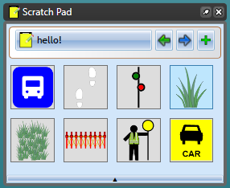
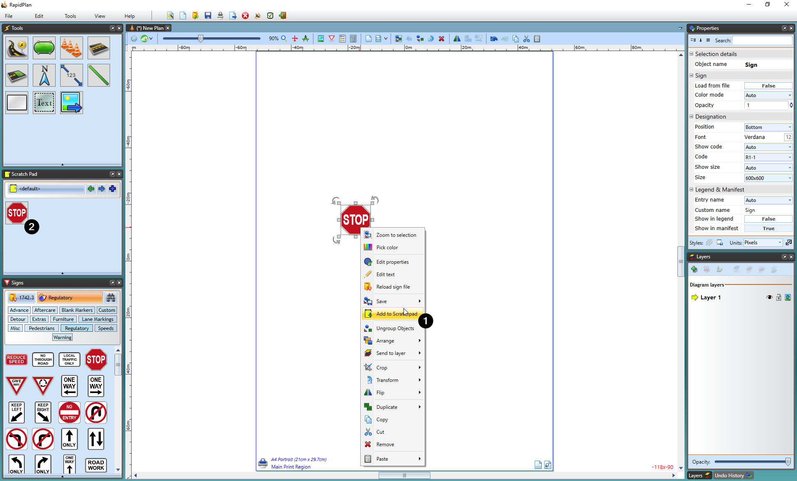

---

sidebar_position: 3

---
# The Scratch Pad

The Scratch Pad is used to store objects that you commonly use to make them easily accessible.

To place an object in the scratch pad palette, select the object then right click and select **Add to Scratchpad**.

## Scratchpad management

Right clicking on an object *inside* the scratch pad will allow you to remove it or **reorder buttons**.
In the reorder buttons menu you will be able to click and drag scratch pad items into different orders, as well as using the slidebar control at the bottom to change the size of icons in the scratchpad.
Once you are finished in the reorder screen, click OK done to finish.

## Folder management

Folders can be added in the scratchpad by clicking the **plus icon** in the top right. Folders can be renamed or deleted by right clicking on them.

