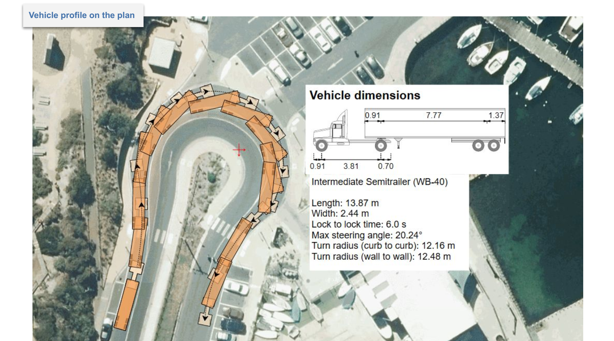
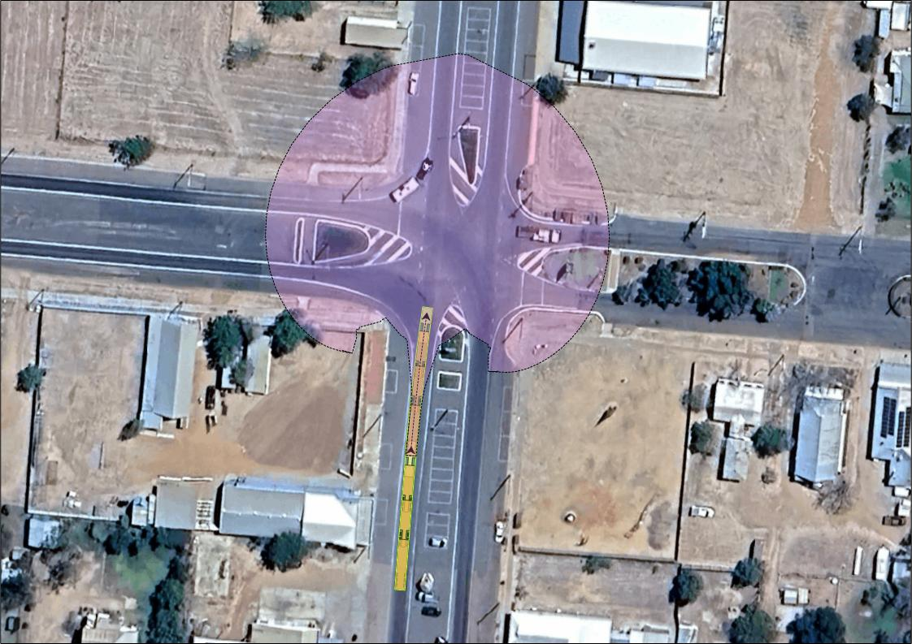
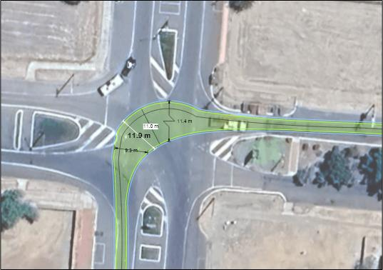

---

sidebar_position: 6

---
# Using Swept Path Annotation Items

## Adding a Vehicle Profile

It is always a good idea to add the description of the vehicle used for the Swept Path Analysis to your document. You can easily do this by clicking with the right mouse button on the vehicle or Vehicle Path and choosing "Add profile" from the appropriate sub-menu ("Vehicle" or "Vehicle path").

The **Vehicle Profile** displays the:

- Vehicle's name;
- Vehicle's side view with the most important dimensions; and
- Vehicle's properties crucial for the Swept Path Analysis.

You can ungroup the vehicle profile, then edit and style its parts - just like you would any other RapidPath objects.

**Note:** a **Vehicle Profile** can also be added from the vehicle itself (rather than by clicking on a drawn path). To do this, right click the vehicle, hover over **Vehicle** in the menu and select **Add Profile**.

## Adding Predicted Movement Area Clouds

If you need to demonstrate not a specific path that a vehicle can take, but a vehicle's capacity to manuever at a number of angles in a given situation, a Predicted Movement Area cloud can be added to your plan that will be visible when the plan is exported.

To do so, right click on a swept path, hover over **Vehicle Path**, and select **Add predicted movement area**.
Then, moving your mouse over the swept path you will be able to click to select the position of the vehicle at a given point in the path at which to generate the **predicted movement area**.

### Predicted Movement Area cloud properties

Clicking the **predicted movement area** cloud will open an array of options in **Properties** in which you can alter both its appearance, as well as its spacial characteristics (by means of altering implied vehicle behavior).

Changes to the **Vehicle** section of its properties will decide whether a copy of the vehicle is visible as an element of the cloud, and the appearance of the vehicle.

Changes to the **Style** section of the cloud's properties will alter the fill and stroke of the cloud itself.

Changes to the **Parameters** section of the cloud's properties will alter the behavior of the vehicle that is implied by the cloud.
When the cloud is initially generated, it will mimic the properties of the vehicle at the selected section of the swept path envelope. Because of this you will likely not need to alter **Parameters**.

Modifiable **Parameters** include:

- **Direction of Travel**
- **Speed** and **Friction**
- [**Turn on Stop**]((./preparing-swept-path-analysis.md/#editing-an-existing-vehicle))
- **Range Factor** - How far the cloud extends (at max value of '1' by default).
- **Units** - chosen unit of measurement.

Note that a **Vehicle Predicted Movement Area** cloud can also be generated from the vehicle itself by **right-clicking**the vehicle > hover over **Vehicle** in the menu > select **Predicted Movement Area**.

## Swept Path Width Markers

**Markers** are a valuable tool to demonstrated the width of your swept path at a chosen point.

Once a swept path has been created, **markers** can be added by right-clicking on the path, hovering over **Vehicle Path** and selecting **Add Marker**.

Once this is complete, wherever you click on the swept path a **marker** will be placed.
If you have [**Clearances**](./swept-path-analysis-properties.md/#clearance) engaged, holding **Ctrl** as you click will widen the **marker's** span to include the **clearance** area.

### Swept Path Width Marker Properties

Once a **marker** has been created, like all other objects it can be selected and its properties - adjusted.

The properties section labelled **Marker** is a space in which the content of the measurement displayed on the marker can be adjusted:

- **Units** - alter the unit of measurement used.
- **Significant Digits** - alter how many decimal places are included.
- **Mode** - when set to *Default*, the measurement will display the distance measured based on the span of the marker. If set to *Custom Text*, it will display the input in the **Text** field.

**Note:** Like other objects, tThe content of the marker can also be edited by **Double clicking** on it and typing a new value or message.

The **Style** and **Arrows** fields alter the appearance of the line and arrow aspects of the marker's apperance.

If required a breakline symbol can be added to the marker using the fields in the **Breakline** section of the marker's properties.

The **Text Style** of the marker can be altered, including adding/removing a background to the text and changing its color.

The marker's presence and appearance on the **Legend & Manifest** can, as for all objects, be altered in the given field.
