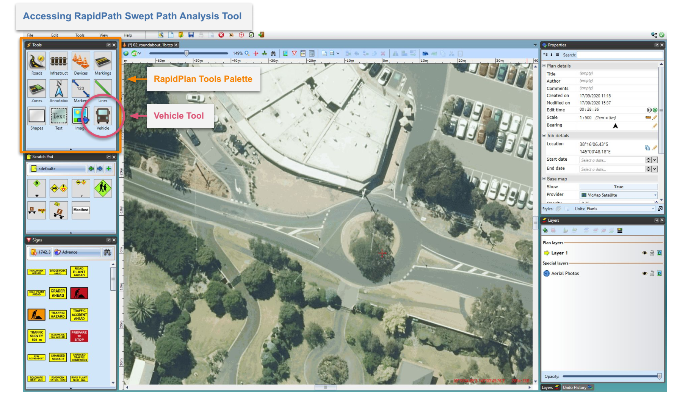
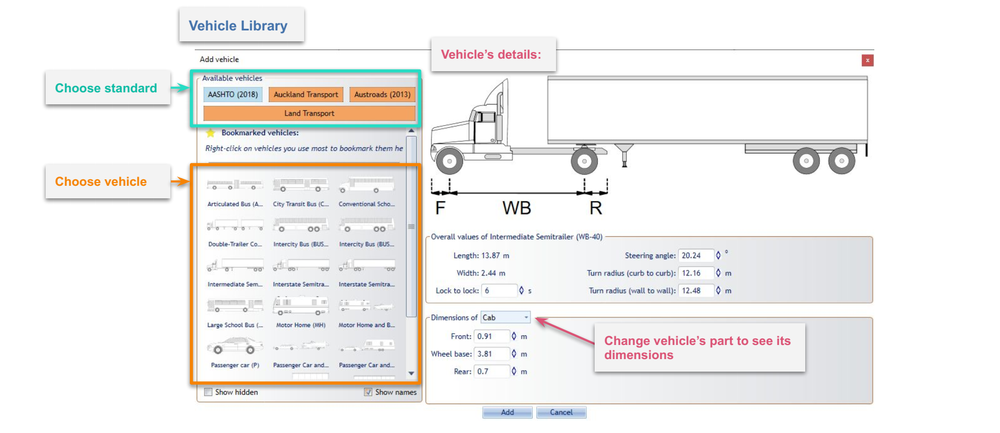
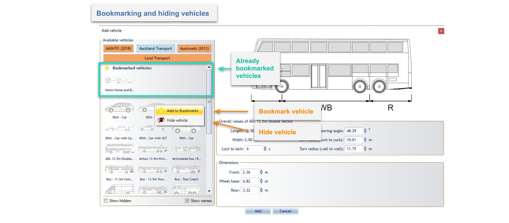

---

sidebar_position: 3

---
# Using the Vehicle Library

To open the RapidPath Vehicle Library you need to select the Vehicle tool from the Tools Palette.

The Vehicle Library window is divided into two parts. The left section is used for browsing through available standards/guidelines and their predefined vehicles. Standards available to you will depend on which country you are operating in and/or which vehicle bundles you have included in your subscription. The right section displays information about the currently selected vehicle. It shows a side view diagram of the vehicle, key dimensions and parameters necessary for the swept path analysis. The unit system used (metric or imperial) is dependent on your application settings (under Preferences).

Use the buttons at the top left to choose the vehicle package (country standard, etc), then appropriate vehicles will appear below. Select the vehicle to see its details. Vehicle's dimensions are visible at the bottom of the right section. If the vehicle consists of many parts, or contains trailers, use the select box to choose the part you are interested in. Changing the vehicle part will also adjust dimension markers on the side view, so they refer to the appropriate part. The selected part will be highlighted in red.

All of these parameters can be modified when editing already placed vehicles. Read more about it in the [Adding Vehicle to The Plan and Editing and Existing Vehicle](/docs/rapidpath/Preparing-Swept-Path-Analysis.md) topics on the next page.

**Note**: Changes made to the vehicle will not be saved to the Vehicle Library.

You can bookmark frequently used vehicles by clicking on them with the right mouse button and choosing "Add to Bookmarks". Bookmarked vehicles are displayed at the top of the vehicles grid regardless of the chosen standard. You can also hide unwanted or unused vehicles by choosing "Hide panel".

