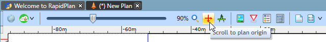
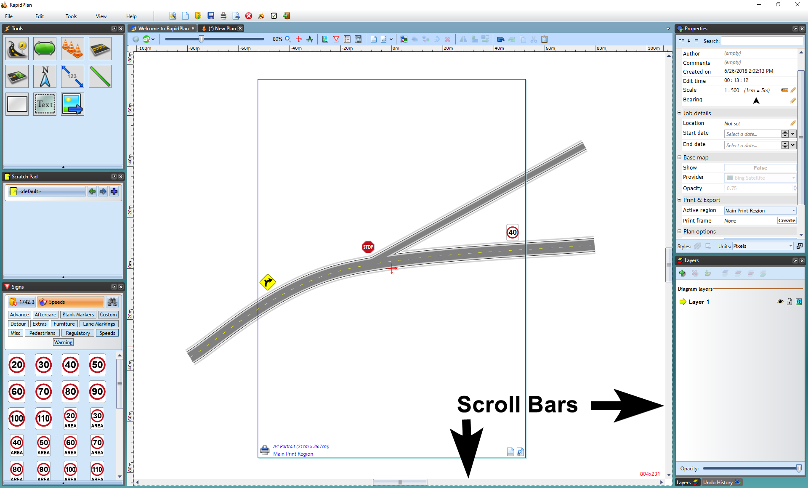
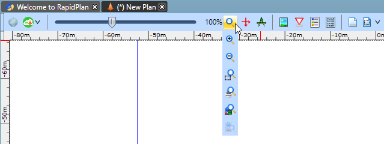
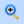
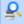
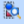
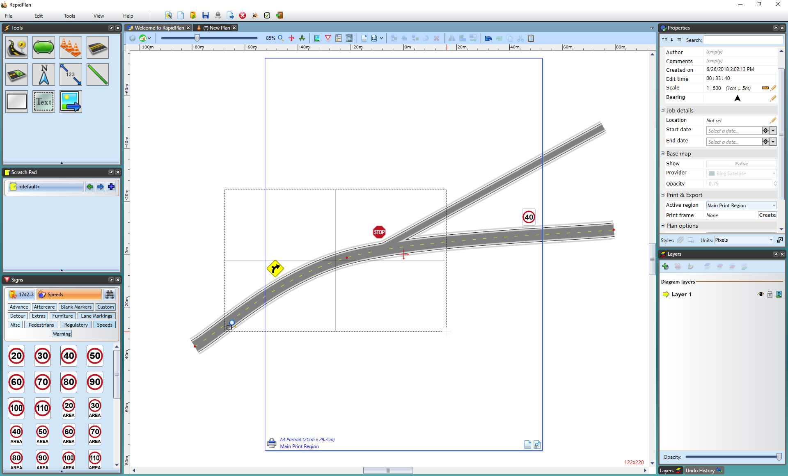
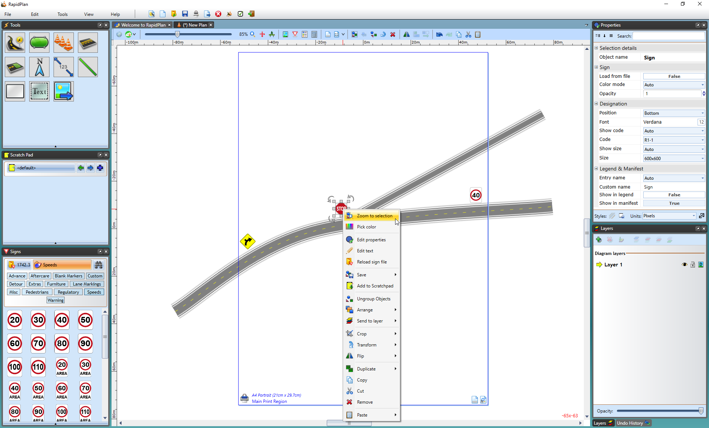

---

sidebar_position: 3

---
# Canvas Navigation

There are essentially four ways that you will need to master when it comes to navigating around the canvas: the origin icon, scrolling, zooming and shifting between layers

## Scroll to Plan Origin

If you become lost in your unrestricted canvas, you can simply click the **Scroll to Plan Origin** icon and it will take you back to the origin of your canvas.

## Scrolling

Scrolling used around the RapidPath canvas is very simple, and there are two main ways to do so.

### The Canvas-Shift Technique

Holding down the **SPACE BAR**, then dragging on the canvas with the mouse will cause the canvas to move and follow the mouse. It is an extremely efficient way of moving around, because your mouse need not leave the canvas to action the scroll bars.

### The Scroll Bars

Using the scroll bars like virtually all desktop publishing programs (and virtually all other Windows applications) RapidPath has a set of scroll bars along the edge of the canvas allowing you to move up, down and across the canvas. This will be the primary way that you will move around in RapidPath.

## Zooming

 Getting to grips with the various zoom techniques is also critical. Seldom will you ever construct a plan at one zoom level for the entire duration of your plan drawing. There are many zoom features catering to an array of needs.

| Zoom toolbar                                      |  Description                                                      |
|:-------------------------------------------------:|-------------------------------------------------------------------|
|             | **Reset Zoom** - This first option is used to reset the canvas to the set scale                                       |
|               | **Zoom In** - This feature is used to zoom closer into your plan in a general manner                                    |
|              | **Zoom out** - This feature is used to zoom  your plan out in a general manner                                      |
|           | **Select Area to Zoom to** - Used by selecting a desired area to zoom to (*see the **note** below)  |
|       | **Adjust Zoom to see Active Print Area** - This feature zooms the print region you have outlined                      |
|      | **Adjust Zoom to see all Objects in Plan** - This feature zooms to a range that completely encompasses all of the elements on the plan, but no more. This feature is especially helpful if you lose your bearings on the unrestricted canvas   |
|  | **Adjust Zoom to see Selected Objects** - This feature is used to zoom in on a selected object                        |

**Select Area to Zoom** to can also be done by:

- Selecting **Select Area to Zoom to** in the zoom toolbar.
- Click and drag (hold down the mouse button) a box around the area that you wish to magnify.
- The area that you encapsulate in your zoom region will be shown in full in your drawing window.

    

Alternatively:

- for this feature you can simply right-click on a selected area of the canvas and select **zoom to selection**.

    

## Unrestricted Canvas

RapidPath offers an unrestricted canvas. Virtually limitless in size, this canvas allows you to draw anywhere from a small simple plan to enormous traffic management plans when you need to. With no restriction on size, it's ideal for applications like races, parades or large scale, multi-block road closures.
It has a range of printing options which allow you to print either your entire plan, or just certain sections as you need. This is especially useful for large jobs which have multiple traffic treatments which you may wish to print into individual plans.

To view or edit your plan properties just use the Properties Palette located to the right of the canvas. Properties can also be accessed through **Edit > Plan Properties** or default shortcut key **F2**.

