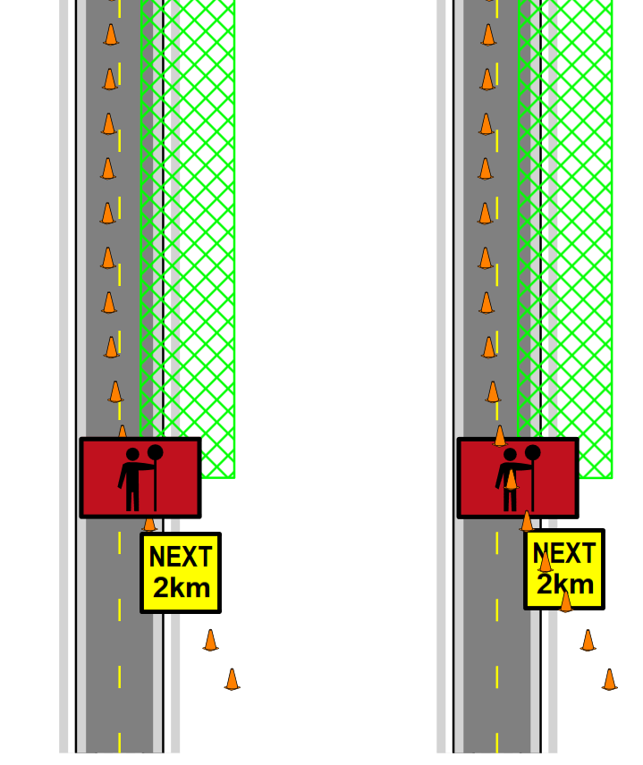
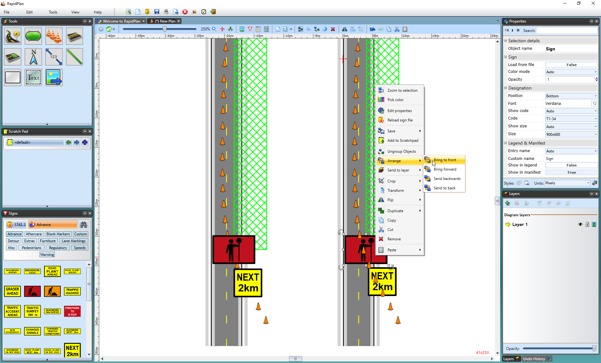

---

sidebar_position: 4

---
# Managing the Order of Your Canvas

An important function of the RapidPath canvas is the ability to order objects. The following diagram demonstrates the concept of ordering.

Ordering is a very important concept to understand because inevitably during the course of your plan creation you will need to move something over or under something else that you've already drawn. Fortunately, the ordering process is simple.

## Changing the Order of Objects

**To change the order of objects on the canvas with the mouse:**

- Select the item that you wish to alter the order of.
- Once it is selected, right click on the object.
- Select **Arrange** >
  - **Bring to front** - on top
  - **Bring forward** - one step forward
  - **Send backwards** - one step backward
  - **Send to back** - on bottom

You can also use the keyboard shortcut keys to effect the change, which will be faster and easier.

**To change the order of objects on the canvas with the keyboard:**

- Select the item that you want to alter the order of.
- Hold:
  - **Alt + Home** - Bring to front
  - **Alt + Page Up** - Bring forward
  - **Alt + Page Down** - Send backwards
  - **Alt + End** - Send to back

**Note**: the reordering of items happens only inside the scope of the given layer. That is to say that if you are operating on a lower layer and attempt to bring an object to front, it will still be drawn behind anything on a higher layer.
