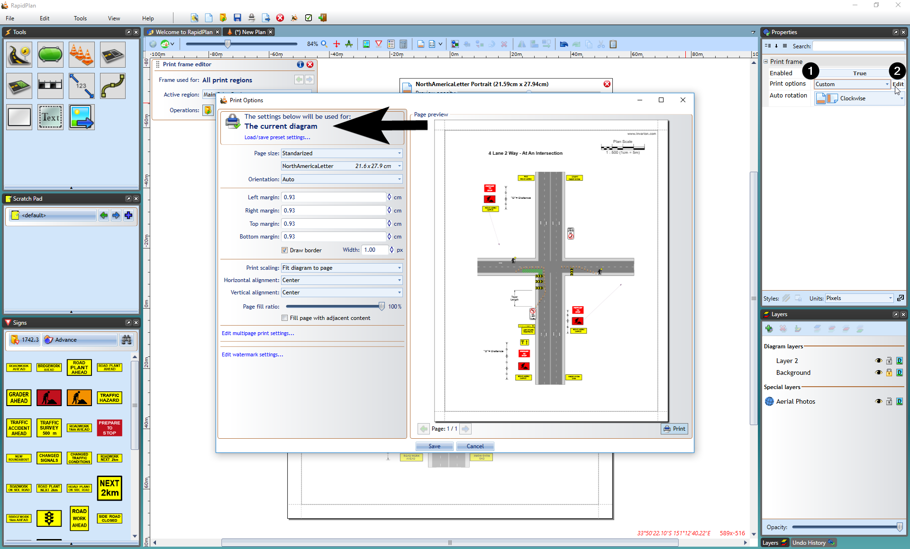

---

sidebar_position: 8

---
# Print Frames

## Typical Usage Scenarios

- Reusing standard TCP annotations - if your TCPs need to have a similar titlebox layout (company logo, job details, planner signature, permit number), you can extract these annotations into a print frame and reuse the frame for different TCPs, only adjusting the necessary details.
- Adjusting annotations to page size - print frames automatically adjust to the current print page size and can auto-rotate their content to ensure annotations are printed in the same position regardless of whether you're printing in portrait or landscape orientation.
- Aligning annotations with page edges - when the proportions of your print region don't exactly match the proportions of the page printable area, you're often left with additional margins between the page border and the content that's scaled to fit inside. Anchoring annotations to frame edges ensured they're aligned with printout borders.
- Preventing annotations from obscuring other print regions - when drawing plans with multiple overlapping print regions, extracting annotations to print frames prevents them from obscuring contents of other regions.

## Creating Print Frames

Print frames can be defined either for individual print regions or for the whole plan (in which case the same frame will be used for all print regions). To create a plan frame, use the toolbar button. To create a print region frame, **Double click** on the region's print frame icon. A popup dialog appears, confirming that you're about to create a new print frame. Once a print frame is created the corresponding icon changes color and can be used to open the frame editor view.

The print frame editor view presents a preview of the printout page with TCP contents scaled to fit inside the page (page size, orientation, margins and the content scaling mode are based on the current print options). You can now start drawing frame objects on top of this page preview and they'll be positioned exactly the same way when you actually print or export the plan. The frame editor mode allows using all kinds of objects and editing them like on a regular plan layer.

Once you're done editing the frame, you click one of the red X icons or press the **Escape** key to go back to close the frame editor view. Anytime you need to edit the frame again, use the plan toolbar or print region frame icon. Alternatively, right-click on the print region icon and select **Edit print frame**.

## Setting a Default Frame

If you're using a single frame template for most of your TCP documents, you can make it the default frame, which means it will automatically be used when printing/exporting diagrams that don't specify their own frames. Save your frame as a .tcpf file, then go to **File** > **Print** > **Print Options** and click **Edit default print frame settings**. This expands a panel letting you browse for the pre-saved frame file.
Check the **Use as default print frame** box and the frame contents should appear on the Print Preview. Click Save to close the options dialog.

## Anchoring Print Frame Objects

Anchoring objects to frame edges can be used to ensure they're always positioned the same way with respect to the page border, regardless of the current page size and orientation. This makes your frames more flexible as they'll automatically adjust to any printout dimensions. To anchor an object, select it and double-click on one of the 8 anchor points represented by blue triangles.
This will automatically move the object towards the anchor point. If you prefer to create the anchor without moving the object, hold the **Ctrl** while double-clicking. In either case, the object's offset from the anchor point will be preserved when the page size changes.

You can also right-click on the anchor point to see the available options.

Going back to the full print frame example presented above, let's anchor each object to the closest page corner and check how changing page size and orientation affects the page preview. As you can see below, the frame contents are still positioned against the corners even after we change the page size.

It is sometimes desirable that the frame rotates its objects when page orientation changes, for example when the plan is using a single frame but has multiple print regions of different orientations. Frame rotation can be done manually with the button located on the Print Frame Editor panel, or by selecting an Auto-rotation mode from the frame Properties.

## Print Frames - Overriding Print Options

By default, when printing or exporting TCPs RapidPath uses the application-wide settings specified in the **File** > **Print** > **Print Options** dialog. However, when creating a print frame it is possible to make it override the default settings and use its own options (for example when a specific print region should be printed to a different paper size). While editing a print frame, go to its **Properties palette**, change **Print options** to **Custom**, then click **Edit**.
This will open a print options dialog that lets you specify settings to be used when printing the current plan or region only (depending on whether your frame is defined for the plan or region).

## Reusing Print Frames

Frames you create for specific plans and print regions are saved together with the plan. The print frame editor additionally allows saving frame contents to separate .tcpf files, so they can be reused on other plans. If you have one or more standard sets of annotations you use for your TCP documents, paste each of them on a print frame and save the frames to separate files.
Then anytime you create a new plan, you can load the appropriate pre-saved frame file and only upload the plan-specific details like job location or permit number.

