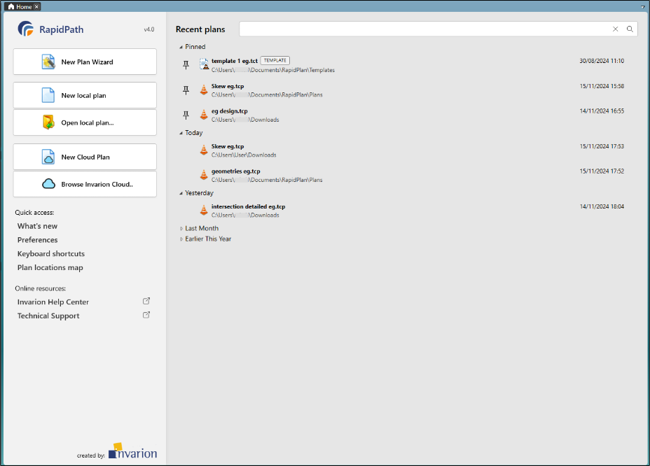
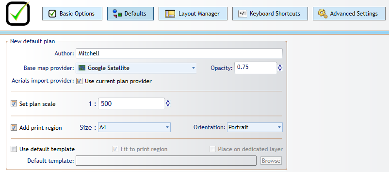

---

sidebar_position: 1

---
# The Home Screen

When you open RapidPath, you will land on the Home Screen:

## Recent Plans

Recently Plans are listed in order of the date they were last edited. Plans can be *Pinned* to the top of your recent plans list by clicking the pin icon to the left of a plan.

*Right-clicking* a plan in Recent Plans will reveal a drop down menu:

- **Unpin** the plan from the top of the Recent Plans list.
- **Remove from list**: Remove the plan from the Recent Plans list.
- **Open** the plan.
- **Open in background tab**: Open a plan in the background, so that it can be reviewed later.
- **Open containing folder** in File Explorer.

## New Plan Wizard

Use the New Plan Wizard in the top-left to start a plan.  specify all properties of a new plan you're creating. The wizard integrates the creation of five basic plan types: **Blank canvas**, **Base map**, **Static template**, **From PDF**, and **Auto template.**

## New Local Plan

Opens a new default plan, to be saved locally.

Both New Local Plan and New Cloud Plan create default plans: These Bypass the Plan Details page that New Plan Wizard utilises, creating a new plan based on your system preferences (set in **Tools > Preferences**).

## Open Local Plan  

Opens plans save locally (not in the cloud).

## New Cloud Plan

Like **New Local Plan**, New Cloud Plan creates a *default plan*, but saves it to the cloud.

## Browse Invarion Cloud

Opens an Invarion Cloud tab in RapidPath, where plans can be reviewed, managed and opened.

## Quick Access

Quick Access features:

- **What's New**: Brings you to the [Release Notes](/docs/rapidpath/release-notes/release-notes-rapidpath.md) section of the RapidPath Help Center.
- **Preferences**: Opens a [Preferences](/docs/rapidpath/installation-preferences-and-adminstration/managing-preferences.md) tab in RapidPath.
- **Keyboard Shortcuts**: Opens a tab in RapidPath listing enabled keyboard shortcuts.
- **Plan Locations Map**: Opens a mapped view of your plans, as this can sometimes be easier than seeking your plans' filenames.

## Online Resources

Online resources brings you here to the Invarion Help Center, where you can learn all about how to use RapidPath to its fullest.
