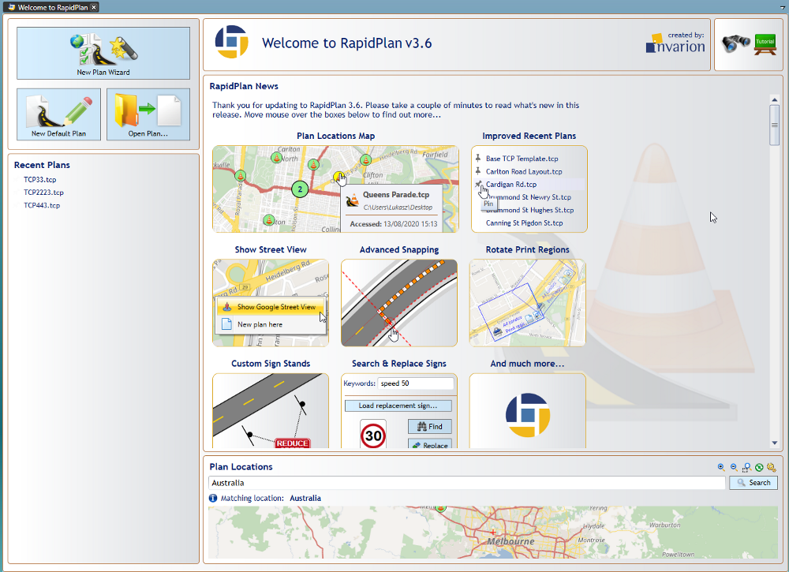
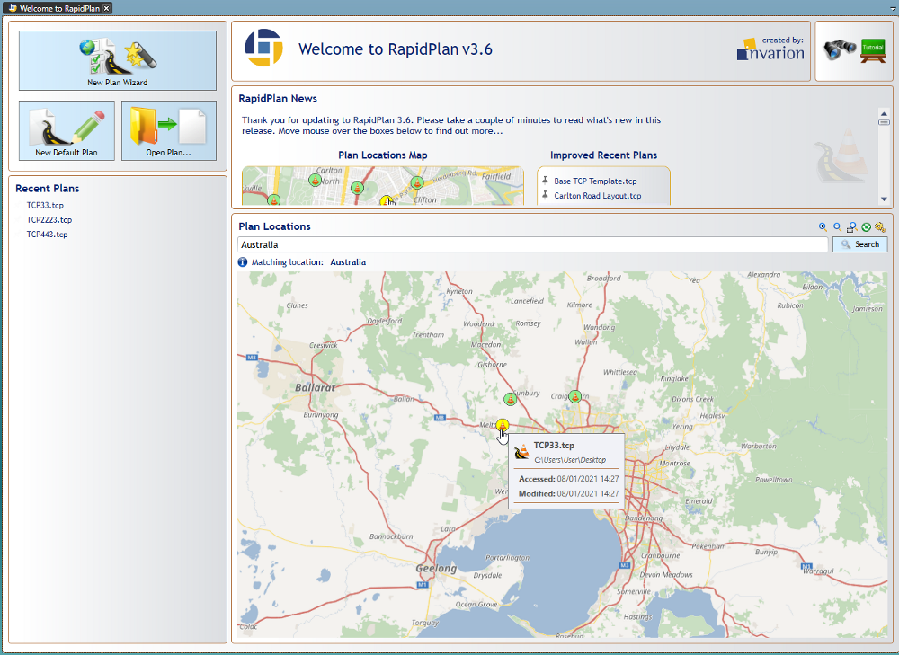

---

sidebar_position: 1

---
# The Welcome Screen

## New Plan Wizard

Use the New Plan Wizard to quickly specify all properties of a new plan you're creating. The wizard integrates the creation of five basic plan types: **Blank canvas**, **Base map**, **Static template**, **From PDF**, and **Auto template.**

## New Default Plan

This selection provides you with a default canvas. Default plan settings can be amended and saved in **Tools > Preferences**.

## Open Plan

Saved plans can be loaded with this selection.

## Recent Plans

Recently saved plans can be quickly accessed from here, hovering over each plan will highlight them on the Plan locations map.

## Tutorials

Selecting this takes you to the **Invarion RapidPath YouTube** page where you have free access to video tutorials covering topics from the basic RapidPath overview, using available tools and controls, up to some more advanced tips and uses.

## RapidPath News

This section provides you with the latest updates and news from RapidPath.

## Plan locations

The plan locations map plots your plans on a map. By clicking a pin, you can view plan information, such as when the plan was last accessed and modified. You can also right-click on a pin and select 'Show Google Street View' to see street view images in your web browser (subject to Street View image availability at the specific location).

