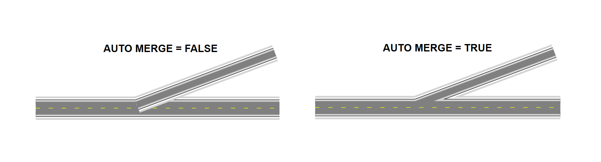
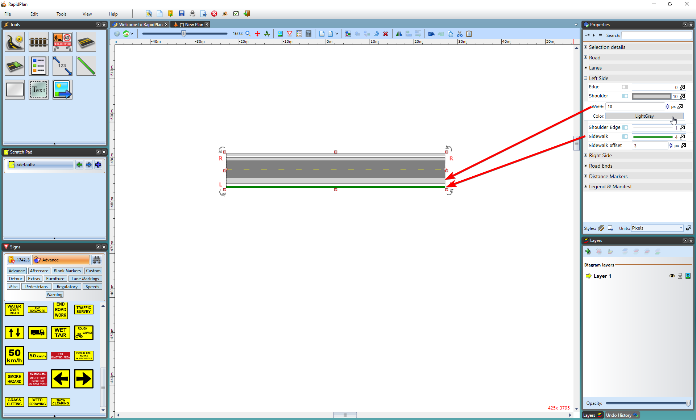
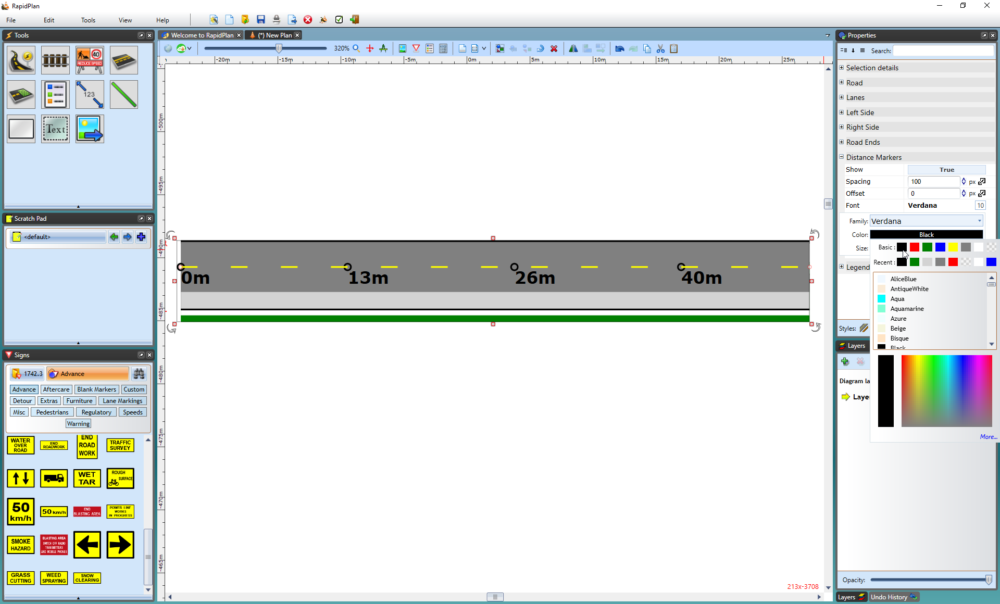
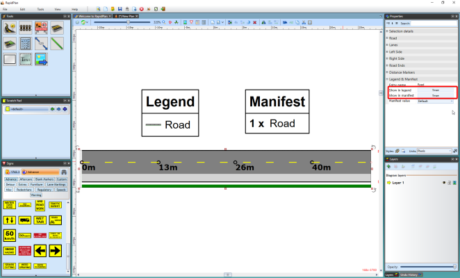

---

sidebar_position: 4

---
# Properties of the Road Tool

Of all the tools in RapidPath, the Road has by far the most power and flexibility. Accordingly, there are a great many settings you can alter to set your road up as you require. You can change:

- Road color, geometry and auto merge
- Lane number, width, color and lane markings
- Left side/right side edge line, shoulder and sidewalk widths and colors
- Distance markers
- Legend and manifest preferences

All of the above settings are accessed through the road properties screen. You can access the properties screen by double clicking on the road you need to change from the Quick Edit mode or from the Properties palette.

## Alter geometry and color

The Road section of the road's properties allows you to adjust the color, the road geometry (Spline, Line or Bezier) and auto merge preferences.

**To change the color of the road in the properties palette:**

- Select the road on your plan
- Select the **Road** section on the properties palette
- Select the **Color** bar (the blue bar the image below)
- Some color options will become available for you to choose from

    

The **auto merge** feature controls whether a new road will automatically merge with the selected road. As shown below, when set to **True** it means the new road will automatically merge, **False** means it will not.

## Lanes

In this section you can edit the number of lanes, lane width and lane markings (including width color and style).

**To change a road's lane markings in properties:**

- Select the road.
- On the Lanes tab in the properties palette select Markings.
- Change the width value, the color and/or style of the markings (Dashed, Solid, DashSolid, SolidDash, Double or None), dash and gap length.

Styles of Lane Markings for your roads:

Each line marking on a road is set individually, so you can have different markings for different lanes. Each extra lane you add will accessible in the Markings section.

## Sides of the Road

By default, each road is drawn with both a left and right edge line shoulder and sidewalk. You can set the width of the shoulders and sidewalks, or choose to turn them off completely. The left and right sides can be configured individually, and as such do not need to be the same in appearance.

In this section you can adjust the left/right edges (color, width), shoulders (width, color, shoulder edge) and sidewalks (width, color, offset).

**To change Left Side (or Right Side) shoulder properties:**

- Select the road.
- On the **Left Side/Right Side** section of the properties palette select **Shoulder** to adjust the width and color of the Left Shoulder (see the image below).

    **Note**: The Edges and Sidewalks can be adjusted in a similar way.

    

**To turn a edge/shoulder/sidewalk on or off:**

- Select the road.
- On the Left Side/Right Side section use the check boxes to toggle the on/off state of the properties as shown below.

    

## Properties of the Road Tool - Distance Markers

This section allows you to activate distance markers on the road. On the image below, you can see the distance markers have been set to **True** and are visible on the road, also font color changed to black.

**To activate Distance Markers on a road:**

- Select the road.
- On the **Distance Markers** section of the properties palette click **False** in the **Show** section to change it to **True**.

    

## Legend and Manifest

By default, roads are not included in **Legend** and **Manifest**. To change this you to activate the road object on a **Legend & Manifest** section.

There you can also choose the manifest value as **Default** or **Dimensions** and set custom **Entry name** (see the image below)

**To activate road on your plan's legend and/or manifest:**

- Select object.
- On the **Legend & Manifest** section of the properties palette clock on **False** on **Show in legend** section to make it **True**.

    

    

    **Note that this function is in the properties of all objects in RapidPath**
