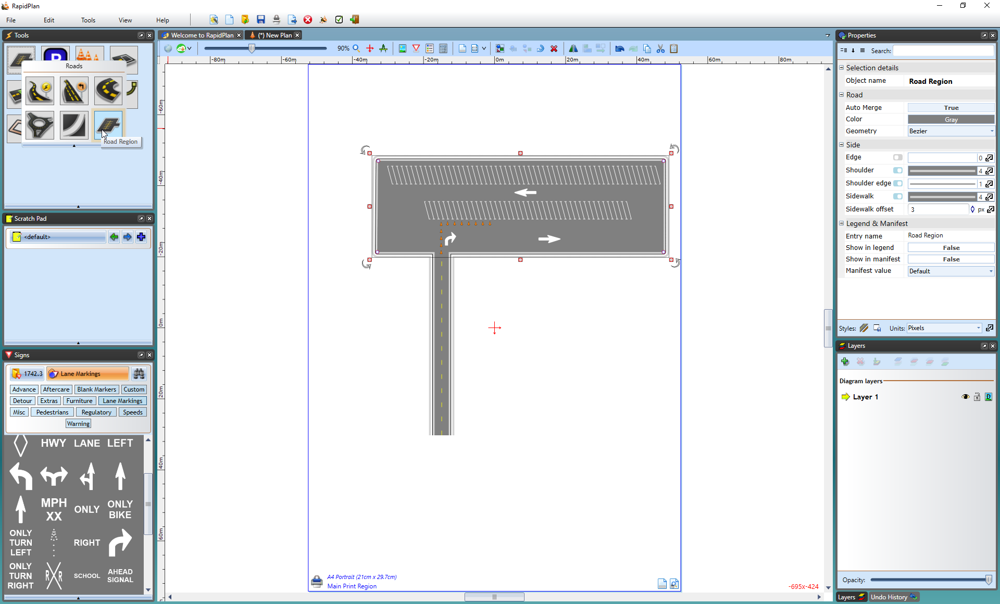

---

sidebar_position: 1

---
# Other Road Creation Tools

Often, the road tool alone will be all you need to create your roadway. Other times you will need some extra pieces to make your road look the way it should. RapidPath has many more tools which compliment the road tool and allow you more options in your plan creation. They can be found in the Roads tab of the Tools Palette.

## The Turn Lane Tool

This tool is used for making a slip lane or a turning lane.

**To create a turning lane:**

- Select the **Turn Lane** tool from the Roads tab in the Tools Palette
- Assuming you are adding this to a pre-existing road, click on the road where you want the turning to start
- Click again around the middle of the turning lane to place a control point
- Place your final click where you want your turning lane to end
- Right click to drop the tool

    

## The Road Arc Tool

This tool allows you to create a precise arc in a road with ease. As you can see in the images below, it is created from a radius.

**To create a Road Arc:**

- Select the **Arc Road** tool in the Roads tab of the Tools palette
- Click once to set the radius of the road arc
- The second click is where you start drawing your road arc from
- Now drag your cursor in the direction you want the road
- Click to place the road
- Right click to drop the tool

    

You can also choose to set the arc's radius, angle and direction manually in the **Arc** tab of the Properties Palette.

## The Roundabout Tool

The Roundabout tool is relatively simple to use and blends easily like other road tools.

**To Create a Roundabout:**

- Select the **Roundabout** tool in the Roads tab of the Tools palette
- Click once to place the roundabout, this is going to be a center of your roundabout
- Shift your mouse up or down to make the roundabout bigger or smaller
- Right click to finish

    

## The Road Corner Tool

This tool allows you to easily create road corners for your roads. It is controlled by three control points to assist in the shape and positioning of the object and a single shape point that controls the shape of the curve.

**To create a road corner:**

- Select the **Road Corner** tool from the Roads tab in the Tools Palette
- Place your first click where you want your corner to begin
- The second click places the inner corner of the object
- The third click places the final corner
- The final click positions the shape point.
- As mentioned, there are three control points and shape point to help you adjust the object

## The Road Region Tool

The Road Region tool is **free form** road tool which you can use to draw irregular paved surfaces, like parking lots.

**To create a road region:**

- Select **Road Region** tool from Roads tab in the Tools Palette.
- Start your region at the smallest corner and click once to start drawing.
- Move in either a clockwise, or anti-clockwise order, clicking at each of your region's corner points (**Note:** Remember, you can hold **Shift** to keep the corners of your region perfectly straight).
- When you have placed your last point, right click to stop drawing, and then right click to drop the Road Region tool.

