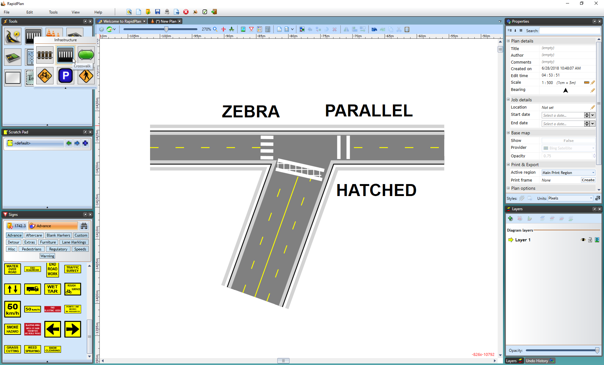
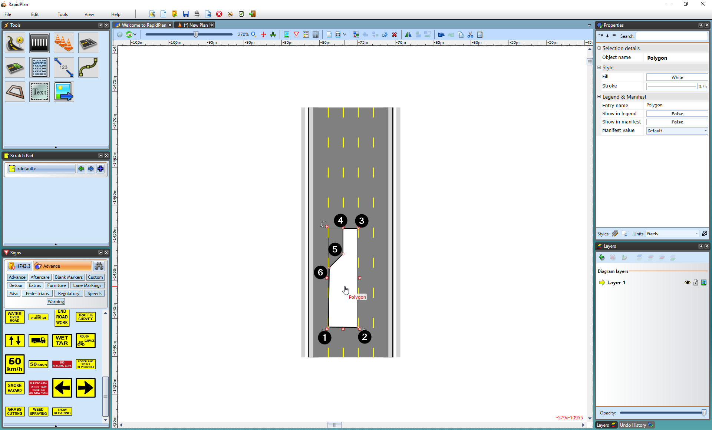
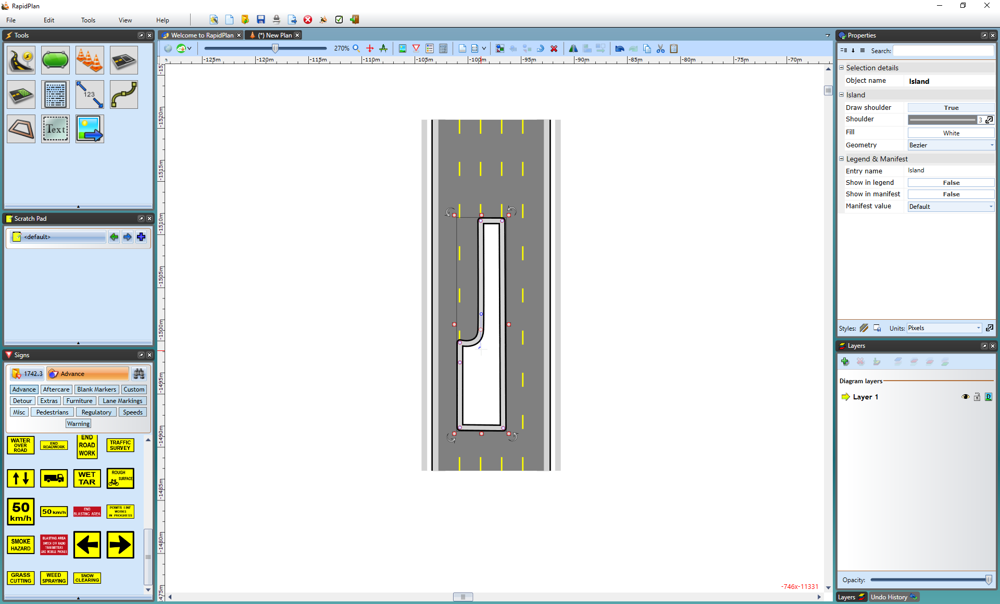
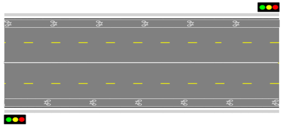
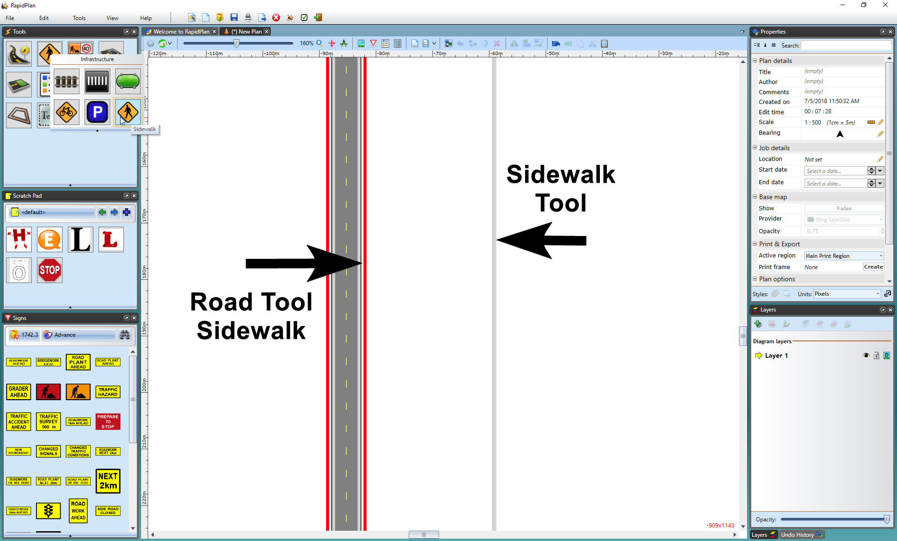

---

sidebar_position: 4

---
# Road Infrastructure Tools

These tools enable you to add infrastructure to your road plans. They can be found in the **Infrastructure** tab of the Tools Palette.

## The Train Tracks

The Train Tracks tool allows you to quickly add train or tram (light rail) lines to your plan.

**To place a train line:**

- Select the **Train Tracks** tool from the Infrastructure tab in the Tools Palette
- Click once to start your rail line.
- Click at each turn point.
- Right click to stop drawing.

    

To place a tram line on **Properties palette** change **Type** value from **Train** to **Tram**

## The Crosswalk

The Crosswalk tool is a handy tool that creates crosswalks on roads, arcs, and roundabouts. There are a few options available when editing the crosswalk. You can change the crosswalk width and type to parallel or hatched. The stripe width and spacing can also be changed to accommodate your specifications.

**To create a crosswalk:**

- Draw your road
- Select the **Crosswalk** tool from the Infrastructure tab in the Tools palette
- Place your cursor where you want the crosswalk to start and left click your mouse once to start drawing
- Right click to finish drawing

    

Three different types of crosswalks have been created in the screen print above. Crosswalk type can be changed on the Properties palette.

## Traffic Islands

Learning how to create traffic islands/refuge points and center medians is important. There are two tools that you can use in RapidPath to create them - the Polygon tool and the island tool.

**Islands with the Polygon:**

Creating islands with the polygon is as simple as tracing out the shape of your island on your road. This is the easier of the two methods.

To create an island with the polygon:

- Select the Polygon tool from the Shapes tab in the tools palette

- It is best to start your island at one of its corners. Click once to start drawing

- Move in either a clockwise, or anti-clockwise order, clicking at each of your island's corner points (Note: Remember, you can hold Shift to keep the corners of your island perfectly straight)

- When you have placed your last point, right click to stop drawing, and then right click to drop the Polygon tool

The picture above shows an example of a click sequence to create an island. Polygon is a free form tool, you can make islands of virtually any shape.

**To create an island with the island tool:**

- Select the **Island** tool from the Infrastructure tab in the tools palette
- Start your island at the smallest corner, click once to start drawing
- Move in either a clockwise, or anti-clockwise order, clicking at each of your island's corner points (**Note**: Remember, you can hold **Shift** to keep the corners of your island perfectly straight)
- When you have placed your last point, right click to stop drawing, and then right click to drop the Island tool

    

There are two main differences between using the polygon and Island tool:

**Note that you should never start your island on a steep corner point (anything greater than about 45 degrees). This is because it can cause the shoulder lines to cross over.**

The technique for creating control points is simple but requires some practice.

**To create a curved island:**

- Draw your island as normal
- Ensure your cursor is clear of the Island Tool by right clicking
- Now select the Island that you've drawn by clicking on it once
- Move your cursor over the control point that you wish to curve and hold down the **Ctrl** button on the keyboard. The control points will then turn from red to blue and display curve handles
- Drag the curve handles out (away from the control point) to increase the radius of the curve until you are happy with the islands shape

    

## The Bicycle Lane Tool

The Bike Lane tool works similarly to tools like the Polyline and the Road tool. The bike image can be changed from a Standard (as shown below) to a Shared lane symbol in Properties.

**To place the bike lane:**

- Select the **Bike Lane** tool from the Infrastructure tab in the Tools Palette.
- Click to start the bike lane.
- Hold **Shift** to create a straight lane, or click to create control points to adjust the lane's shape.
- Right click to finish.

## The Parking Bay Tool

This tool makes it simple to add parking bays to your plan. In the items Properties Palette you have a selection of Parking styles. As you can see below, they include sides & corners, full, sides, and corners.

|Parking Bay type options                   |Parking Bays along a road                      |
|:-----------------------------------------:|:---------------------------------------------:|
||   |

**To place a parking bay:**

- Select the **Parking Bay** tool from the Infrastructure tab in the Tools Palette.
- Click at the first corner and drag out a line (hold **Shift** to keep straight).
- Click again to make the second corner then drag the parking bays out to make their full shape.
- Click a third time to complete it, and Right click to finish.

## The Sidewalk Tool

The **Sidewalk** tool is used like any **Polyline** tool. In the example below, you can see that the Road tool's sidewalk and the Sidewalk tool's sidewalk are visually the same, however, you have more control over the Sidewalk tool as it is an individual item, such as putting a sidewalk through a grassy patch like in the example below.

