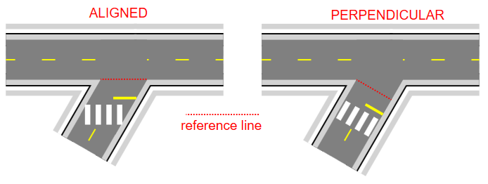

---

sidebar_position: 6

---
# The Intersection Editor

The Intersections Editor tool can be used to create complex intersections with just a few mouse clicks. The editor will assist you in adding corners, turn lanes, markings, crosswalks and lane symbols, automatically aligning them with underlying roads. Once created, an intersection remains fully adjustable and editable, or it can be ungrouped for custom adjustments of the individual elements.

## Creating and Editing Intersections

The Intersection tool is available from the Tools palette, in the Roads category. After selecting the tool, the first click positions the center of the intersection, then subsequent clicks add roads to the intersection. Once you've placed 3 or more roads, right-click to finish drawing, right-click again to release the tool, then click on the intersection to select it (TIP: alternatively, double-click when placing the last road - this will finish the drawing and select your object in one go).  

When an intersection object is selected, Control Points are available to adjust the length and position of incoming roads, and the Intersection Editor panel is displayed - this is where you will be editing intersection elements. To change style of an incoming road, for example to change the number of lanes, select it in the editor list and its style options will be exposed in the Properties panel.  

 

## Adding and Selecting Intersection Elements

Note the 4 icons at the top of the Intersection Editor panel - these can be used to switch between the available editor modes:

- Road properties - adding and editing incoming roads,

- Road extensions - road corners and turn lanes,

- Markings - lane markers, stop lines and flush medians,

- Symbols - crosswalks and lane symbols.

To add an intersection element, switch to the required category and click one of the add [+] buttons in the panel. This will decorate the intersection with additional [+] buttons showing places where this type of element can be added. The sample below shows the process for adding a turn lane:

 

Once an intersection element is added, it appears on the elements list in its category. You can select an intersection element directly from the list, or by holding the Ctrl+Alt keys and clicking on the required element of the intersection object. The selected element gets highlighted with a red outline. TIP: to select more than one element hold the Ctrl key when selecting from the editor list, or Ctrl+Alt+Shift when clicking on the intersection object.  

 

## Editing Element and Positioning Styles

When an element is selected, it displays a draggable Offset point. You can drag the point to position the element along the road it was added to (Offset = 0 represents the position at which the road meets the other roads forming the intersection). For Turn Lanes, the point allows adjusting the lane length, and for Road Corners - the corner radius. Some elements (Lane Markers, Flush Medians) present two points - for adjusting the Offset and the Length of the element.

NOTE: since the Offset value is relative to the intersection, changing the layout of roads forming the intersection will automatically adjust all intersection elements.

Other than dragging the points, you can also provide specific values for Offset, Length of selected intersection elements in the Properties panel. The Properties grid also contain some more advanced settings (see the set of properties for a Flush Median element below), allowing you to draw medians with different transitions and tails. Note the "Edit mode" button - for elements that have editable styles, clicking it exposes the dedicated style properties instead of positioning ones.

 

One property that requires an additional comment is Position & size -> Orientation that determines the reference line used when calculating object position for the current Offset value. The orientation can either be Aligned (with the line connecting the points where the road meets its left and right neighbors) or Perpendicular (to the road itself). For roads meeting at right angles these modes will produce identical results,
but for some other road layouts it'll be important to understand the difference in order to achieve the desired positioning, particularly for objects stretching across the road, like the crosswalk or stop lines. The difference between the two modes is presented below:

 

## Ungrouping Intersections

The intersection editor is designed to assist in drawing typical intersections. If any additional adjustments are required for more complex intersection layouts, an intersection can be ungrouped, allowing all its elements to be freely edited (ungrouped elements become regular plan objects, exposing adjustable control points and properties). To ungroup, simply select an intersection and hit Ctrl+U.

Sometimes, instead of ungrouping the whole object, you might want to detach a specific element from the intersection. To achieve this, select one or more elements, right-click and select Edit intersection elements -> Detach from intersection. This will remove the elements from the intersection and replace them with identical object added directly to the plan. See an example below:

## Connecting Incoming Roads

The intersection object exposes control points at the end of each of its roads. These points can be snapped to when drawing a road object or adjusting control points of an existing road. Holding down the Ctrl key while snapping to intersection enables automatic road alignment - RapidPath will automatically adjust the shape of the road so that it seamlessly merges with the intersection object.

 
