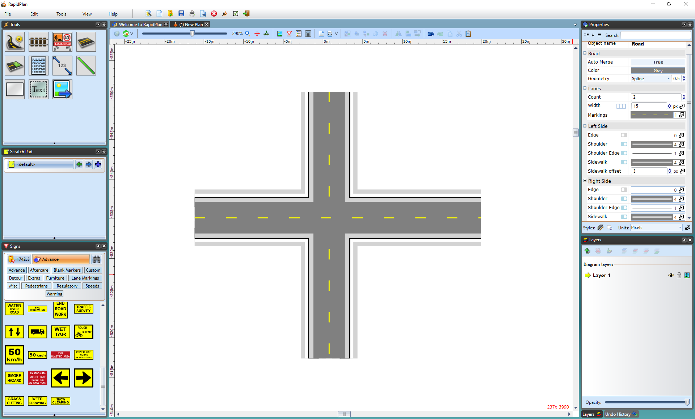

---

sidebar_position: 6

---
# Creating Intersections

The real power of RapidPath lies in its ability to quickly create intersections. They are formed by "adding" new roads to existing ones. RapidPath will automatically remove edge lines, shoulders, and sidewalks to blend at the intersecting point where a road is overlapping another road.

**To form an intersection:**

- Select the Road tool from the Road Tools tab.
- Draw your first road.
- Now draw a second road overlapping the first road.

    

Once the added road is in place, it can be modified like any other.

*See [this section](/docs/rapidpath/the-tools-palette/road-tools/advanced-intersections/what-this-section-covers.md) for Advanced Intersections.*
