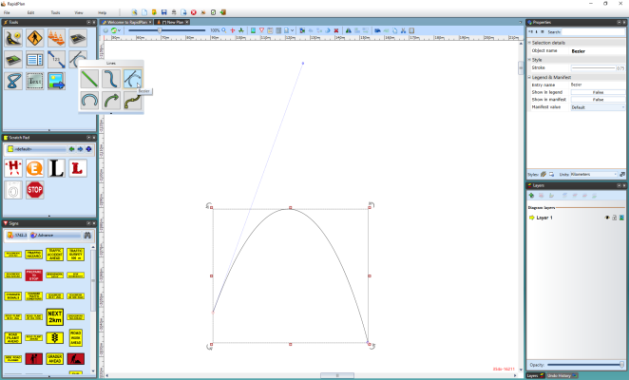

---

sidebar_position: 3

---
# The Bezier Tools

One of the trickier techniques to master in RapidPath is the drawing of a Bezier. Beziers offer a powerful way to create curves with great precision.

There are two components of a Bezier curve:

- The center **Control Point** sets the apex of the curve.
- The **Curve Handle** allow you to set the direction and sweep of the curve.

    

## Drawing a Bezier

When you are using either the **Filled Bezier** or the **Bezier** tool, it is important to understand that, depending on the technique you use, there are two different types of control points you can lay down.

A regular **Control Point** (without the Bezier functionality) is placed if you simply click, release the mouse button then move on.

A Bezier style control point (with **Curve Handles**) is placed if click, hold, drag, and unclick as you drop out a
point.

The tools are designed this way so that you can create a shape or line that has both curved and straight corners, such as the one below:

## Using the Curve Handles

Using the Curve Handles may initially seem a little tricky, but once you have had some practice, most people prefer the Bezier to the Spline because of the precision it offers. The crucial factor is the location of the handles relative to the control point itself, the further from the control point,
the wider the sweep of the curve and vice versa. To manipulate the curve handles, click on **Ctrl** and one of the handles and move your mouse in any direction. Using our shape from above, the effect of the curve handles is easily seen.

## To Modify a Bezier Curve Handle

- Click on the shape or line to reveal its control points.
- Click on one of the two curve handles until the mouse cursor changes to a +.
- Hold down **Ctrl** and drag the curve in and out.

## Converting non-Bezier Control Points

If you place a regular control point on a Bezier or Filled Bezier but decided you need to turn it into a Bezier point, this is easily achieved.

**To convert a standard control point to a Bezier control point:**

- Select the **Filled Bezier** or **Bezier** by clicking on it once.
- Click once on the control point you wish to convert. (The cursor will change to a +.)
- Hold down **Ctrl** on the keyboard and drag the handles in or out as you choose.
