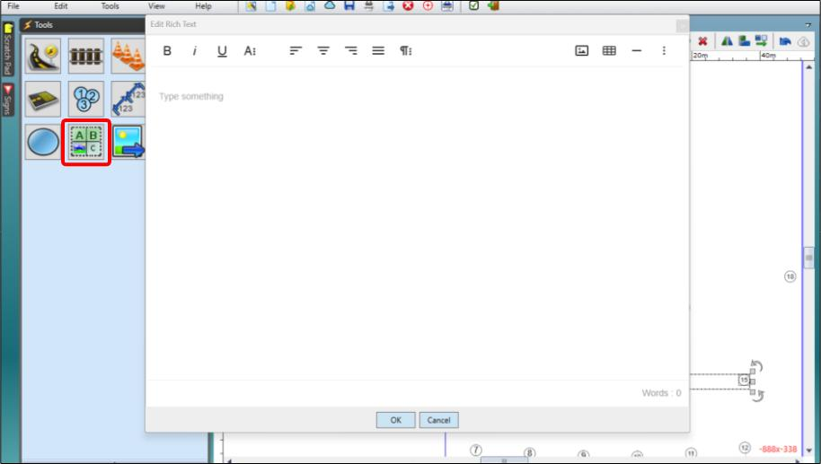
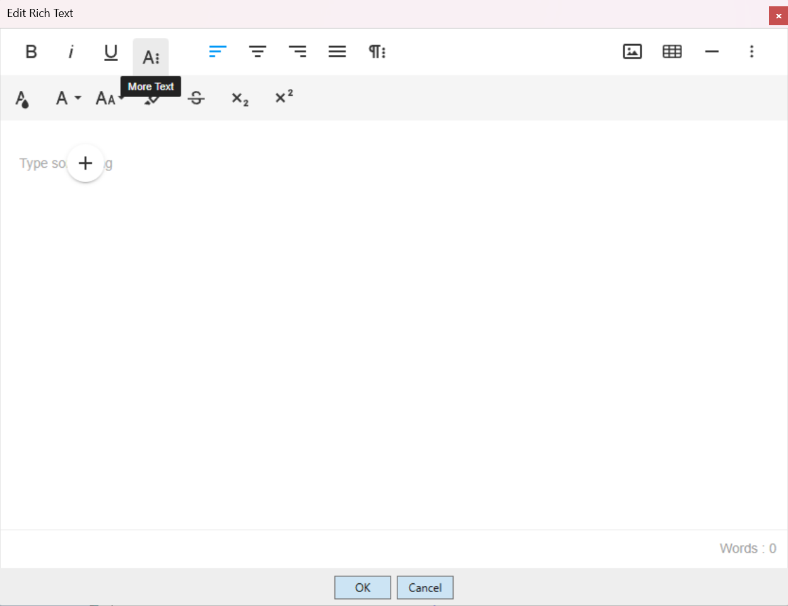
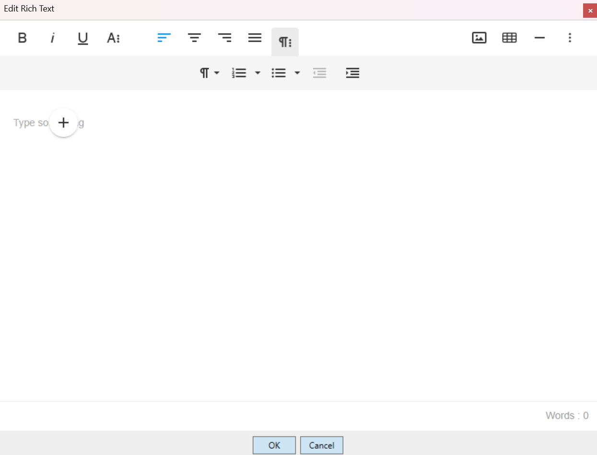
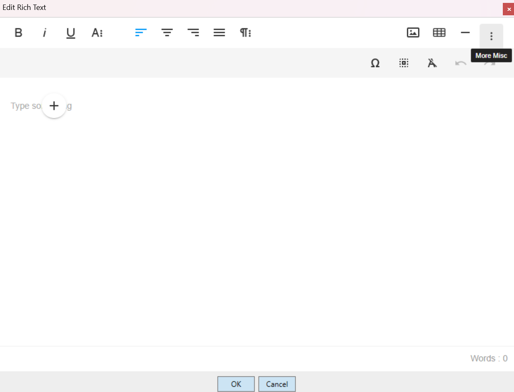
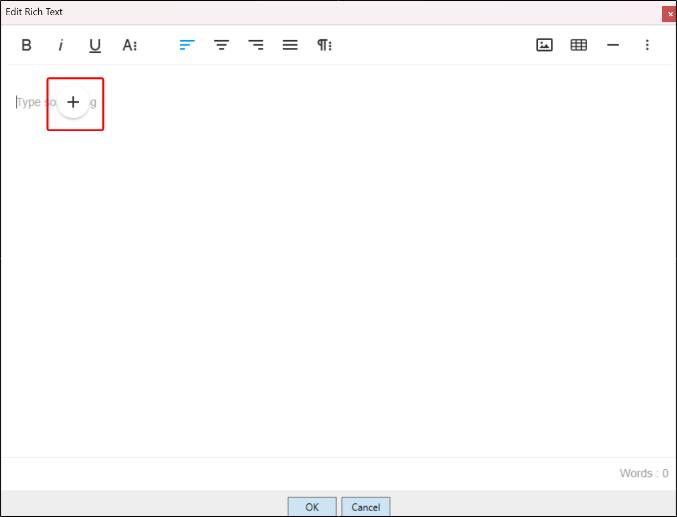
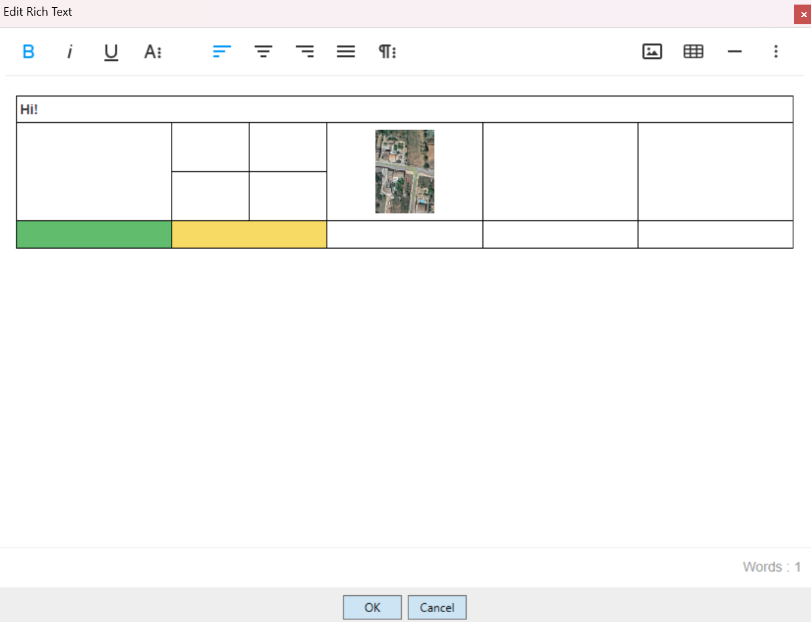

---

sidebar_position: 3

---

# Rich Text Editor

The Rich Text Editor allows for a more vibrant and varied mix of formatting and arrangements. It also allows for in-line (amongst the text) image importing, and table creation.

The Rich Text Editor is unique to the other editors, clicking the icon (seen to the left in the image below) will open a window in which the text can be put together and edited, before being placed on plan by clicking **OK**.

## The Rich Text Interface

Once open, you'll see familiar text editing iconography:

- **On the left:** Bold, italics and underlining.
- **In the center:** Alignment settings.
- **On the right:** Buttons to insert an image, a table, or a horizontal line.

There are also drop down buttons:

### 'More Text'

The 'More Text' button will open a drop down menu for additional text controls:

- **Text Color**
- **Font**
- **Text Size**
- **Background Color (highlighting)**
- **Strike-through**
- **Subscript**
- **Superscript**

### 'More Paragraph'

The 'More Paragraph' button will open a drop down menu for additional paragraph related controls:

- **Paragraph Format:** Switch between varied heading sizes and normal body text.
- **Ordered List:** Insert a list ordered by numbers and various other numerals.
- **Unordered list:** Dot-points and similar.
- **Decrease Indent**
- **Increase Indent**

### 'More Misc'

The 'More Misc' button will open a drop down menu for the controls listed below:

- **Special Characters**
- **Select All**
- **Clear Formatting**
- **Undo**
- **Redo**

### 'Quick Insert'

The 'Quick Insert' button is visible when the cursor is on an empty line, and reveals a list of objects that can be inserted when clicked:

- **Image**
- **Table**
- **Unordered List**
- **Ordered List**
- **Horizontal Line**

**Note:** Tools accessed through Quick Insert will be set to their default settings, whereas if they are accessed through the Rich Text Editor's toolbar you will be offered more options to customise the insert.

### Rich Text table

Once a table is created, changes can be made to cells using all of the toolbar functions above, as well as using the context menu that appears when a cell or cells are selected.

Using a table's context menu:

- Rows/columns can be inserted or removed.
- Borders can be engaged/disengaged (made invisible).
- Cells can be split horizontally/vertically, or .
- Cells can be merged.
- Background color can be applied, and vertical/horizontal text alignment can be applied.

A columns' width can also be adjusted, by clicking and dragging it.

## Placing a Rich Text Object on a Plan

Once your work is complete, click **OK** to place the rich text object on your plan. Don't worry, you can still edit its contents once place, by double clicking it.

Once it's on the canvas area, it has the normal control handles to rotate and resize it. 

If you would like to alter the Rich Text object's aspect ratio (eg. portrait vs landscape), this can be manipulated without stretching, using the two control ponts found in the top-left and bottom-right corners.

