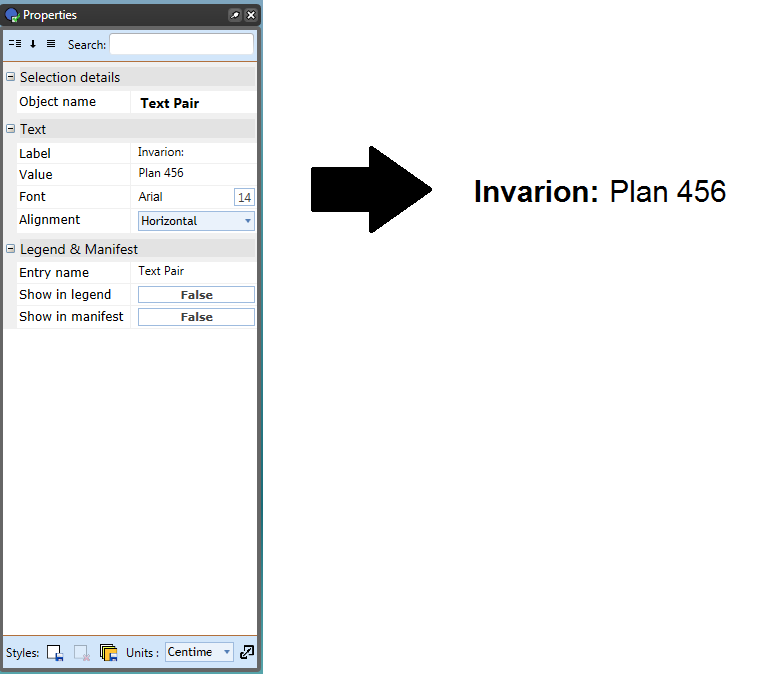

---

sidebar_position: 1

---
# The Text Tools

Because they are different, the text tools behave differently to the other tools. They are however exceptionally easy tools to use. You can enter and edit text in these objects on the canvas simply by **Double clicking** directly on the text, even on grouped objects and signs.

## The Text Object Tool

This tool creates an **object** out of text that can be manipulated like any other object.

- Select the **Text Object** tool from the Text tab.
- Place it on the canvas with a click, then a writing cursor will appear in that place.
- Type in your content then use the Properties Palette to make any changes.
- If you wish to change the text content, font style, size or color, or to center the text, click the Text tab in properties and make any necessary adjustments.
- If you wish to paint the background of the text box, click the Box tab in properties and make your adjustments.

    

## The Text Box Tool

The Text Box is created in a similar way to the Text Object tool but the products are different. The difference between the **Text Object** and the **Text Box** tools is the Text Object literally creates an object that can be stretched and manipulated like any other in RapidPath, whereas a Text Box is literally a text box.

## The Text Pair Tool

The Text Pair tool operates similar to the regular text tool but with limited editing capabilities. For instance, you cannot set a background color with the text pair tool nor can you set your fonts to bold. This tool only provides a Label and a Value to be set thereby giving it it's name as a text pair.

### To use the Text Pair tool

- Select the **Text Pair** tool from the Text tab.
- Click on your canvas to place the text box and enter your desired text for your Label. (In the example the **Label** is Invarion).
- Enter your desired text for your Value. (Plan 456 is the **Value** in the example).
- Use the Properties Palette to set the orientation of the text. (Horizontal or Vertical)

    

## The Path Text Tool

Just as the name implies, this tool allows you to create text fit to follow a path. It is used as a hybrid of a spline and text tool.

## Hyperlink tool

The Hyperlink text tool can be used on your plans to reference online resources and other files via clickable links on exported PDF documents.

To activate the tool, select **Hyperlink** from the Text tab.

Click on the canvas area to type in the text you wish to have as your clickable link. In the **Custom URL** area, you can enter the link for the website or document you wish to hyperlink.

When the plan is exported to PDF, the reader will be directed to the web page or document when the hyperlink is clicked.

