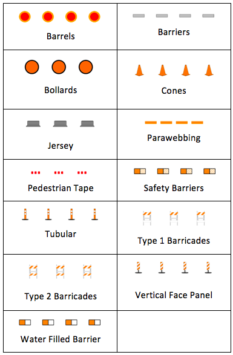
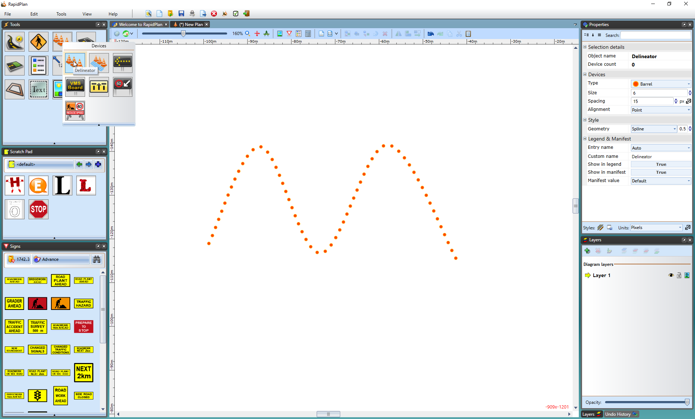
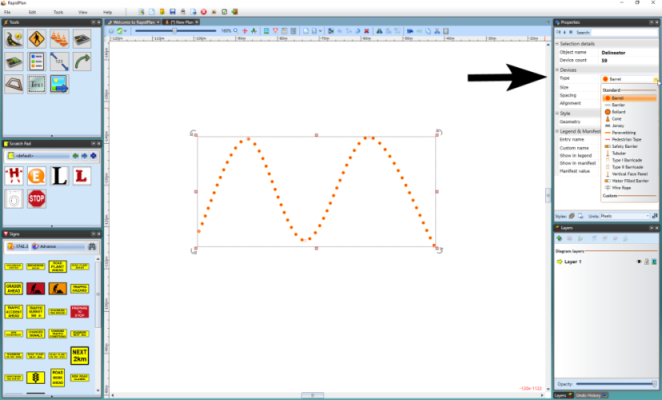
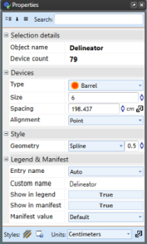
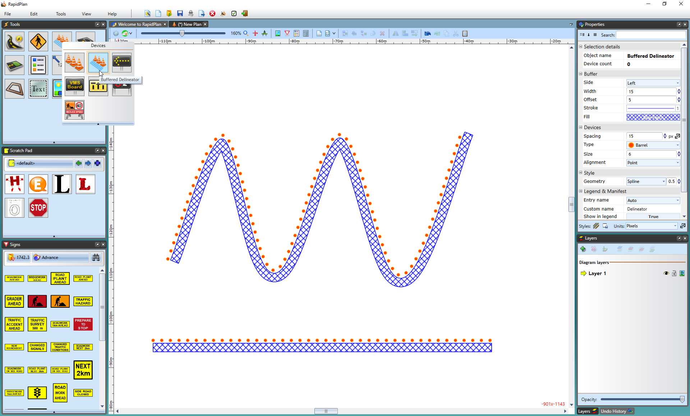

---

sidebar_position: 1

---
# Delineators

Traditionally, one of the most difficult things to do when creating a traffic plan was run out lines of bollards, cones, barrels, etc. The RapidPath delineator tool allows you to drag out lines of devices in seconds.

**Types of delineators available:**

There are thirteen standard types of delineators available:

## Creating a Basic Delineator Line

All delineator lines start by default as Barrels with a size of 6 units and a spacing of 30 units. They can then be changed into the required type after placement on the plan. You can also set new default values from the Properties palette.

**To create a basic delineator line:**

- Select the Delineator from the Devices tab in the Tools Palette.
- Click once where you wish to start drawing (don't hold).
- Click at each corner for your line.
- After you have placed the end point, **Right click** to stop drawing.
- **Right click** to clear the cursor.

    

## Changing the Type of your Delineator

Once your line is on the plan, you can change the type of delineator that you use from the list on the previous page.

**To change delineator types:**

- Select the delineator line on the plan and observe the Properties Palette.
- Click on the Devices tab and choose the type of delineator required from the Type drop down box.

    

## Changing the Properties for the Delineator

As always, more in depth editing is done via the Properties palette. The following properties can be edited for each delineator:

**Devices** - Type, Size, Spacing, Alignment

**Style** > **Geometry** - Line, Spline, Bezier

## The Buffered Delineator Tool

The Buffered Delineator tool works much the same as the Delineator tool with an added buffer zone. It can be manipulated to the shape you need and you can change the delineator.

