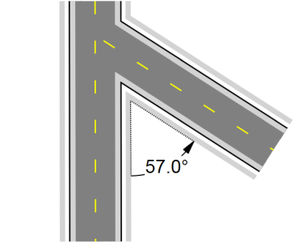
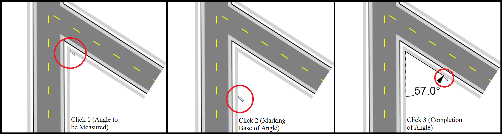

---

sidebar_position: 15

---
# Distance Markers

There are six distance markers used for indicating spatial information on your plan, the Distance Marker, the Combined Distance Marker, the Offset Distance Marker, the Angle Marker, the Area Marker and the Combined Offset Distance Marker.

In essence, all six distance markers do exactly the same thing - they indicate to a reader the distance between elements. They all automatically calculate the distance and enter its amount. You can also enter your own values if needed.

## Creating a Distance Marker

Irrespective of which distance marker you are using, the technique for creating it is much the same. However, there are some differences, so this will be explained separately for each marker below.

**To place a Distance Marker:**

- Select the **Distance Marker** tool from the Marker tab in the Tools Palette.
- Click once to start drawing the distance marker, click a second time to mark the end point.
- **Right click** to finish

**Note**: It is helpful to hold **Shift** whilst drawing the distance marker to keep it straight.

## Changing a Distance Marker's Properties

For each of the distance markers, you can change the arrow size, stroke width and color, font color etc. Utilize the Properties palette to edit all settings for each marker.

## The Six Types of Distance Markers

### Distance Marker

The Distance Marker calculates one distance.

### Combined Distance Marker

This tool does the same as the Distance Marker but with the ability to show multiple distances as shown below.

**To place a Combined Distance Marker:**

- Select the **Combined Distance Marker** tool from the Marker tab in the Tools Palette.
- **Left click** once to start drawing the distance marker, **Left click** again to end the first distance marker and start the second
- Repeat this until you have all of your distances marked for that marker
- **Right click** to finish

### Offset Distance Marker

This tool allows you to un-clutter items on your plan by being "offset" from its true location.

**To place an Offset Distance Marker:**

- Select the **Offset Distance Marker** tool from the Marker tab in the Tools Palette.
- Click once to start drawing the distance marker, click a second time to mark the end point.
- Drag your mouse laterally away from the distance
marker to set the offset. Click a third time to finish drawing the marker.

### The Angle Marker Tool

This tool enables you to show angle degrees on your plan.

**To place an Angle Marker:**

- Select the **Angle Marker** tool from the Marker tab in the Tools Palette.
- Click the space you wish to measure (the first click will be the angle measured)
- Click a second time to mark the base point of the angle.
- Drag your mouse in the direction you want to measure and click to finish the angle once it is set to the desired degree/location.

    

    **Note:** Like any item in RapidPath, the angle marker, once made, can be moved and adjusted, with the degrees changing accordingly.

### The Area Marker Tool

This tool calculates the area you allocate which is shown as the cross-hatched netting in the image below.

**To place an Area Marker:**

- Select the **Area Marker** tool from the Marker tab in the Tools Palette.
- **Left click** once to start drawing.
- Continue clicking to set corner points of the area.
- **Right click** to finish.

### The Combined Offset Distance Marker Tool

This tool allows you to create a combined marker that is offset on your plan.

**To place an Combined Offset Distance Marker:**

- Select the **Combined Offset Distance Marker** tool from the Marker tab in the Tools Palette.
- **Left click** once to start drawing the distance marker, **Left click** again to end the first distance marker and start the second.
- Repeat this until you have all of your distances for that marker.
- To finish the last distance press **Right click**.
- Drag your mouse laterally away from the distance marker to set the offset. Click a third time to finish drawing the marker.
- **Right click** to finish.

### The Distance marker breakline

When not drawing to scale, use the Breakline property of a Distance Marker to indicate whether the marker symbolically represents a larger on-site distance.

To enable the breakline, simply select the distance marker, in its Properties there is a subheading for Breakline.

Simply change it from False to True and it will set the breakline in the middle of your marker. You can also adjust the size directly underneath.

## Changing the Distance on the Marker

- Select the Marker
- **Double click** on the distance number provided
- The writing cursor will appear and will allow you to enter your desired distance
- Click anywhere on your plan to finish

    
