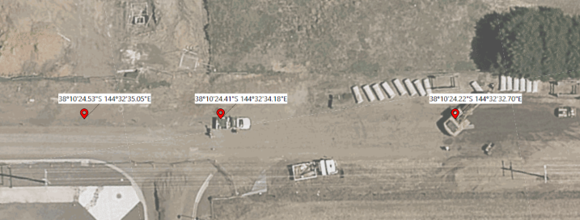
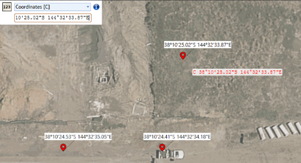

---

sidebar_position: 10.5

---

# The Location Marker

The Location Marker is an annotion tool in the form of a small labelled pin that can be used to indicate the location of particular points of interests on a plan.

The location marker tool is found in Annotation category of the [Tools Palette](./assets/location-marker%20-%20small.png)
Once it's selected, simply click on the Canvas Area where you would like a marker to be located. If a Location Marker is moved, by default the coordinates displayed will adjust in kind.

If you would like to place a marker at a known coordinate rather than placing it on a landmark seen on the plan, the [Dimension Input Panel](/docs/rapidpath/object-properties-and-transformations/dimension-input-panel.md) can be used: Simply select the Location Marker tool, click the letter **C** on your keyboard, and then type or paste your coordinates into the dialog box and click **Enter**.

 

## Properties of the Location Marker

### Icon

- Style: Change the icon type of a pin on the plan (flag, pin, marker icon etc.).
- Size: Size of pin.
- Stroke: Adjust the outline of the pin.
- Fill: Color of the pin.

### Text

- Mode: *Default* will display the coordinates of the pin in text depending on where you place the pin, *Custom Text* allows you to write whatever details you prefer.
- Font: Adjust the font.
- Centered: Toggle whether text is centered or offset.
- Coords format: Toggle whether coordinates displayed are in *Decimal Degress* (**DD**), or *Degrees Minutes Seconds* (**DMS**).

### Box

Adjust appearance of the background box behind the text of the pin.

### Connector

Adjust appearance of the line connecting the text box to the pin.

## Batch Edit Location Markers

In RapidPath coordinates are tracked in the WGS84 coordinate system, in either 'Decimal Degrees', or 'Degrees, Minutes, Seconds'. There are however circumstances in which you might choose to refer to a coordinate point on your plan by a different coordinate system.  The Batch Edit Location Markers tool has been designed for such a scenario.

To use it, first place location markers in your chosen locations, then select them all (perhaps by selecting one and then clicking **Ctrl+Shift+A** to select all 'like' objects). aThen click **Tools > Advanced Tools > Batch Edit Location Markers**.

The dialog window below will appear, with the existing locations displayed on the left:

Above the list of locations is a dropdown box which can toggle the means of expression for the existing locations (Degrees Decimal or 'DD' by default). 
To the right of this is a button to Copy the existing coordinates.

In the text box in this view labelled **Marker texts**, one can input anything that you would like to display at the marker location on the same line in the **Locations** field to its left.

As detailed below, one popular use for this functionality in New Zealand is to convert and replace the existing locations with **Mobile Roads** coordinates.

### Importing Mobile Roads coordinates

1. Place your location markers on a plan in your chosen locations, then select them all. 
Click Tools > Advanced Tools > Batch Edit Location Markers. Then click the Copy button in middle of the dialog box.

2. Visit [https://www.mobileroad.org/converter.html](https://www.mobileroad.org/converter.html). 
In the top-left, toggle Input to **WGS84**, and paste the coordinates into the 'Latitude, Longitude' field on the left.

3. Click **Convert**, before copying Output type required on the right, selecting the entire contents of the text box before copying all of it at once.

4. Returning to RapidPath, **Paste** the converted coordinates into the field on the right.

Once you click **Ok**, the converted coordinates will appear above the corresponding location markers.

**Note:** Once converted, the location marker's coordinates will not update if the marker is moved to a different point on the plan.
