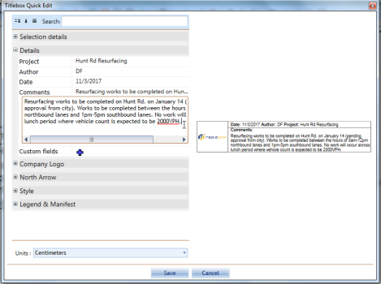

---

sidebar_position: 13

---
# The Title Box

The Title Box is an essential item on your plan - it captures a lot of important information about you and your works in one convenient location.

**The Title Box has provisions for the following information:**

- Date
- Author
- Project
- Custom details
- North marker
- Company logo
- Comments field

## Creating a Title Box

Creating a title box is a simple matter of selecting, filling and placing on the canvas.

**To place a Title Box:**

- Select the **Title Box** from the Annotations tab in the Properties Palette and place the box on the plan.
- **Double click** on the Title Box to open **Quick Edit**.
- Fill in each of the required fields and click **Save**.

 **Note**: As always in RapidPath, this editing can be done from the Properites Palette.

## Manipulating the title box

The title box can be moved, rotated, resized, cut copied and pasted just like any other item on the canvas. Simply select it and make any changes as required.

## Filling in the Title Box Fields

Entering data into the title box is very easy, but because a number of fields are quite unique in nature, we will cover them one by one.

### Date, Author, Project, and Comments Field

These are all simple text entry fields. Note that the Date field doesn't have an input mask, so you can enter your date which ever way you like.

### Custom Details

Because we don't know every field, you are likely to need, we have included a custom details field where you can give your plan a **Label** and a **Value**.

Naming the fields is simple, first click on the **Add** icon  and enter the appropriate values for **Label** and **Values** as shown below, then click **Save**.

**Note**: Instead of entering Label and Value text, you can also delete the words Label and Value and enter your own custom information.

### The North Marker

The north marker is a handy tool to give your audience an idea of the plan orientation. Its also very easy to use.

In the North Arrow tab of the Properties, simply click on the **Show** section to make it **True**, then adjust the direction of the arrow with the **Angle** bar as shown below.

### The Logo Placeholder

An added hint of professionalism (and identification) is achieved by adding a logo to your plan.

You will need to have a high quality logo, preferably in **JPG**, **BMP** or **PNG** format.

**To include the logo on a title box:**

- Click on the **Company Logo** tab in Properties.
- Hover your cursor over the **Image** section until the option to **Load File From** becomes visible. Select this.
- Browse for your image files on your computer, **Double click** on your file once you've found it.
- Do not forget to make the **Show** section **True** to make your logo visible in the Title Box.

    
