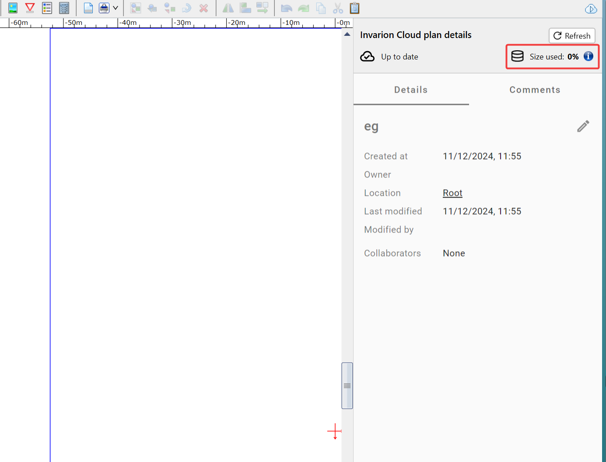

---

sidebar_position: 5

---
# Cloud Plan File Size Management

When editing a cloud plan in RapidPath, you might notice an indicator in the **Cloud Plan Details** dialog box (accessed by clicking  button in the top-right of the [Toolbar](/docs/rapidpath/the-toolbar/the-toolbar.md)), displaying whats percentage of the potential size of a plan has been used.

Cloud plans have a limit of 25mb per plan, determined by the maximum amount of data that can be transferred in a single request. If a cloud plan's file size expands beyond this limit, it will not be able to be saved to the cloud.

If you encounter this limitiation, it is likely that your file's size can be reduced:

## Reducing a Plan's File Size

The dominant factor that decides/increases a plan's file size is the images that are placed on the plan. Therefore by controlling the size of these images, a plan's file size can be reduced.

It's worth noting that if you start with a large image and then resize it in RapidPath, this will not affect the file size of that image in your plan. Therefore if the image is set so that it will be small on the plan, we can reduce its quality as the reduced pixel count will not be noticeable to a certain extent.
