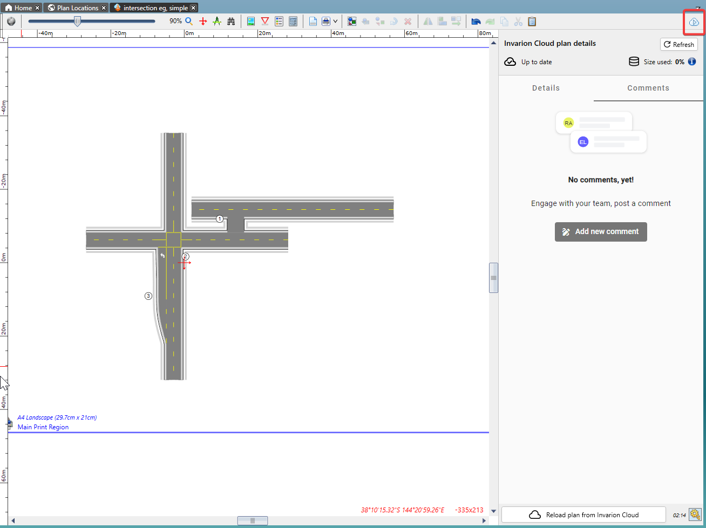
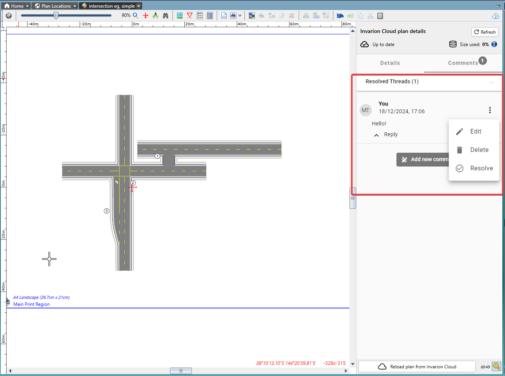

---

sidebar_position: 4

---
# Commenting on Cloud Plans

Plans stored in the cloud can have comments pinned to them - useful as a means of writing notes for yourself or to other [collaborating users](./sharing-cloud-plans.md).

To see or add comments: Simply open a plan and click the **Invarion Cloud Plan Details** button in the top-right of the toolbar, as pictured below:

Then click the **Comments** button to toggle to the correct section of the plan details.

Here you can view existing comments or add a new one.

You can see that there are two comments in the example above:

The comment reading **"Hello!"** is visible and there is an option to reply. Using the **Actions button**, I, as the author of the comment, can *Edit*. *Delete*, or *Resolve* the comment.

The other comment is not visible currently as it is marked as **Resolved**. This indicates that the issue the comment was referring to has indeed been resolved, and can therefore be put out of sight and out of mind. If needed, clicking **"Resolved Threads"** will reveal resolved comments.
