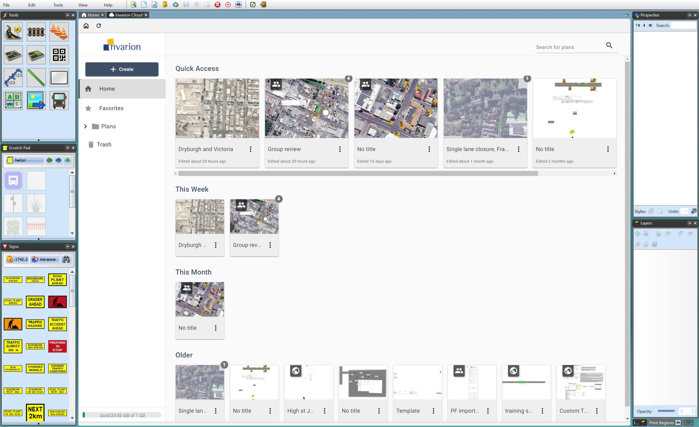
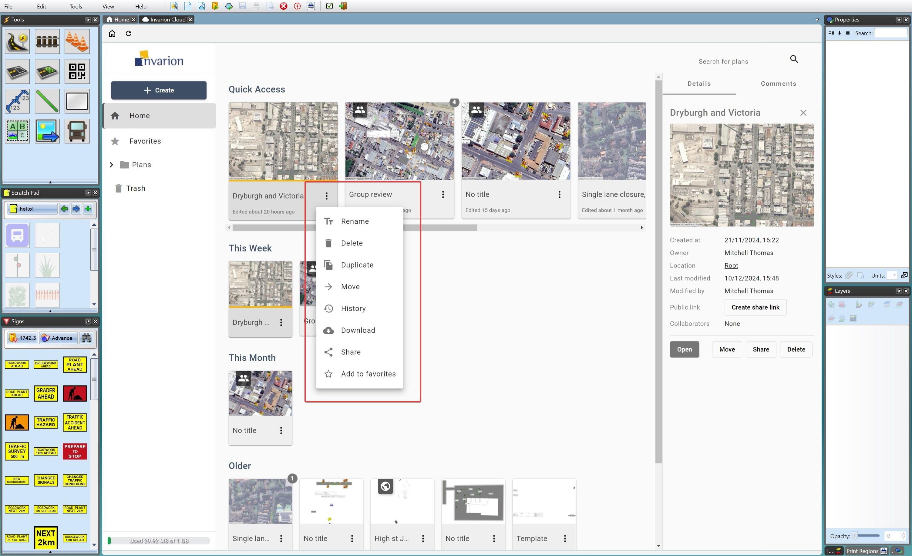

---

sidebar_position: 1

---
# Using the Invarion Cloud

RapidPath now features incorporated cloud functionality, allowing you to:

- Store your library of plans securely, and access them from anywhere.
- Seamlessly collaborate with team members or clients by adding them to a plan and providing editing or view-only access.
- Add comments and create comment threads to discuss aspects of your plan during the design process.
- Quickly share a link to your plan so relevant stakeholders can view a read-only version on their mobile devices.
- Plan files created in the desktop applications can be opened and edited by our web applications, and vice versa.

## Creating a Cloud Plan

As discussed in [The Home Screen](/docs/rapidpath/the-home-screen-and-starting-a-plan/the-home-screen.md), a cloud plan can be created in a number of ways:

[**New Plan Wizard**](/docs/rapidpath/the-home-screen-and-starting-a-plan/the-new-plan-wizard.md), found on the home screen as well as in [The Toolbar](/docs/rapidpath/the-toolbar/the-toolbar.md) can be used to create cloud and local (locally saved) plans. In the final step of creating a plan using New Plan Wizard, the button highlighted below will decide whether a plan is saved to the cloud or locally.

A cloud plan can also be created by clicking **New Cloud Plan**: Note this will create a *default* plan befitting the defaults you have set (in Tools > Preferences > Defaults in the [Toolbar](/docs/rapidpath/the-toolbar/the-toolbar.md)). Note that default plans do not have a location set initially and so won't have aerial mapping available. If necesary to add a location to a default plan: Click **F2** to open the *Edit Plan Properties* menu > uncheck the **Don't Set Location** box > choose your location.

## Uploading an Existing Plan to the Cloud

If you have a plan or plans saved locally they can be saved to the cloud in one of two ways:

### From the Workspace

To save a local plan that you have open in RapidPath to the cloud: Simply click the button in the Toolbar on the top-right, highlighted below.

Then click **Transfer to Invarion Cloud**, choose the file name you would like to use initially for that plan in the cloud, and which folder you would like to save it to (these can be updated later if need be).

Doing this will leave the locally saved copy of your plan as is. Changes and saves to the cloud file you create will not be applied to the local file.

If you want to return to working on the local version, you will find it in the same location in your computer's File Explorer. It can also be spotted in your Recent Plans in the [Home Screen](/docs/rapidpath/the-home-screen-and-starting-a-plan/the-home-screen.md) - note the *cloud* icon indicating which version of the file is saved to the cloud.

# Organising the Invarion Cloud

The Invarion Cloud can be opened by clicking **Browse Invarion Cloud** on the [Home screen](/docs/rapidpath/the-home-screen-and-starting-a-plan/the-home-screen.md), or the button by the same name in the [Toolbar](/docs/rapidpath/the-toolbar/the-toolbar.md) under *File*.

Here we will discuss how to sort, view and arrange plans in the Invarion Cloud.

## The Invarion Cloud Layout

The Invarion Cloud screen will display in a new tab within RapidPath, as seen below.

## Invarion Cloud file tree

A file tree is visible on the left side of the Invarion Cloud page:

- The **Home** page of the Invarion Cloud (picture above) features a staggered list of recently used plans, the most recently used being featured in *Quick Access*.
- Plans can be saved as favorites by clicking the 3 dots button next to them > **Add to Favorites**, thereby including them in the plans that will be shown by clicking into the **Favorites** section.
- **Plans** lists all plans and user-created sub-folders.
- **All Plans** puts sub-folders aside, listing all plans in a single list.
- **Plans Shared with Me** lists plans created by another user, who has listed you as a *Collaborating User*, granting you edit permissions.
- **Trash** keeps deleted plans for 30 days before permanent it is emptied (contents being permanently deleted). It can be emptied immediately by clicking '**Empty Trash Now**'.

## Managing and Altering Plans in the Invarion Cloud

Each cloud plan can be altered using its drop-down **Context Menu**, or using the **Details Side Panel**.

The **Context Menu** is a more efficient means to make changes to the plan.  The **Details Side Panel** will provide some information about the plan along with controls.

### Plan Context Menu

clicking the **3 dot button** of a plan will reveal the *Context Menu* menu:

|**Button**|**Effect**|
|-|-|
|**Rename**|Opens a dialog box to rename the plan.|
|**Delete**|Deletes the plan, moving it to *Trash*.|
|**Duplicate**|Creates a matching copy of the plan.|
|**Move**|Moves the plan from one folder to another.|
|**History**|Opens a *History* dialog window, allowing you to *Restore* a plan to a prior version, or to *Create a Copy* of a chosen historic version of the plan.|
|**Download**|Download a copy of the plan, saving it locally as a '.tcp' file.|
|**Share**|Share a plan, either via a read only link, or invite another user to contribute to the plan (granting editing permissions)|
|**Add to Favorites**|Add a plan to the *Favourites* folder in the file tree.|

### Plan Details Side Panel

To access a plan's **Plan Details Side Panel**, simply **click its preview image**:

|**Feature**|**Details**|
|-|-|
|**Details** and **Comments** toggle|Switch between the *Details* section (discussed here), and the *Comments* section.|
|**Plan Title**|Can be clicked to rename it.|
|**'X' icon**|Seen next to the plan's title, clicking this closes the side panel.|
|**'Created at'**|Shows the date the plan was created.|
|**'Owner'**|Shows the name of the user who initially created the plan.|
|**'Location'**|Shows where in the Invarion Cloud the plan is saved. ('*Root*' refers to the plan being in the *Plans* folder)|
|**'Last Modified'**|Displays the date the plan was last altered.|
|**'Public Link'**|If a sharable link has been created; it can be *Copied* to or *Deleted* here. If a link hasn't been created, 'Create share link' can be clicked here.|
|**'Collaborators'**|Displays a list of other users who you have invited *directly* to have editing permissions on this plan.|
|**Open** button|Open the plan.|
|**Move** button|Change the folder that the plan is currently saved in.|
|**Share** button|Opens the *Sharing* dialog box.|
|**Delete** button|Delete the plan, moving it to the *Trash* folder. (Where it will be deleted in 30 days)|

## Reviewing and Organising Cloud Plans

## Sharing Cloud Plans
