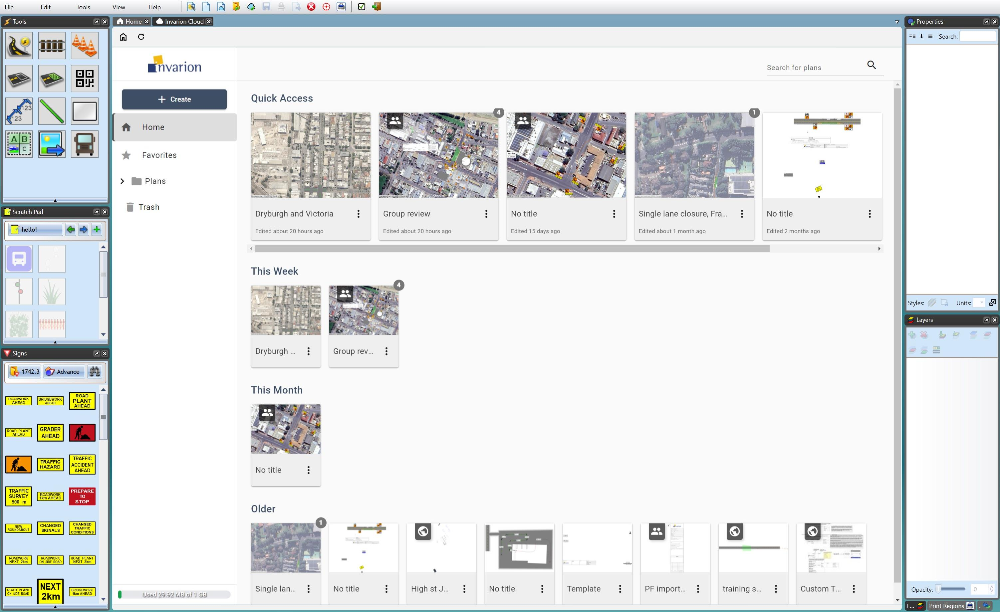
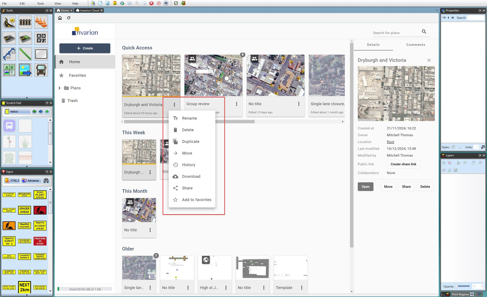

---

sidebar_position: 2

---
# Organising the Invarion Cloud

The Invarion Cloud can be opened by clicking **Browse Invarion Cloud** on the [Home screen](/docs/rapidpath/the-home-screen-and-starting-a-plan/the-home-screen.md), or the button by the same name in the [Toolbar](/docs/rapidpath/the-toolbar/the-toolbar.md) under *File*.

Here we will discuss how to sort, view and arrange plans in the Invarion Cloud.

## The Invarion Cloud Layout

The Invarion Cloud screen will display in a new tab within RapidPath, as seen below.

## Invarion Cloud file tree

A file tree is visible on the left side of the Invarion Cloud page:

|**File Tree Heading**|**Details**|
|-|-|
|**Home**| As picture above, the home page of the Invarion Cloud features a staggered list of recently used plans, the most recently used being featured in *Quick Access* at the top.|
|**Favorites**| Lists plans saved as favorites by clicking the 3 dots button next to them > *Add to Favorites*.|
|**Plans**| Lists all plans and user-created sub-folders.|
|**All Plans**| Puts sub-folders aside, listing all plans in a single list.|
|**Plans Shared with Me**| Lists plans created by another user, who has listed you as a *Collaborating User*, granting edit permissions.|
|**Trash**| Holds deleted plans for 30 days before it is emptied (contents being permanently deleted). It can be emptied immediately by clicking '**Empty Trash Now**'.|

## Managing and Altering Plans in the Invarion Cloud

Each cloud plan can be altered using its drop-down **Context Menu**, or using the **Details Side Panel**.

The **Context Menu** is a slightly more efficient means to make changes to the plan.  The **Details Side Panel** will provide some information about the plan along with controls.

### Plan Context Menu

clicking the **3 dot button** of a plan will reveal the **Context Menu** menu:

|**Button**|**Details**|
|-|-|
|**Rename**|Opens a dialog box to rename the plan.|
|**Delete**|Deletes the plan, moving it to *Trash*.|
|**Duplicate**|Creates a matching copy of the plan.|
|**Move**|Moves the plan from one folder to another.|
|**History**|Opens a *History* dialog window, allowing you to *Restore* a plan to a prior version, or to *Create a Copy* of a chosen historic version of the plan.|
|**Download**|Download a copy of the plan, saving it locally as a '.tcp' file.|
|**Share**|Opens the [Plan Sharing Dialog Box](./sharing-cloud-plans.md).|
|**Add to Favorites**|Add a plan to the *Favorites* folder in the *file tree*.|

### Plan Details Side Panel

To access a plan's **Plan Details Side Panel**, simply **click its preview image**:

|**Feature**|**Details**|
|-|-|
|**Details** and **Comments** toggle|Switch between the *Details* section (discussed here), and the *Comments* section.|
|**Plan Title**|Can be clicked to rename it.|
|**'X' icon**|Seen next to the plan's title, clicking this closes the side panel.|
|**'Created at'**|Shows the date the plan was created.|
|**'Owner'**|Shows the name of the user who initially created the plan.|
|**'Location'**|Shows where in the Invarion Cloud the plan is saved. ('*Root*' refers to the plan being in the *Plans* folder)|
|**'Last Modified'**|Displays the date the plan was last altered.|
|**'Public Link'**|If a sharable link has been created; it can be *Copied* to or *Deleted* here. If a link hasn't been created, 'Create share link' can be clicked here.|
|**'Collaborators'**|Displays a list of other users who you have invited *directly* to have editing permissions on this plan.|
|**Open** button|Open the plan.|
|**Move** button|Moves the plan from one folder to another.|
|**Share** button|Opens the *Sharing* dialog box.|
|**Delete** button|Deletes the plan, moving it to *Trash*.|
