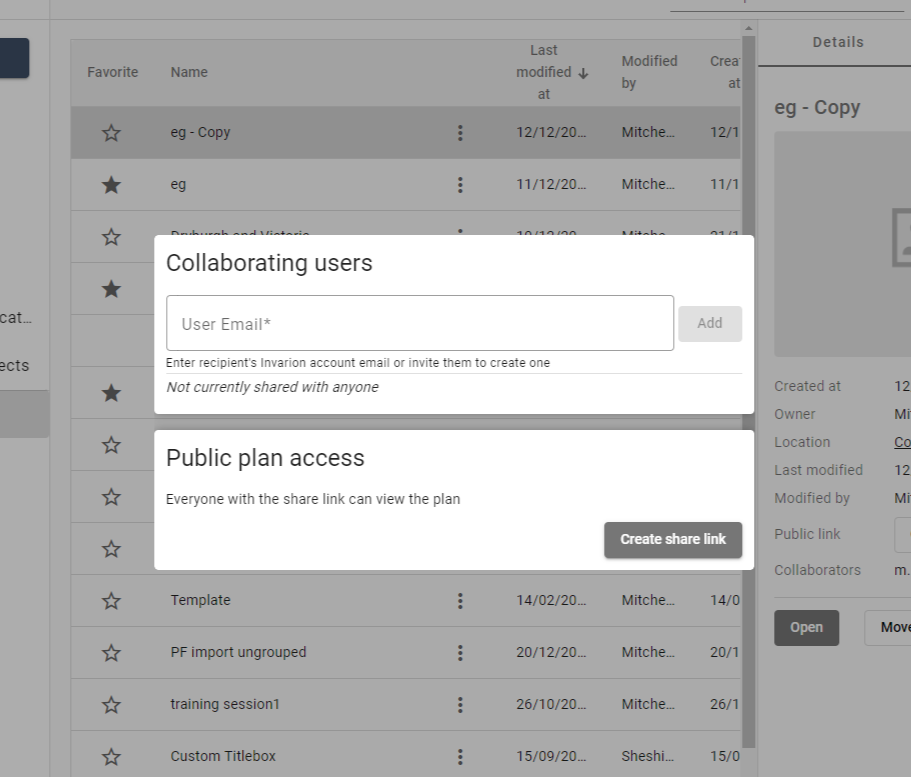

---

sidebar_position: 3

---
# Sharing Cloud Plans

The integrated Invarion Cloud system allows for seamless sharing of plans:  Either granting other users permission to make changes and adding comments by adding coworkers as **Collaborating Users**. Or sharing a *view-only* copy of the plan with non-contributing stakeholders, by sharing a **Public Plan Access Link**.

To share a plan you will first need to open the **Plan Sharing Dialog Box**: To do so, in the [Invarion Cloud](./organising-the-invarion-cloud.md) click the **Actions Button** () of a plan > click **Share**.

## Sharing Editing Permissions with Collaborating Users

Adding a **Collaborating User** will grant the chosen user permission to access and edit the plan in the same way you are able to. Once a user is added to the plan as a Collaborating User, they will see the plan in their cloud, and will be able to open and edit it.

A collaborating user must have a valid Invarion license. Note that only one user can edit a cloud plan at a time.

The initial creator of a plan will remain the plan **Owner**, as displayed on a plan. The plan Owner is free to remove a Collaborating User's access to the plan at any time. Keep in mind that a Collaborating User is free to make their own duplicate of a plan while they have access.

A Collaborating User will be able to find plans shared with them quickly, by navigating to the aptly name section of the Invarion Cloud file tree - **Shared with me**.

### Adding and removing Collaborating Users

**To add a Collaborating User**: Simply input the email address they have associated with their Invarion login and click **Add**.

**To remove a Collaborating User**: Open the **Plan Sharing Dialog Box** again, and click the '**X**' icon next to their email address.

## Public Plan Access Links

**Public Plan Access Links** allow anyone that follows the link to see a *read-only* copy of the plan. They can navigate around the plan - zooming and panning - and can see the plan's core details (title;author;job dates etc.).

### Creating, sharing and deleting Public Plan Access Links

**To create a link**: Simply click **Create share link** in the **Plan Sharing Dialog Box**.

**To share a link**: Click **Copy Link**, and make that link available to the people you'd like to view the plan by whatever means suits your needs.

Removing the link will render the link shared before ineffective, removing access to the plan via that link.
**To remove the link**: Click **Remove share link**.

Note that if a link is removed and then a subsequent new link for the same plan is created - the new link will be different to the original.
