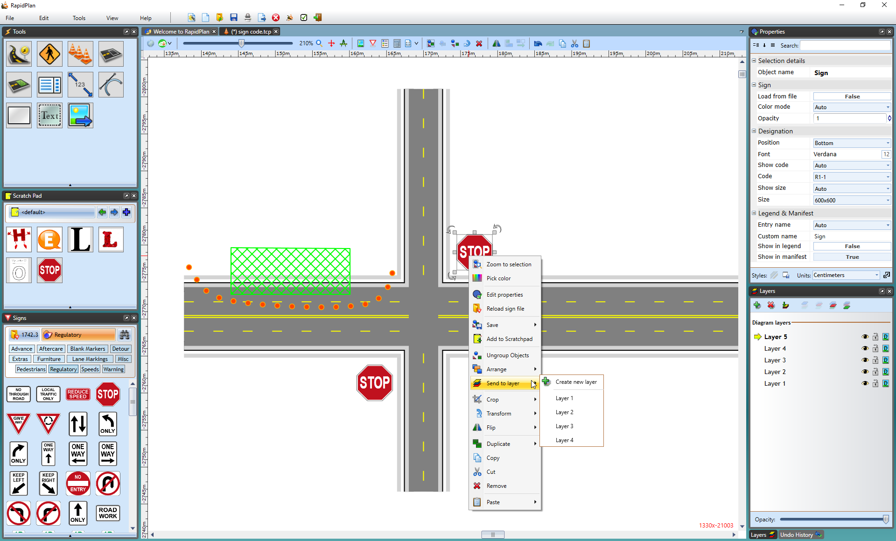

---

sidebar_position: 2

---
# Moving Objects Between Layers

There will be occasions where you want to move an object (or group of objects) between different layers. There are two ways to do this - using the **Send to Layer** function or simply with copy and paste.

## The Send to Layer Function

The Send to Layer function allows you to move objects directly from one layer to another. You can elect to move one or more objects at a time. The advantage of this method is that it doesn't move the location of the moved items on the page, so it appears on its new layer, in the same place.

**To use the Send to Layer function:**

- Select the object or objects that you wish to move.
- Right click on the object (or one of the objects if there are more than one) and select **Send to Layer**. A list of available layers will appear.
- Select the layer that you wish to send the object(s) to.

**Note**: You can also select Create new layer to create a new one to send to.

## The Cut/Paste Method of Changing Layers

This method of shifting between layers is to simply cut or copy the desired objects from one layer and paste them to another. This option is best if you want to duplicate items from one layer to the next.

**To cut/copy and paste items to a new layer:**

 1.Select the object(s) you wish to move.
 2.Cut or copy your selection:

- To move, use **Edit** > **Cut** from the main menu (or press **Ctrl + X**)
- To copy, use **Edit** > **Copy** from the main menu (or press **Ctrl + C**)
 3.Move to the desired layer that you wish to paste the objects using the Layer Selector box.
 4.Paste your objects:

- If you don't care where they are pasted on the page, either press **Ctrl + V** or select **Edit** > **Paste** from the main menu.
