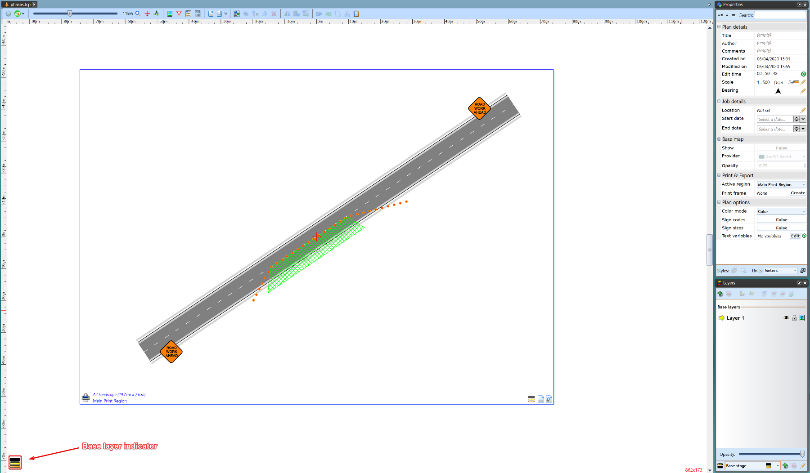
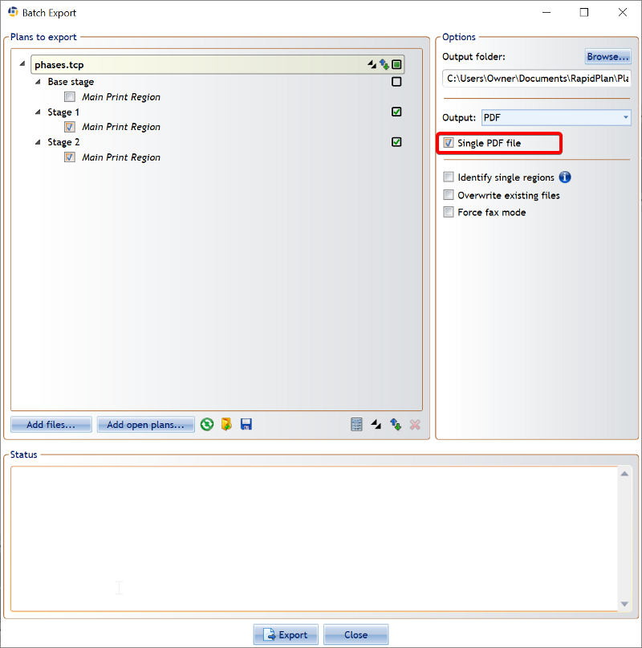

---

sidebar_position: 5

---
# Plan Stages

Several phases of works at one location can now be included in a single traffic plan, using the Plan Stages feature.

Each plan stage has its own set of layers and print regions, while the base layer is used for elements shared across all the other stages (e.g., road network, permanent markings).

## Setting Up Plan Stages

Selecting the **Enable plan stages** button will activate Plan stages on the layer you currently have selected.

When you have enabled the Plan stages on a particular layer, your layers tab will be separated into **Stage** layers and **Base** layers.

The **Base** layers are where all of the permanent road objects, signs and markings will be displayed. The **Stage** layers are used for showing objects in different phases. For example, you can have one base layer with two stage layers - daytime setup and nighttime setup.

**Select stage** allows you change between your different stages. **Add/remove stage** allows you to create new stages with the click of a button. It also remove stages, if necessary. **Edit stage properties** allows you to name the stage and attach specific comments to it.

## Plan Stages in Action

Below is an example of how a plan stages setup might look.

Plan objects are set up on the base layer. These objects are always visible. Whilst daytime and nighttime stages contain different objects.

The following images show the two stages (daytime and nighttime)

## Printing or Exporting Stages

Printing or exporting your plan stages is made a lot easier with the quick access right click menu. Simply right click to open the menu and then either select Print or Export all regions.

This will open up a dialogue box, with the plan stages automatically displaying in each layer based on how you arranged them. You can then select the checkbox to have all stages displaying in the one PDF file.

When ready, select **Export** and RapidPath will save all of the plan stages into one PDF document.

