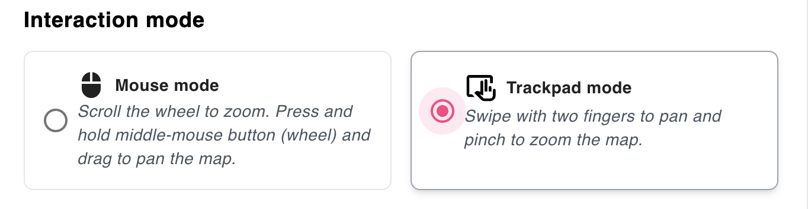

# Choose mouse or trackpad interaction

Open **Settings** and select the interaction mode that matches your input device: **Mouse** or **Trackpad**.

For the controls available in each mode, see [Navigate the plan canvas](../rapidplan-online-basics/navigate-the-plan-canvas).
