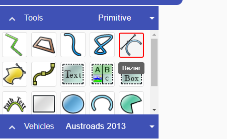

# Create precise curves with the Bezier tool

Use the **Bezier** tool when you need precise control over the curves in a line or object.

For details about Bezier geometry, see [Geometries](../rapidplan-online-basics/geometries).
