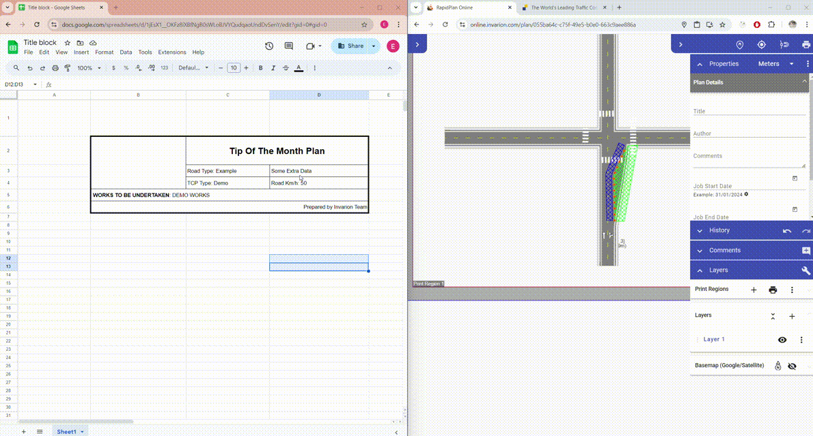

# Paste rich text

You can paste rich text or tables from applications such as Microsoft Word, Microsoft Excel, Google Docs, and Google Sheets into the RapidPlan Online or RapidPath Online editor. Supported formatting includes bold, italic, and underlined text.

