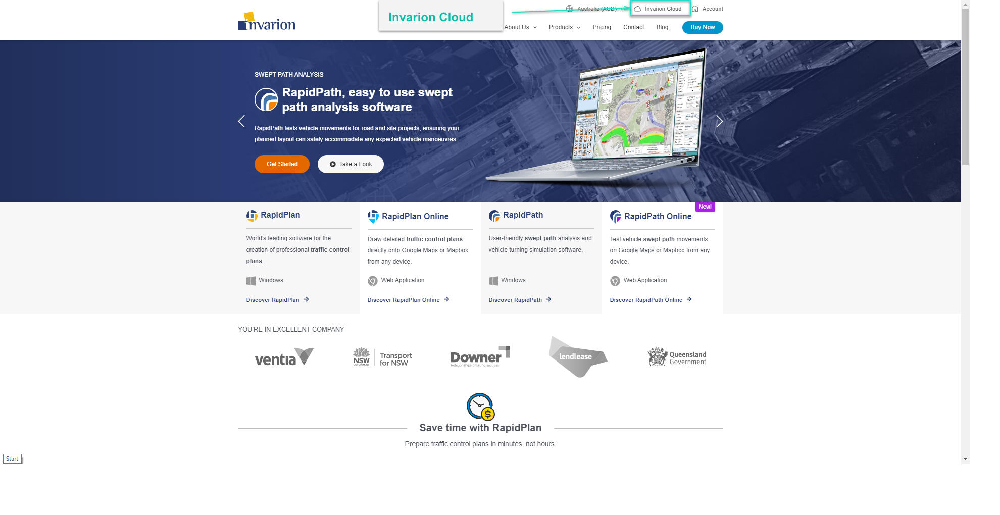
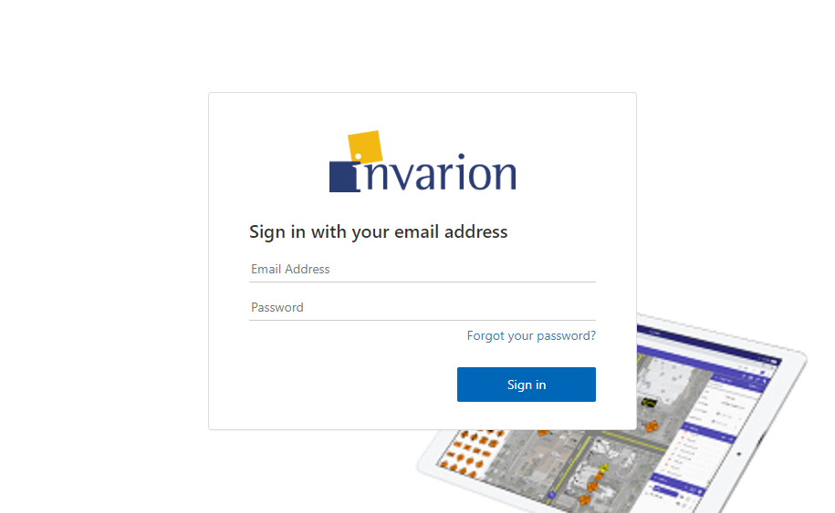
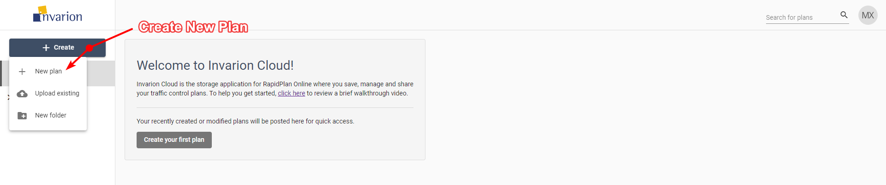

---

sidebar_position: 1
tags:
  - getting-started

---
# Getting started

To start using RapidPlan Online, first sign in to your Invarion Cloud account. You can open [Invarion Cloud](https://cloud.invarion.com/home) directly, or select the Invarion Cloud button on [invarion.com](https://invarion.com) in the top right of the page.

RapidPlan Online will then ask you to sign-in:

## Creating your first plan

To create your first plan, from the Invarion Cloud select **Create** button and choose **New plan** from the menu. After clicking this you will be taken to RapidPlan Online.

Later, you can find your plan in the **Plans** sections inside Invarion Cloud.
More details on using the Invarion Cloud can be found in the [Invarion Cloud layout](/rapidplan-online/the-invarion-cloud/invarion-cloud-layout) section.
