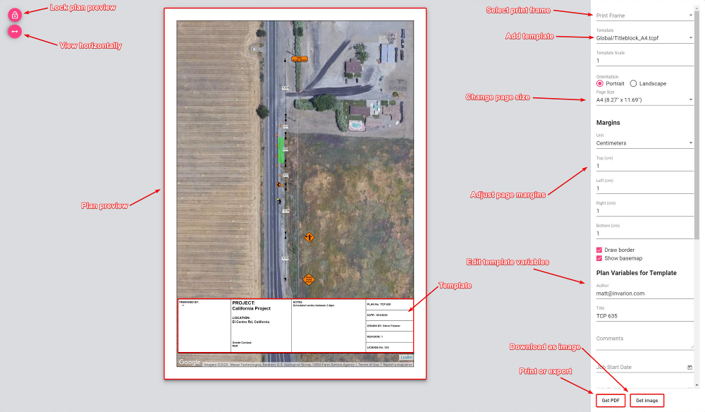
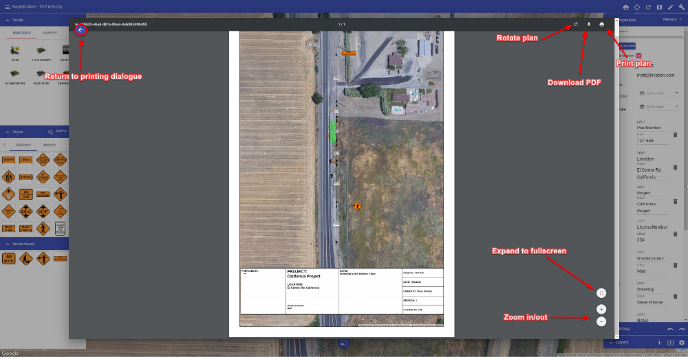

---

sidebar_position: 1
tags:
  - print-export

---
# Print and export

[Watch the print and export video on YouTube](https://www.youtube.com/watch?v=6s_StQTBn7w).

The areas you print in your plan is dictated by the location of your [Print Regions](/rapidplan-online/rapidplan-online-workspace/layers-palette). When your plan is ready for Printing or Exporting, simply select the **Print** option in the Main Menu, or click the printer icon () in the toolbar. Once selected, the following print dialog window opens, containing several options to customize your document.

## Printing options

* **Plan preview:** The preview of your plan in the center shows how your plan will print out. In this preview window you can adjust the plan to fit the page size, by simply clicking and moving the map around, or by simply scrolling up and down to zoom in and out on the map area.

* **Lock plan preview:** The lock plan preview button locks the ability to adjust the plan preview.

* **View horizontally:** The view horizontally button adjusts the view of the plan for different screen sizes. For example, a laptop screen is quite often smaller - this button adjusts the view so that you can view the plan appropriately on your screen.

* **Template:** Here you can select a template for your desired page size. Templates include generic title blocks where plan information can be added.

* **Page size and orientation:** Change the page size and orientation to suit your printout. When selected you will also need to make sure, if you have added a template, that it matches the page size/orientation you have chosen.

* **Page margins:** Adjust the page margins.

* **Print or export:** When ready to print, simply select the **Get PDF** button to download your plan as a .PDF file, or select **Get Image** to download the plan as a .PNG file.

## Print a plan on multiple pages

Use a separate print region for each page you want to include in the output.

1. Open **Print Regions** in the **Layers palette**.
2. Select the plus icon to create a print region for each page.
3. Move and resize each print region to cover the required area of the plan.
4. Review the page size and orientation for the print regions.
5. Select the printer icon at the top of **Print Regions** to print all regions.
6. In the print dialog, review the pages and adjust their order if needed.
7. Select **Get PDF** to create the multi-page PDF.

For details about creating and adjusting print regions, see [Layers palette](/rapidplan-online/rapidplan-online-workspace/layers-palette#print-regions).

## Exporting to PDF

Once the **Get PDF** button has been selected, you will be able to Print or Download your plan to PDF.

As shown in the image above, selecting **Download PDF** button will allow you to save your plan as a PDF file. This will then open your default PDF application and show you a preview of your downloaded plan. Clicking **Print plan** will open your default printer dialog.
