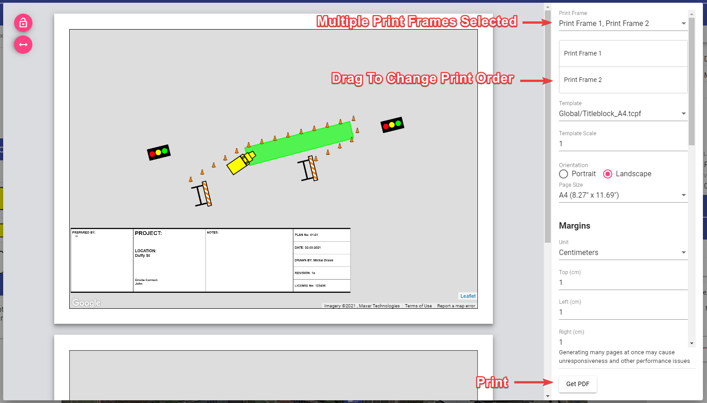

# Printing multiple pages

Print several print regions together when you want to create one multipage PDF from a RapidPlan Online plan.

## Before you begin

Create and position each print region that you want to include. For help setting up print regions, see [Layers palette](../rapidplan-online-workspace/layers-palette#print-regions).

## Print multiple pages

1. In the **Print Regions** section of the **Layers palette**, select the printer icon to print all print regions.
1. In the **Print Frame** list, confirm that each print region you want to print is selected.
1. Drag the print frames into the order in which you want the pages to appear.
1. Review the template, page size, orientation, and margins.
1. Select **Get PDF**.

RapidPlan Online generates a multipage PDF with the print frames in the order shown in the list.

**Note:** Generating many pages at once may cause the application to become unresponsive or affect performance.

## Related articles

- [Print and export](./print-and-export)
- [Fit print regions to the page size](../Tips/fit-print-regions-to-the-page-size)
