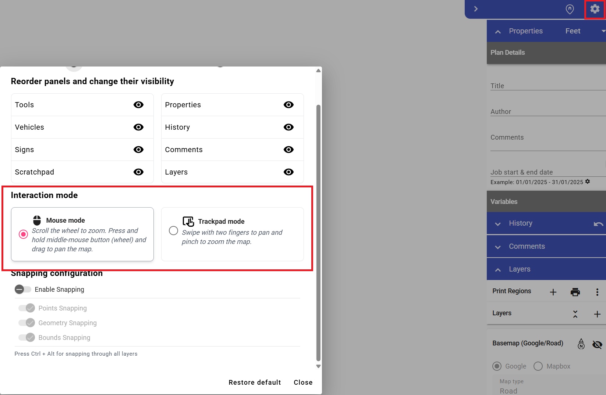

---

sidebar_position: 0

---

# Navigating the Plan Canvas

The RapidPlan Online canvas provides comprehensive navigation controls designed to facilitate efficient interaction with your traffic management plans. This document outlines the available navigation methods for desktop and laptop devices.

For touch-enabled mobile devices, please refer to the [Using Mobile Devices](../using-mobile-devices/using-mobile-devices.md) guide.

## Navigation Methods

### Mouse and Keyboard Controls

The following navigation options are available when using a standard mouse and keyboard configuration:

#### Zooming

- **Mouse wheel**: Scroll up to zoom in, scroll down to zoom out

#### Panning

- **Middle mouse button** (recommended): Press and hold the middle mouse button (scroll wheel) while dragging to pan across the canvas
- **Spacebar + drag**: Hold the Spacebar key and drag the mouse (without pressing any mouse buttons) to pan the view
- **Modified scroll**: Use the mouse wheel in combination with modifier keys:
  - **Shift + scroll**: Horizontal panning
  - **Ctrl + scroll**: Vertical panning

### Trackpad Controls

When using a laptop trackpad or external trackpad device, the following gestures are supported:

- **Two-finger drag**: Place two fingers on the trackpad and drag to pan across the canvas
- **Pinch gesture**: Place two fingers on the trackpad and pinch together to zoom out, or spread apart to zoom in

## Configuring Interaction Mode

RapidPlan Online allows you to optimize navigation controls based on your input device. To switch between mouse and trackpad interaction modes:

1. Access the Settings menu
2. Navigate to the Interaction Mode section
3. Select your preferred input method

Selecting the appropriate interaction mode ensures optimal responsiveness and precision when navigating your traffic management plans.
