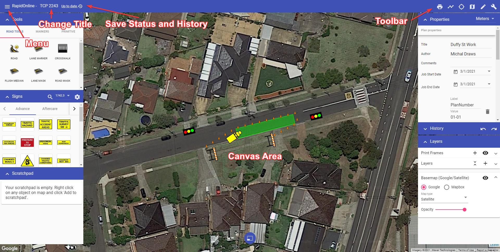

---

sidebar_position: 1

---
# RapidPlan Online Workspace

<iframe width="560" height="315" src="https://www.youtube.com/embed/-SY3iKtvkII?si=Qaa_t7vOSVCbUaVC" title="YouTube video player" frameborder="0" allow="accelerometer; autoplay; clipboard-write; encrypted-media; gyroscope; picture-in-picture; web-share" referrerpolicy="strict-origin-when-cross-origin" allowfullscreen></iframe>

Before starting to create plans, we recommend getting to know your way around the workspace. It has been designed to be intuitive, easy to follow and to allow you the maximum available working space to create your traffic plan.

There are four main components of the RapidPlan Online workspace:

- [Canvas area](./canvas-area.md)
- [Main menu](./main-menu.md)
- [Toolbar](./toolbar.md)
- [Palettes](./palettes.md)

These workspace components are highlighted in the image below.

To name your plan, simply click where it mentions **No Title**, highlighted in the image below. Once renamed the plan will autosave.

The plan author, comments and job work dates can be adjusted in Plan properties.

The following sections steps through each of component of the workspace.
