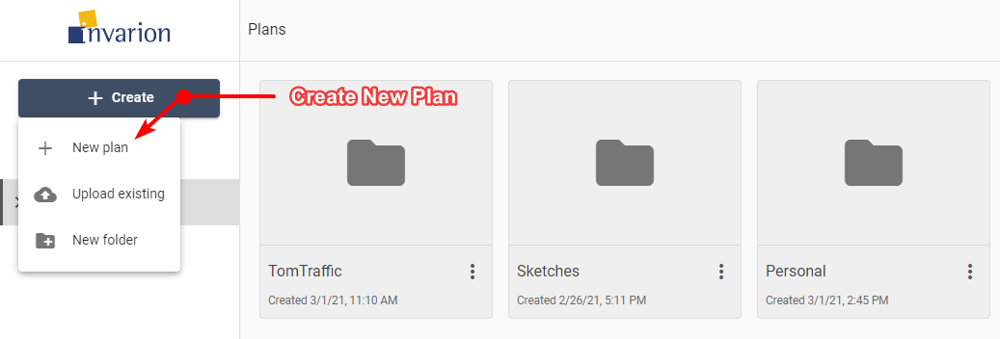

---

sidebar_position: 3
tags:
  - cloud-plans
  - getting-started

---
# Create a new plan

To create a new plan simply select the **Create** button in the [Navigation Menu](/rapidplan-online/the-invarion-cloud/navigation-menu) and choose **New plan** from the menu. The plan will be created in the folder you are currently in, and you will be taken automatically to RapidPlan Online.

