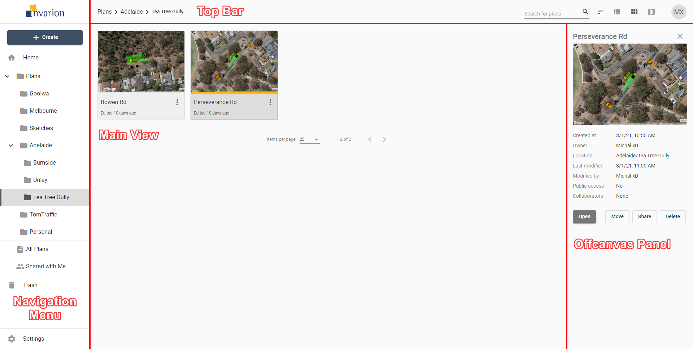

---

sidebar_position: 1
tags:
  - cloud-plans

---
# Invarion Cloud layout

## What is the Invarion Cloud?

Invarion Cloud is an online application for storing all your plans and related documents. It is also the entry point to the RapidPlan Online and other web-based Invarion applications.

**Note:** Invarion Cloud has superseded our old storage application, the RapidPlan Cloud.

## Layout

Invarion Cloud is a dynamic web application with four main elements:

|Element|Description|
|-----------|-----------|
| [**Navigation Menu**](./navigation-menu)      | Navigation menu located on the left side of the screen. Use it to navigate through Invarion Cloud sections such as **Plans**, **Trash**, and **Shared with Me**. It also contains **+ Create** for creating plans and folders or uploading an existing plan from your computer. |
| **Main View**   | Main view of the page showing the plans within the selected folder or section. See [Main menu - access plans](./main-menu-access-plans) for plan actions. |
| [**Off-canvas Panel**](./off-canvas-panel) |  Panel on the right side of the screen used for displaying details of a selected plan or folder. |
| **Top Bar**   | At the top of the page, on the left side you can find an interactive path to your current location. Right part of the top bar is populated by a search input for searching folders and plans, toggle buttons for switching the type of view and your initials button that holds a link to account settings, support page and logout option.       |

**Note:** Even though Invarion Cloud is a single page application, it stores your current folder location in your web browser search bar. Thanks to that, you can successfully create browser bookmarks for your favourite or commonly used sections.
