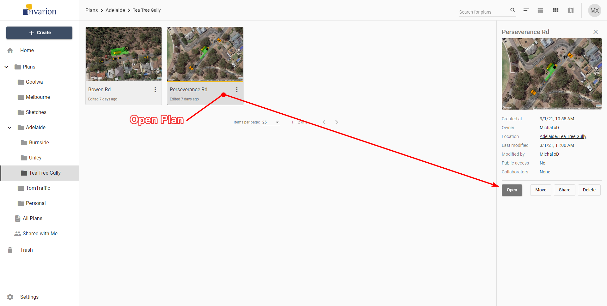
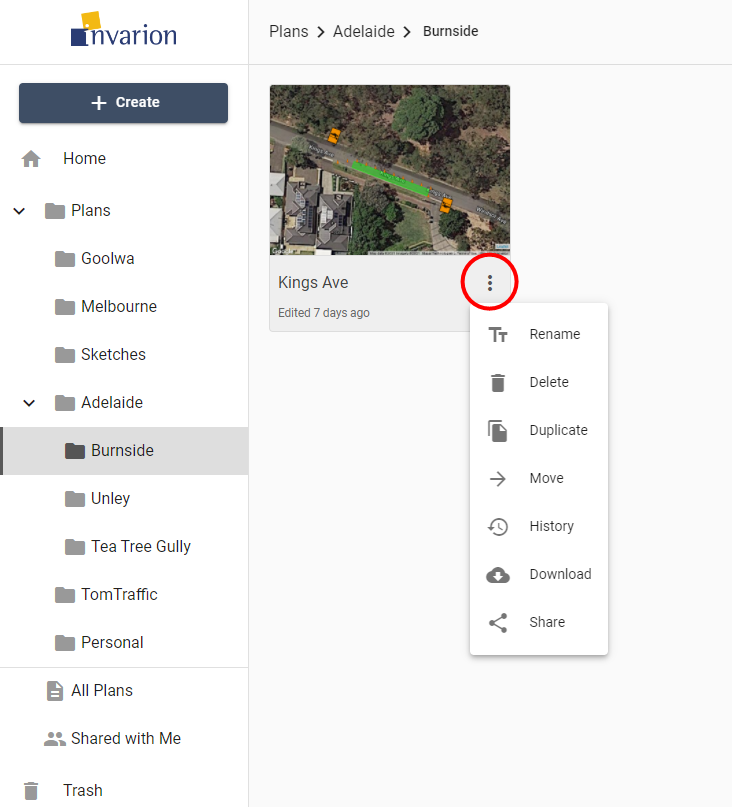
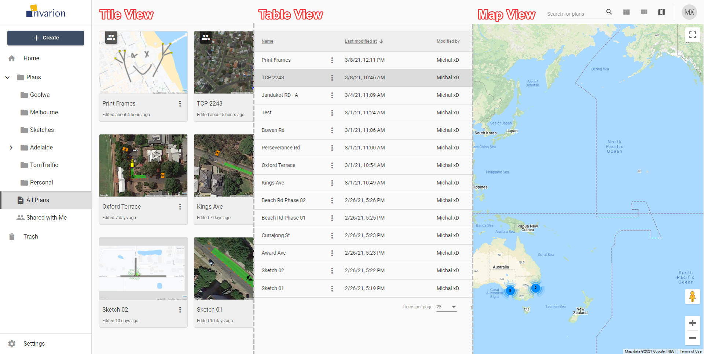
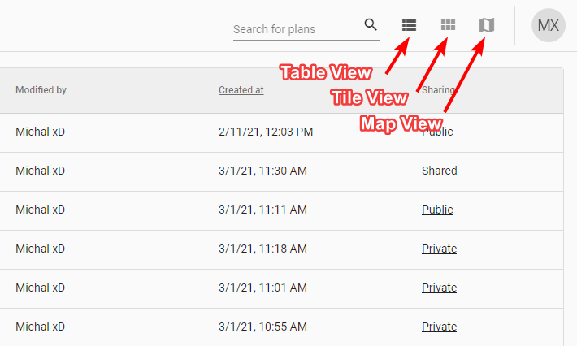

---

sidebar_position: 6
tags:
  - cloud-plans

---
# Main menu - access plans

## Open plans

To open a plan, select it in the [main view](./invarion-cloud-layout). This opens the [off-canvas panel](./off-canvas-panel) with the plan details. In the panel, select **Open**.

**Tip:** To open the plan in a separate tab or window, right-click **Open**, then select **Open in New Tab** or **Open in New Window**.

## Other plan actions in Invarion Cloud

To see available actions for a plan, select the **three dots** button near its name. This opens the plan context menu.

### Available plan actions

|Action|Description|
|---|---|
|**Rename**|Rename plan.|
|**Delete**|Move plan to trash.|
|**Duplicate**|Create a copy of the plan. Duplicate will appear in the same location as the original plan.|
|**Move**|Move plan to a different location.|
|**History**|Restore a previous version of the plan. See [Plan history and recovery](./plan-history-and-recovery).|
|**Download**|Download plan to your device.|
|**Share**|Open sharing options for the plan. See [Share plans](./share-plans).|
|**Add to Favorites**|Add the selected plan to a quick access Favorites list, visible and accessible in the [Navigation Menu](./navigation-menu).|

## Change main menu views

Depending on the current view, plans can be represented in the Main Menu as rows in a table, tiles in a grid, or pins on a map (as shown below). This can be altered using the buttons in the top-right corner of the screen in the [Top Bar](./invarion-cloud-layout).

|View|Description|
| ----------- | ----------- |
| **Table View**      | The Table view presents all of your plans in a table. The table shows the document name, the date it was created, last modified and the editor's name. You can also see if a plan is public, private and or has been shared with a collaborator. You can sort your plans by clicking on column's heading to order by plan's name, creation date or last modified date. |
| **Tile View**   | The tile view presents your plans as a series of thumbnail images. The tiles show a preview of the plan for easy identification. Shared plans have a special overlay icon that indicates that a plan has been shared. To sort in tile view, select **Sort** on the top bar and choose a sorting option. |
| **Map**   | The map view displays your plans on a map. This can be useful when searching for a plan at a specific location, or for visualizing clusters of projects within a particular region. Plans displayed on the map will show depending on the folder you are currently in. To see all of your plans on the map, open map view while in the **All Plans** section. |

To change the view use the appropriate buttons on the top bar.

You can change the view at any moment. It won't reset your current location or search results. The view you last selected will be saved in your browser as your default view. So next time you enter Invarion Cloud your preferred view will be shown.

## Search plans

In the top right corner of the page in the [Top Bar](./invarion-cloud-layout) you will find search input for searching your plans or folders.

Searching will search in the current location (folder). If you want to search in all of your plans, switch to the **Home** or **All Plans** section.
