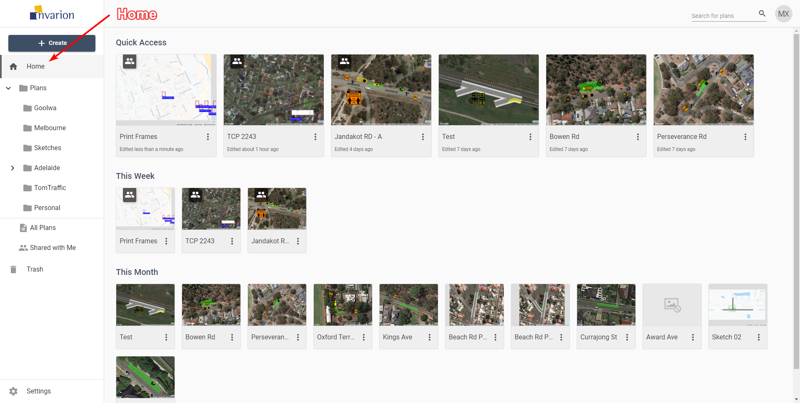
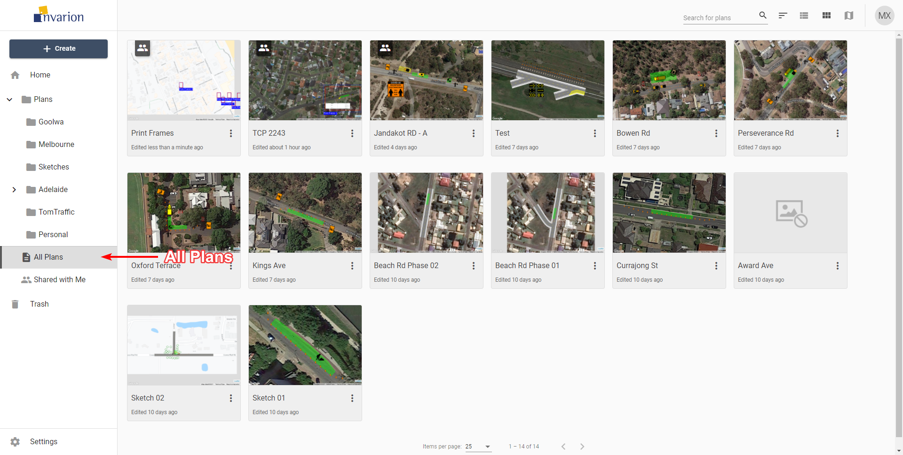
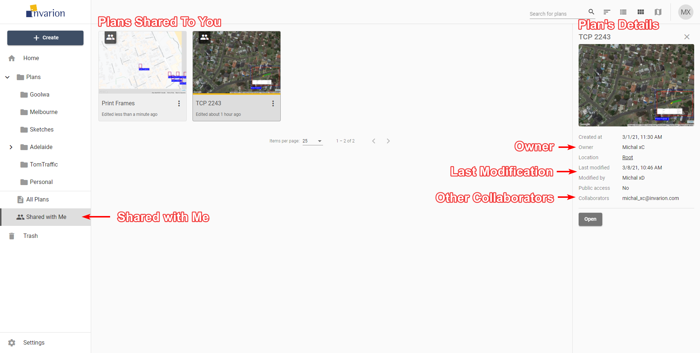
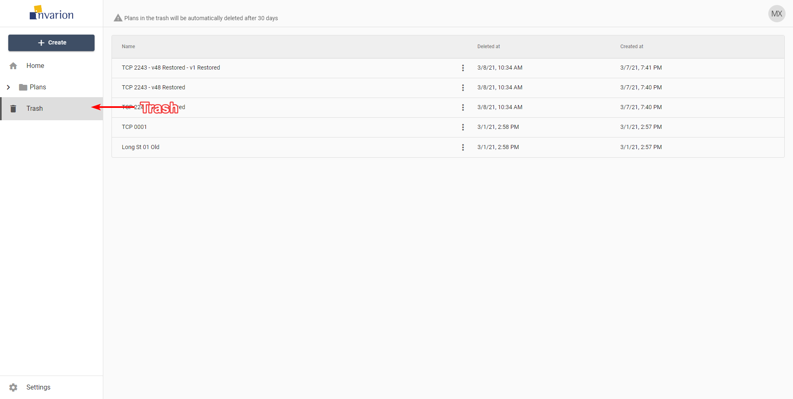

---

sidebar_position: 2

---
# The Navigation Menu

## Home

When you first open the Invarion Cloud, the Home section is where you land. Here you can see your recently created/modified plans but also plans that have been shared to you recently. Home is divided into three parts:

- **Quick Access** - most recently created, modified or shared to you plans.
- **This Week** - plans that were active this week.
- **This Month** - plans that were active this month.

## All Plans

All Plans is an special section that shows all plans that you have access to. That includes plans shared with you by other users. This section doesn't show folders. Plans are displayed regardless of their containing folder.

**Tips:**

- You can see plan location in plan's details. To do this simply click on the plan, the panel with extra information will show up on the right side of the screen.
- All Plans section was designed to let users quickly find the plan they are interested in.

## Shared with Me

In this section you can see all the plans that were shared with you by other RapidPlan Online users.

## Trash

Inside the Trash section you can find all your deleted plans and folders. Plans and folders in the trash will be automatically deleted after 30 days.

You can restore the plan or a folder by choosing **Restore** option in the plan's or folder's context menu. If you want to clean up your trash manually, choose the **Delete forever** option from the same menu.
