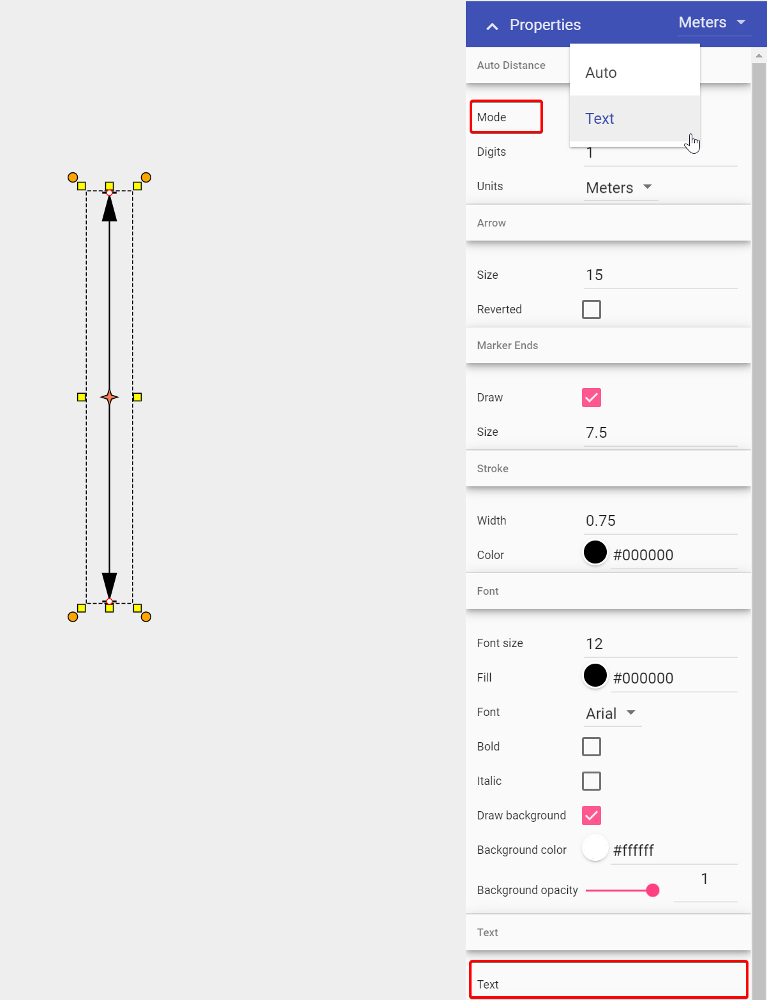

---

sidebar_position: 2

---
# Creating a Distance Marker

There are four distance markers used for indicating spatial information on your plan, the Distance Marker, the Combined Distance Marker, the Offset Distance Marker and the Angle Marker.

In essence, all of these distance markers do exactly the same thing - they indicate to a reader the distance between elements. They all automatically calculate the distance and enter its amount. You can also enter your own values if needed.

Irrespective of which distance marker you are using, the technique for creating it is much the same.

**To place a Distance Marker:**

- Select your **Distance Marker** tool from the Markers tab in the Tools Palette;
- Click once to start drawing the distance marker, click a second time to mark the end point;
- **Right click** to finish.

**Quick Tip:** It is helpful to hold **Shift** whilst drawing the distance marker to keep it straight.

## Editing the Distance on the Marker

Provided your plan is scaled to match the background image you are working on, your distance marker will have an accurate distance value to match. If however you wish to define your own distance on the marker, simply follow the steps below:

- Select the Marker;
- Navigate to the Properties palette;
- Change mode from Auto to Text, enter desired Distance in Text heading;
- Click anywhere on your plan to finish.

